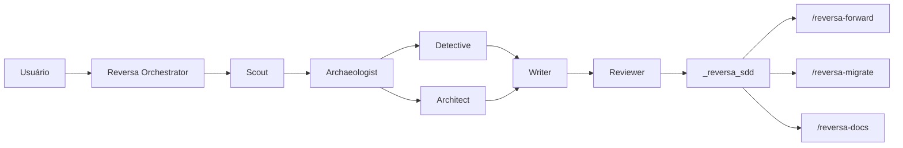
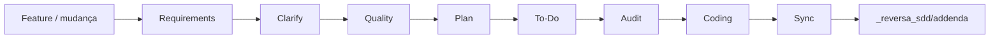
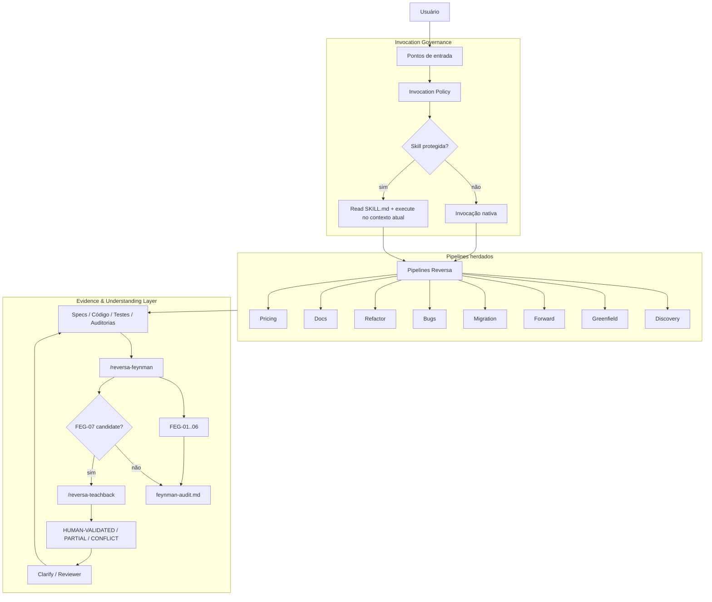
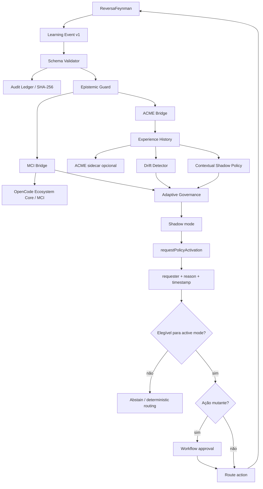
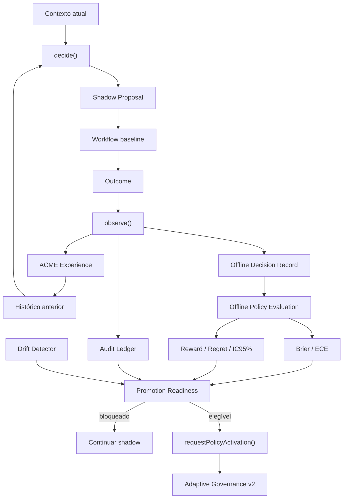
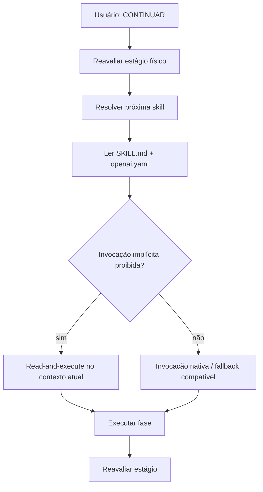

# ReversaFeynman

**Engenharia reversa, especificações executáveis, validação epistemológica e aprendizagem adaptativa governada para agentes de IA.**

**Identidade canônica preparada:** `MarceloClaro/reversaFeynman`

> **Estado do slug no GitHub — 13/09/2026:** o repositório físico ainda está publicado como `MarceloClaro/reversa`. A identidade `MarceloClaro/reversaFeynman` já é usada pelo código e pela documentação, mas o rename administrativo do GitHub ainda não foi concluído. Até esse rename, comandos que apontem diretamente para `github:MarceloClaro/reversaFeynman` podem falhar.

ReversaFeynman é uma linha independente mantida por **Marcelo Claro Laranjeira**, derivada historicamente do framework **Reversa** original e licenciada sob MIT.

A edição preserva engenharia reversa, SDD, rastreabilidade, pipelines especializados e compatibilidade multi-engine, acrescentando quatro camadas principais:

- **Feynman Evidence & Understanding Layer** — FEG-01..FEG-07, evidência, falsificabilidade e Teach-back;
- **Invocation Governance** — handoff seguro para skills protegidas;
- **Adaptive Governance v2** — MCI/ACME bridges, ledger auditável, shadow policy, drift detection e ativação controlada;
- **Offline Policy Evaluation v3** — `decide → observe`, holdout temporal, Brier/ECE, reward/regret, IC95% bootstrap e Adaptive Governance Report.

> A linha independente não apaga a proveniência do Reversa original. Licença, referências e atribuição histórica permanecem preservadas.

> Política de independência: [`INDEPENDENCE.md`](INDEPENDENCE.md)  
> Proveniência acadêmica detalhada: [`docs/ACADEMIC-PROVENANCE.md`](docs/ACADEMIC-PROVENANCE.md)  
> Metadados de citação: [`CITATION.cff`](CITATION.cff)

---

# Origem acadêmica e atribuição explícita

## Reversa original — obra de origem

O **ReversaFeynman é uma obra derivada do framework Reversa original**, desenvolvido e publicado no repositório:

**SANDECO — Reversa**  
https://github.com/sandeco/reversa

O Reversa original define a base conceitual e arquitetural de **reverse documentation engineering** utilizada por esta linha: análise de sistemas legados, pipeline multiagente, extração de regras e decisões implícitas, geração de especificações operacionais rastreáveis e uso dessas especificações por agentes de IA.

A referência científica primária do framework original é:

**Sanderson Oliveira de Macedo; Ronaldo Martins da Costa.**  
**Reversa: A Reverse Documentation Engineering Framework for Converting Legacy Software into Operational Specifications for AI Agents.**  
arXiv, 2026. `arXiv:2605.18684`. Categoria principal `cs.SE`. Submetido em 18 de maio de 2026.  
https://arxiv.org/abs/2605.18684  
DOI persistente: https://doi.org/10.48550/arXiv.2605.18684

O paper original descreve o Reversa como um framework de engenharia de documentação reversa que converte conhecimento implícito em sistemas legados em especificações operacionais rastreáveis para agentes de IA, usando um pipeline multiagente e mecanismos explícitos de rastreabilidade, confiança e preservação de lacunas para validação humana.

## Referência do paper original — ABNT

> MACEDO, Sanderson Oliveira de; COSTA, Ronaldo Martins da. **Reversa: A Reverse Documentation Engineering Framework for Converting Legacy Software into Operational Specifications for AI Agents**. arXiv, 2026. arXiv:2605.18684. DOI: 10.48550/arXiv.2605.18684. Disponível em: https://arxiv.org/abs/2605.18684. Acesso em: 13 set. 2026.

## Referência do software original — ABNT

> SANDECO. **Reversa**: transform legacy systems into executable specifications for AI coding agents. GitHub, 2026. Disponível em: https://github.com/sandeco/reversa. Acesso em: 13 set. 2026.

## BibTeX do paper original

```bibtex
@misc{demacedo2026reversa,
  title         = {Reversa: A Reverse Documentation Engineering Framework for Converting Legacy Software into Operational Specifications for AI Agents},
  author        = {Sanderson Oliveira de Macedo and Ronaldo Martins da Costa},
  year          = {2026},
  eprint        = {2605.18684},
  archivePrefix = {arXiv},
  primaryClass  = {cs.SE},
  doi           = {10.48550/arXiv.2605.18684},
  url           = {https://arxiv.org/abs/2605.18684}
}
```

## BibTeX do repositório original

```bibtex
@software{sandeco_reversa_2026,
  author = {{sandeco}},
  title  = {Reversa},
  year   = {2026},
  url    = {https://github.com/sandeco/reversa},
  note   = {Original Reversa repository; MIT License}
}
```

## Delimitação de autoria e contribuição

Para evitar ambiguidade acadêmica, este repositório usa a seguinte distinção:

| Camada | Proveniência |
|---|---|
| conceito de reverse documentation engineering | **Reversa original — Macedo & da Costa / sandeco** |
| Discovery e pipeline multiagente de extração | **Reversa original** |
| especificações operacionais rastreáveis | **Reversa original** |
| estrutura `.reversa/`, famílias `/reversa-*` e compatibilidade multi-engine | **Reversa original / evolução histórica do projeto-base** |
| Forward, Migration, Documentation, Bugs, Refactor e equipes herdadas | **arquitetura-base Reversa** |
| Feynman Evidence & Understanding Layer | **extensão ReversaFeynman** |
| FEG-01..FEG-07 e Teach-back | **extensão ReversaFeynman** |
| `OBSERVED / INFERRED / UNVERIFIED / BLOCKED` | **extensão ReversaFeynman** |
| handoff metadata-aware para skills protegidas | **extensão ReversaFeynman** |
| MCI/ACME Adaptive Governance | **extensão ReversaFeynman** |
| Audit Ledger, shadow policy e drift detection | **extensão ReversaFeynman** |
| Offline Policy Evaluation v3 | **extensão ReversaFeynman** |
| Brier/ECE, regret, IC95% e governance report | **extensão ReversaFeynman** |

A expressão **“Reversa original”** neste README refere-se explicitamente ao projeto `sandeco/reversa` e ao trabalho científico de Macedo e Costa (2026). A expressão **“ReversaFeynman”** refere-se às extensões e à linha independente mantida neste repositório.

> Independência de desenvolvimento não significa independência de proveniência. O ReversaFeynman reconhece explicitamente o Reversa original como sua base histórica, arquitetural e científica.

---

# Evolução arquitetural

| Dimensão | Reversa base | ReversaFeynman | Adaptive Governance v2 | Offline Evaluation v3 |
|---|---|---|---|---|
| Engenharia reversa | Discovery + specs | preservada | preservada | preservada |
| Forward | requirements → coding → sync | handoff seguro | pode receber ranking adaptativo | decisão e outcome separados |
| Evidência | CONFIRMED / INFERRED / GAP | `OBSERVED / INFERRED / UNVERIFIED / BLOCKED` | policy não altera autoridade | métricas também não alteram autoridade |
| Auditoria | Reviewer / Quality / Audit | FEG-01..07 | ledger + drift + governance | holdout + calibration + report |
| Fonte humana | perguntas/validação | Teach-back | continua separada de `OBSERVED` | idem |
| Metacognição | não é camada do núcleo | parcial via FEG | MCI envelope opcional | métricas de calibração offline |
| Aprendizagem | não | não | ACME experience opcional | avaliação antes de promoção |
| Reward | não | não | `heuristic-v1` | baseline × shadow estimados |
| Policy | determinística/heurística | determinística/heurística | `contextual-shadow-v1` | avaliada em holdout temporal |
| Drift | não | não | reward/confidence/epistemic mix | continua gate obrigatório |
| Auditoria de eventos | artefatos | artefatos + Feynman | hash-chain SHA-256 | decision records + report |
| Execução adaptativa | não | não | shadow por padrão | readiness apenas solicita ativação |
| Auto-ativação | não | não | não | **não** |
| Dependência RL | nenhuma | nenhuma | sidecar externo opcional | continua opcional |
| Upstream | projeto original | sem sync automático | sem sync automático | sem sync automático |

---

# Arquitetura original

A arquitetura-base herdada do Reversa usa **orquestradores especializados + agentes de fase + artefatos persistidos em disco**.

## Discovery



Fluxo conceitual:

```text
Reconnaissance → Excavation → Interpretation → Generation → Review
     Scout        Archaeologist   Detective       Writer     Reviewer
                                     Architect
```

## Evolução de feature



O núcleo funcional permanece preservado.

---

# Arquitetura ReversaFeynman

ReversaFeynman adiciona dois planos transversais: **governança de invocação** e **controle epistemológico**.



Invariantes:

```text
TEACHBACK_GREEN ≠ OBSERVED
HUMAN-VALIDATED ≠ OBSERVED
policy confidence ≠ OBSERVED
reward ≠ OBSERVED
```

---

# Adaptive Governance v2

A camada adaptativa está em:

```text
lib/integrations/adaptive/
```

Ela não substitui os pipelines Reversa e não torna reinforcement learning autoridade sobre evidência.



Responsabilidades:

| Componente | Pergunta | Autoridade |
|---|---|---|
| ReversaFeynman | O que sabemos? | evidência/especificação |
| FEG | Por que acreditar? O que refutaria? | auditoria epistemológica |
| MCI | Quem deve agir? Quando abster? | metacognição/orquestração |
| ACME | Qual política tende a gerar melhor outcome? | recomendação adaptativa |
| Drift Detector | O comportamento recente mudou? | contenção operacional |
| Governance | A proposal pode sair de shadow? | autorização adaptativa |
| Evidence Guard | Pode virar `OBSERVED`? | autoridade epistemológica final |

---

# Offline Policy Evaluation v3

A v3 adiciona uma etapa obrigatória de avaliação antes de considerar promoção da shadow policy.

## Correção de look-ahead leakage

Na v2, `ingest(event)` podia ser interpretado como uma decisão online mesmo sendo um fluxo pós-outcome. A v3 separa explicitamente:

```text
decide(contexto + histórico anterior)
            ↓
workflow baseline executa
            ↓
observe(outcome)
            ↓
histórico é atualizado
```

Nunca:

```text
outcome atual → histórico → decisão do mesmo evento
```

A API oferece:

```js
const decision = runtime.decide(event);
const result = await runtime.observe(event, { decision });
```

`ingest(event)` continua disponível por compatibilidade e internamente respeita `decide → observe`.

## Arquitetura v3



## Contratos v3

| Contrato | Schema | Função |
|---|---|---|
| Offline Decision | `reversa.offline.decision/v1` | baseline × shadow × executed action × outcome |
| Offline Evaluation | `reversa.offline.evaluation/v1` | holdout, calibration, reward/regret |
| Adaptive Report | `reversa.adaptive.report/v1` | relatório auditável da governança |

Contratos anteriores preservados:

```text
reversa.learning.event/v1
reversa.mci.envelope/v1
reversa.acme.experience/v1
```

---

# Holdout temporal

`evaluateOfflinePolicy()` ordena decision records por `decided_at` e separa treino/holdout.

Baseline:

```text
trainFraction = 0.70
```

O bloco de treino estima desempenho por `stage × action`. O holdout é usado para medir a política fora desse bloco.

Isso reduz a chance de declarar melhora usando o mesmo resultado que foi usado para estimar a ação.

---

# Shadow outcomes e contrafactual

A v3 é conservadora:

```text
shadow_action == executed_action
        ↓
outcome shadow diretamente observado
```

Quando:

```text
shadow_action != executed_action
```

o sistema **não inventa** o outcome contrafactual.

Reward/regret estimados para ações não executadas usam médias de ação/estágio aprendidas no bloco de treino e são rotulados como:

```text
observational / model-based
not causal
```

---

# Brier Score e ECE

A `policy.confidence` representa probabilidade estimada de sucesso a partir de outcomes binários históricos ponderados por similaridade. Ela é separada do reward/utility score usado no ranking.

Calibração é calculada apenas em `shadow-matched-only`.

## Brier

```text
Brier = mean((confidence - outcome)^2)
```

## Expected Calibration Error

```text
ECE = Σ weight_bin × |avg_confidence_bin - accuracy_bin|
```

Os bins são configuráveis.

Essas métricas avaliam calibração da confiança; não transformam policy confidence em evidência.

---

# Reward, regret e IC95%

A avaliação calcula:

- reward baseline estimado;
- reward shadow estimado;
- delta estimado;
- regret baseline estimado;
- regret shadow estimado;
- IC95% bootstrap percentile para o delta.

O bootstrap usa PRNG determinístico por seed para reprodutibilidade.

```text
IC95% ≠ prova causal
```

A referência de regret é a melhor média de ação observada no treino para o mesmo estágio, respeitando suporte mínimo configurável.

---

# Promotion Readiness

Defaults de governança:

| Gate | Default |
|---|---:|
| `minRecords` | 30 |
| `minMatchedShadow` | 12 |
| `minShadowCoverage` | 0.20 |
| `maxBrier` | 0.25 |
| `maxEce` | 0.20 |
| `maxEstimatedShadowRegret` | 0.10 |
| `minEstimatedRewardDelta` | 0.00 |

Esses valores são **baselines operacionais configuráveis**, não limites cientificamente universais.

Readiness também exige:

- drift não detectado;
- ledger válido;
- limite inferior do IC95% do delta >= threshold.

Mesmo quando todos os critérios passam:

```text
eligible_for_activation_request = true
auto_activate = false
```

A próxima etapa continua sendo `requestPolicyActivation()`.

---

# Adaptive Governance Report

A v3 gera Markdown auditável via:

```js
const evaluation = runtime.offlineEvaluation();
const readiness = runtime.promotionReadiness({ evaluation });
const report = runtime.governanceReport({ evaluation, readiness });
```

Caminho sugerido:

```text
_reversa_sdd/adaptive/governance-report.md
```

Persistência é opt-in:

```js
await writeAdaptiveGovernanceReport(report, { rootDir: process.cwd() });
```

O writer rejeita path traversal para fora de `rootDir`.

O relatório inclui registros treino/holdout, shadow coverage, agreement baseline × shadow, Brier, ECE, reward, regret, IC95%, drift, validade do ledger, readiness, blockers e caveats metodológicos.

---

# Evidence Guard

Somente evidência direta rastreável pode produzir `OBSERVED`.

Tipos reconhecidos pelo baseline:

```text
code
contract
test
execution
log
dataset
artifact
```

Bloqueado:

```js
applyEvidenceProposal(
  { id: 'claim-1', epistemic_state: 'INFERRED' },
  {
    proposed: 'OBSERVED',
    source: { kind: 'learned-policy', direct: false, ref: 'policy:acme' },
  },
);
```

Aceitável quando sustentado por evidência direta:

```js
applyEvidenceProposal(
  { id: 'claim-2', epistemic_state: 'INFERRED' },
  {
    proposed: 'OBSERVED',
    source: { kind: 'test', direct: true, ref: 'tests/example.test.js:42' },
  },
);
```

---

# Reward baseline

`heuristic-v1` combina aceitação da spec, testes, ganho de evidência observada, redução de incerteza, calibração, regressões, findings HIGH/CRITICAL, custo, latência e retries.

```text
-1 ≤ reward ≤ 1
```

Reward é hipótese operacional, não medida de verdade.

---

# Audit Ledger

`createAuditLedger()` cria uma cadeia SHA-256:

```text
genesis_hash
    ↓
entry_1 = H(sequence + previous_hash + payload_hash)
    ↓
entry_2 = H(sequence + previous_hash + payload_hash)
    ↓
...
```

Propriedades:

- dedupe por `event_id`;
- payload canonicalizado;
- hash encadeado;
- verificação integral;
- snapshot somente leitura;
- exportação JSONL.

---

# Contextual Shadow Policy

`contextual-shadow-v1`:

1. recebe observation atual;
2. filtra candidatos pela allowlist global;
3. busca experiências anteriores da mesma ação;
4. calcula similaridade entre observation vectors;
5. estima reward empírico ponderado;
6. estima probabilidade de sucesso quando há outcomes binários;
7. acrescenta bônus de incerteza para ranking;
8. ranqueia ações.

Toda proposal nasce com:

```text
mode = shadow
evidence_authority = false
```

Uma lista externa de candidatos não redefine a allowlist global.

---

# Drift Detector

A v2/v3 compara janela de referência e janela recente usando reward médio, confidence média e proporção `OBSERVED`.

Estados:

```text
insufficient_data
stable
drift
```

Drift detectado bloqueia readiness e active mode.

---

# Módulos adaptativos

```text
lib/integrations/adaptive/
├── constants.js
├── schema.js
├── event.js
├── evidence-guard.js
├── reward.js
├── ledger.js
├── drift.js
├── policy.js
├── evaluation.js
├── report.js
├── governance.js
├── mci-bridge.js
├── acme-bridge.js
├── runtime.js
└── index.js
```

Especificações:

```text
specs/SPEC-ADAPTIVE-MCI-ACME-BRIDGE.md
specs/SPEC-ADAPTIVE-GOVERNANCE-V2.md
specs/SPEC-ADAPTIVE-OFFLINE-EVALUATION-V3.md
```

Testes:

```text
scripts/test-adaptive-bridges.mjs
scripts/test-offline-policy-evaluation.mjs
```

---

# Feynman Evidence & Understanding Layer

| Gate | Pergunta operacional |
|---|---|
| `FEG-01` | O mecanismo pode ser explicado sem depender apenas do nome? |
| `FEG-02` | A afirmação forte possui evidência/proveniência? |
| `FEG-03` | Observação e inferência estão separadas? |
| `FEG-04` | Existe teste/oracle capaz de refutar? |
| `FEG-05` | A solução resolve necessidade demonstrada ou é cargo cult? |
| `FEG-06` | Qual menor experimento reduz a incerteza? |
| `FEG-07` | A fonte humana explica mecanismo e transfere para cenário variante? |

Estados:

```text
OBSERVED
INFERRED
UNVERIFIED
BLOCKED
```

Estados humanos:

```text
HUMAN-VALIDATED
HUMAN-PARTIAL
HUMAN-CONFLICT
```

FEG-07 permanece fora do score-base FEG-01..06 (`0..12`).

---

# Handoff seguro

`CONTINUAR` não remove a política da skill seguinte.



---

# Impactos das implementações

## Handoff

Corrige a classe de erro em que uma skill protegida era chamada pelo mecanismo de invocação incompatível com `disable-model-invocation`.

## Economia de contexto

A política de invocação documentada historicamente no framework reduziu skills permanentemente model-invoked de **65 para 9**, e descriptions permanentemente carregadas de aproximadamente **4.987 para 668 tokens**, cerca de **86% nesse componente específico de contexto**.

Esse número não é apresentado como benchmark global do ReversaFeynman.

## V2

- permite MCI/ACME opcionais;
- registra experiência e reward;
- contém ações por allowlist;
- detecta drift;
- exige activation request;
- impede policy/reward/trust de fabricar `OBSERVED`.

## V3

- separa `decide()` e `observe()`;
- evita look-ahead do outcome atual;
- mede política fora do bloco usado para estimativa;
- mede calibração com Brier/ECE;
- mede regret;
- produz IC95% reprodutível;
- gera report auditável;
- readiness não autoativa.

## Trade-offs

- mais eventos e artefatos aumentam complexidade;
- reward mal definido pode otimizar comportamento errado;
- holdout reduz dados disponíveis para estimativa;
- matched-only calibration pode ter baixa cobertura;
- estimativas observacionais não substituem experimentos causais;
- sidecar ACME real adiciona stack Python/RL externamente;
- linha independente não recebe mudanças upstream automaticamente.

---

# Equipes e agentes

A taxonomia funcional preserva os grupos herdados:

| Grupo | Função |
|---|---|
| Discovery Core | extrair conhecimento e produzir specs |
| Migration | reconstrução/migração |
| Translators | adaptar fontes estruturadas |
| Pricing | estimativa e perfil |
| Forward | requirements → implementação |
| Documentation | site, mapas e narrativa |
| Ideation | problema → alternativas → pre-spec |
| New Project | ideia → PRD → SDD |
| Bugs | memória causal, diagnóstico e fix |
| Refactor | melhoria interna preservando comportamento |
| ReversaFeynman | auditoria epistemológica e Teach-back |
| Adaptive Layer | MCI/ACME, drift, policy, offline evaluation e report |

Discovery Core inclui Reversa, Autonomous, Scout, Archaeologist, Detective, Architect, Writer, Reviewer, Visor, Data Master, Design System, Agents Help e Reconstructor.

Ideation:

```text
Framer → Explorer → Challenger → Arbiter → Pre-Spec
```

New Project:

```text
Ideator → Researcher → Drafter → Spec SDD
```

Forward:

```text
requirements → clarify → quality → plan → to-do → audit → coding → sync
```

Migration:

```text
Paradigm Advisor → Curator → Strategist → Designer → Screen Translator → Inspector
```

Bugs:

```text
SPEC ↔ CODE ↔ TEST ↔ BUG
```

---

# Artefatos gerados

## Discovery

```text
_reversa_sdd/
├── inventory.md
├── dependencies.md
├── code-analysis.md
├── data-dictionary.md
├── domain.md
├── state-machines.md
├── permissions.md
├── architecture.md
├── c4-context.md
├── c4-containers.md
├── c4-components.md
├── erd-complete.md
├── confidence-report.md
├── gaps.md
├── questions.md
├── sdd/
├── openapi/
├── user-stories/
├── adrs/
├── flowcharts/
├── sequences/
├── ui/
├── database/
├── design-system/
├── addenda/
└── traceability/
```

## Forward

```text
_reversa_forward/
└── <NNN>-<short-name>/
    ├── requirements.md
    ├── roadmap.md
    ├── investigation.md
    ├── data-delta.md
    ├── onboarding.md
    ├── interfaces/
    ├── actions.md
    ├── progress.jsonl
    ├── legacy-impact.md
    ├── regression-watch.md
    └── audit/
        ├── requirements-audit.md
        ├── cross-check.md
        ├── feynman-audit.md
        └── teachback.md
```

## Adaptive Governance v3

Caminho recomendado quando a persistência do report for explicitamente solicitada:

```text
_reversa_sdd/
└── adaptive/
    └── governance-report.md
```

---

# Instalação

Enquanto o slug físico permanecer `MarceloClaro/reversa`:

```bash
npm exec --yes --package=github:MarceloClaro/reversa -- reversa install
```

Após o rename administrativo para `MarceloClaro/reversaFeynman`:

```bash
npm exec --yes --package=github:MarceloClaro/reversaFeynman -- reversa install
```

Requisitos do core:

- Node.js `>=18.20.2`;
- pelo menos um harness/agente compatível.

OpenCode MCI, ACME, JAX e TensorFlow continuam opcionais.

---

# Como usar

| Objetivo | Comando |
|---|---|
| Analisar legado | `/reversa` |
| Discovery autônomo | `/reversa-autonomous` |
| Brainstorm | `/reversa-brainstorm` |
| Projeto novo | `/reversa-new` |
| Projeto novo expresso | `/reversa-new expresso "<ideia>"` |
| Evoluir feature | `/reversa-forward` |
| Pequena emenda | `/reversa-add` |
| Sincronizar addendum | `/reversa-sync` |
| Migrar/reconstruir | `/reversa-migrate` |
| Documentar | `/reversa-docs` |
| Registrar bug | `/reversa-debugger` |
| Corrigir bug | `/reversa-debugger-fix` |
| Debate de bug | `/reversa-debugger-debate` |
| Refatorar | `/reversa-refactor` |
| Pricing | `/reversa-pricing-profile`, `/reversa-pricing-size`, `/reversa-pricing-estimate` |
| Auditoria Feynman | `/reversa-feynman` |
| Teach-back | `/reversa-teachback` |
| Ajuda | `/reversa-agents-help` |

A camada adaptativa é API interna/integração; ela não adiciona novos slash commands nesta versão.

---

# Engines suportadas

| Engine | Entry file | Skills path |
|---|---|---|
| Claude Code ⭐ | `CLAUDE.md` | `.claude/skills/` + `.agents/skills/` |
| Codex ⭐ | `AGENTS.md` | `.agents/skills/` |
| Cursor ⭐ | `.cursorrules` | `.agents/skills/` |
| Gemini CLI | `GEMINI.md` | `.agents/skills/` |
| Windsurf | `.windsurfrules` | `.agents/skills/` |
| Antigravity | `AGENTS.md` | `.agents/skills/` |
| Kiro | — | `.kiro/skills/` + `.agents/skills/` |
| Opencode | `AGENTS.md` | `.agents/skills/` |
| Hermes | `AGENTS.md` | `.agents/skills/` |
| Cline | `.clinerules` | `.agents/skills/` |
| Roo Code | `.roorules` | `.agents/skills/` |
| GitHub Copilot | `.github/copilot-instructions.md` | `.agents/skills/` |
| Aider | `CONVENTIONS.md` | `.agents/skills/` |
| Amazon Q Developer | `.amazonq/rules/reversa.md` | `.agents/skills/` |

---

# Política de invocação

Pontos de entrada model-invoked documentados:

```text
reversa
reversa-new
reversa-forward
reversa-migrate
reversa-autonomous
reversa-refactor
reversa-debugger
reversa-docs
reversa-agents-help
```

Skills protegidas mantêm lockstep:

```text
SKILL.md: disable-model-invocation: true
openai.yaml: policy.allow_implicit_invocation: false
```

---

# Independência de upstream

ReversaFeynman pode estudar e incorporar ideias externas, inclusive do Reversa original, OpenCode Ecosystem Core e ACME. Isso não significa sincronização automática nem dependência de runtime.

O guard estrutural rejeita padrões como:

```text
gh repo sync
git remote add upstream
git remote set-url upstream
git fetch upstream
git pull upstream
git merge upstream/...
```

`package.json` permanece `private: true`.

A independência operacional não altera a obrigação de atribuir academicamente o Reversa original e seus autores. A política de proveniência está documentada em [`docs/ACADEMIC-PROVENANCE.md`](docs/ACADEMIC-PROVENANCE.md).

---

# Verificação estrutural

```bash
npm run verify
```

A suíte inclui:

```text
scripts/verify-no-upstream-sync.py
scripts/verify-invocation.py
scripts/verify-feynman-layer.py
scripts/test-installer-transport.mjs
scripts/test-adaptive-bridges.mjs
scripts/test-offline-policy-evaluation.mjs
```

A v3 verifica, entre outros:

- separação decide/observe;
- ausência de look-ahead no histórico;
- contratos offline;
- holdout temporal;
- Brier/ECE;
- reward/regret;
- IC95% bootstrap;
- readiness sem auto-ativação;
- bloqueio por drift;
- report Markdown;
- persistência opt-in;
- proteção contra path traversal.

> Falha de provisionamento de runner não deve ser apresentada como falha nem como aprovação dos testes quando nenhum step tiver executado.

---

# Estrutura interna

```text
.reversa/
├── state.json
├── config.toml
├── config.user.toml
├── plan.md
├── version
├── context/
└── _config/

agents/
lib/
├── commands/
├── installer/
├── integrations/
│   └── adaptive/
└── utils/

scripts/
specs/
docs/
CITATION.cff
INDEPENDENCE.md
```

---

# Referências de integração

A camada adaptativa foi desenhada para interoperar com:

- `MarceloClaro/opencode-ecosystem-core` — MCI, MetaBus, Blackboard, Trust/Confidence e coordenação multiagente;
- `MarceloClaro/acme` — framework de reinforcement learning com conceitos Actor/Learner e execução distribuída.

Esses projetos permanecem externos e opcionais. O ReversaFeynman implementa contratos de fronteira e governança própria; não incorpora esses repositórios como runtime obrigatório.

---

# Proveniência, prioridade acadêmica e licença

## Projeto e paper de origem

O framework-base deste repositório é o **Reversa original**, de `sandeco/reversa`, associado ao paper de **Sanderson Oliveira de Macedo** e **Ronaldo Martins da Costa**:

> MACEDO, Sanderson Oliveira de; COSTA, Ronaldo Martins da. **Reversa: A Reverse Documentation Engineering Framework for Converting Legacy Software into Operational Specifications for AI Agents**. arXiv, 2026. arXiv:2605.18684. DOI: 10.48550/arXiv.2605.18684. Disponível em: https://arxiv.org/abs/2605.18684. Acesso em: 13 set. 2026.

Repositório original:

> SANDECO. **Reversa**. GitHub, 2026. Disponível em: https://github.com/sandeco/reversa. Acesso em: 13 set. 2026.

A prioridade intelectual do conceito-base, da arquitetura original e dos mecanismos já existentes em `sandeco/reversa` permanece atribuída ao projeto e aos autores originais.

## Extensões desta linha

Extensões desenvolvidas na linha ReversaFeynman incluem:

- handoff seguro para skills protegidas;
- Feynman Evidence & Understanding Layer;
- FEG-01..FEG-07;
- `/reversa-feynman`;
- `/reversa-teachback`;
- integração Feynman em Reviewer, Clarify, Quality, Audit e Challenger;
- distribuição independente;
- guard contra upstream sync;
- Adaptive MCI + ACME Bridge;
- Learning Event v1;
- MCI Envelope v1;
- ACME Experience v1;
- Audit Ledger SHA-256;
- Contextual Shadow Policy;
- Drift Detector;
- Activation Request;
- Offline Decision v1;
- Offline Evaluation v1;
- Adaptive Governance Report v1;
- Brier/ECE;
- regret observacional;
- IC95% bootstrap;
- separação `decide → observe`.

Para trabalhos acadêmicos, recomenda-se citar **o paper original do Reversa** e, separadamente, identificar a versão/commit/tag do ReversaFeynman utilizado no experimento.

Licença do software: **MIT** — consulte [`LICENSE`](LICENSE).

---

# Síntese

```text
Reversa original — sandeco / Macedo & Costa (2026)
    │
    ├── reverse documentation engineering
    ├── engenharia reversa
    ├── SDD e rastreabilidade
    ├── pipelines especializados
    └── multi-engine installer

            +

ReversaFeynman — extensão independente
    │
    ├── evidence provenance
    ├── observation ≠ inference
    ├── falsifiability
    ├── anti-cargo-cult
    ├── minimal experiments
    ├── Teach-back
    └── handoff metadata-aware

            +

Adaptive Governance v2
    │
    ├── MCI envelope
    ├── ACME experience
    ├── reward baseline
    ├── audit ledger
    ├── drift detection
    ├── shadow policy
    └── explicit activation request

            +

Offline Policy Evaluation v3
    │
    ├── decide → observe
    ├── temporal holdout
    ├── Brier / ECE
    ├── reward / regret
    ├── bootstrap IC95%
    ├── promotion readiness
    ├── governance report
    └── auto_activate = false
```

O ciclo passa de:

```text
extrair → especificar → executar → verificar
```

para:

```text
extrair
  → compreender
  → especificar
  → decidir em shadow
  → executar baseline
  → observar outcome
  → verificar
  → calibrar
  → avaliar offline
  → detectar drift
  → gerar report
  → solicitar ativação
  → governar ativação
  → reavaliar
```

sem permitir que aprendizagem probabilística, confiança estatística ou métricas offline substituam evidência verificável, e preservando explicitamente a autoria e a prioridade acadêmica do Reversa original.