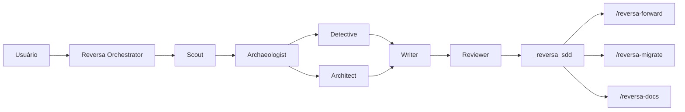
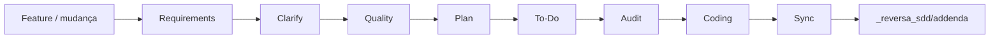
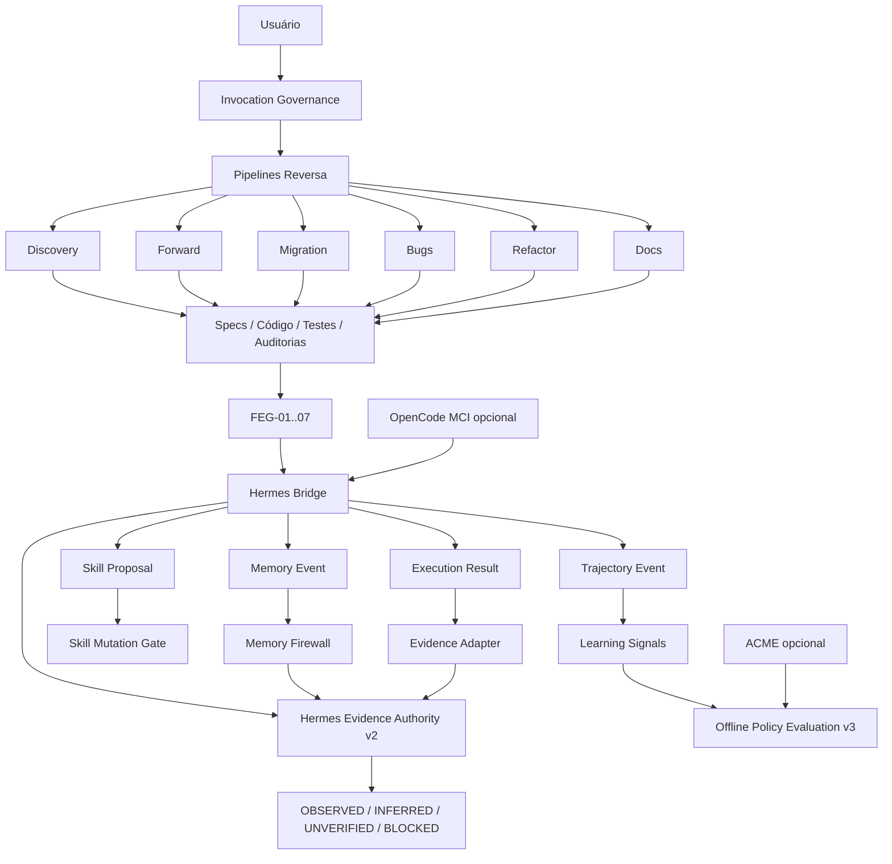
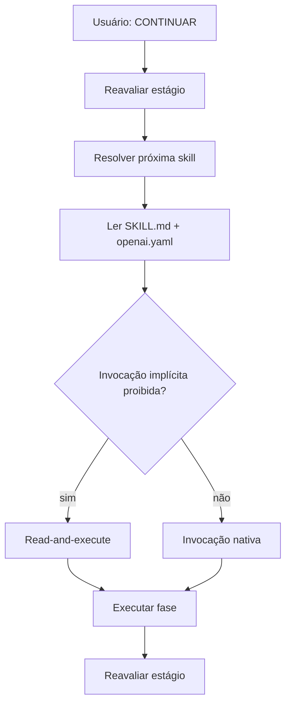

# ReversaFeynman

**Engenharia reversa, especificações executáveis, validação epistemológica, memória longitudinal governada e aprendizagem adaptativa para agentes de IA.**

**Identidade canônica preparada:** `MarceloClaro/reversaFeynman`

> **Estado do slug no GitHub — 13/09/2026:** o repositório físico ainda está publicado como `MarceloClaro/reversa`. A identidade `MarceloClaro/reversaFeynman` já é usada pelo código e pela documentação, mas o rename administrativo do GitHub ainda não foi concluído. Até esse rename, comandos que apontem diretamente para `github:MarceloClaro/reversaFeynman` podem falhar.

ReversaFeynman é uma linha independente mantida por **Marcelo Claro Laranjeira**, derivada historicamente do framework **Reversa** original e licenciada sob MIT.

A edição preserva engenharia reversa, SDD, rastreabilidade, pipelines especializados e compatibilidade multi-engine, acrescentando seis camadas principais:

- **Feynman Evidence & Understanding Layer** — FEG-01..FEG-07, evidência, falsificabilidade e Teach-back;
- **Invocation Governance** — handoff seguro para skills protegidas;
- **Adaptive Governance v2** — MCI/ACME bridges, ledger auditável, shadow policy, drift detection e ativação controlada;
- **Offline Policy Evaluation v3** — `decide → observe`, holdout temporal, Brier/ECE, reward/regret, IC95% bootstrap e Adaptive Governance Report;
- **Hermes Bridge v1** — memória longitudinal, skill proposals em shadow, trajetórias e execution results;
- **Hermes Evidence Authority v2** — autoridade epistemológica canônica do runtime ReversaFeynman, substituindo a implementação autônoma anterior do Evidence Guard.

> A linha independente não apaga a proveniência do Reversa original nem a autoria externa das integrações estudadas. Independência operacional não significa independência de proveniência.

Documentos principais:

- [`INDEPENDENCE.md`](INDEPENDENCE.md)
- [`docs/ACADEMIC-PROVENANCE.md`](docs/ACADEMIC-PROVENANCE.md)
- [`docs/HERMES-BRIDGE.md`](docs/HERMES-BRIDGE.md)
- [`specs/SPEC-HERMES-EVIDENCE-AUTHORITY-V2.md`](specs/SPEC-HERMES-EVIDENCE-AUTHORITY-V2.md)
- [`CITATION.cff`](CITATION.cff)

---

# Origem acadêmica e atribuição explícita

## Reversa original — obra de origem

O **ReversaFeynman é uma obra derivada do framework Reversa original**, publicado no repositório:

**SANDECO — Reversa**  
https://github.com/sandeco/reversa

O Reversa original estabelece a base conceitual e arquitetural de **reverse documentation engineering** utilizada nesta linha: análise de sistemas legados, pipeline multiagente, extração de regras e decisões implícitas, geração de especificações operacionais rastreáveis e uso dessas especificações por agentes de IA.

A referência científica primária do framework original é:

**Sanderson Oliveira de Macedo; Ronaldo Martins da Costa.**  
**Reversa: A Reverse Documentation Engineering Framework for Converting Legacy Software into Operational Specifications for AI Agents.**  
arXiv, 2026. `arXiv:2605.18684`. Categoria principal `cs.SE`. Submetido em 18 de maio de 2026.  
https://arxiv.org/abs/2605.18684  
DOI persistente: https://doi.org/10.48550/arXiv.2605.18684

## Referência do paper original — ABNT

> MACEDO, Sanderson Oliveira de; COSTA, Ronaldo Martins da. **Reversa: A Reverse Documentation Engineering Framework for Converting Legacy Software into Operational Specifications for AI Agents**. arXiv, 2026. arXiv:2605.18684. DOI: 10.48550/arXiv.2605.18684. Disponível em: https://arxiv.org/abs/2605.18684. Acesso em: 13 set. 2026.

## Referência do software original — ABNT

> SANDECO. **Reversa**: transform legacy systems into executable specifications for AI coding agents. GitHub, 2026. Disponível em: https://github.com/sandeco/reversa. Acesso em: 13 set. 2026.

## BibTeX do paper original

```bibtex
@misc{demacedo2026reversa,
  title         = {Reversa: A Reverse Documentation Engineering Framework for Converting Legacy Software into Operational Specifications for AI Agents},
  author        = {Sanderson Oliveira de Macedo and Ronaldo Martins da Costa},
  year          = {2026},
  eprint        = {2605.18684},
  archivePrefix = {arXiv},
  primaryClass  = {cs.SE},
  doi           = {10.48550/arXiv.2605.18684},
  url           = {https://arxiv.org/abs/2605.18684}
}
```

## Referência do software original — BibTeX

```bibtex
@software{sandeco_reversa_2026,
  author = {{sandeco}},
  title  = {Reversa},
  year   = {2026},
  url    = {https://github.com/sandeco/reversa},
  note   = {Original Reversa repository; MIT License}
}
```

## Delimitação de autoria e contribuição

| Camada | Proveniência |
|---|---|
| conceito de reverse documentation engineering | **Reversa original — Macedo & da Costa / sandeco** |
| Discovery e pipeline multiagente | **Reversa original** |
| especificações operacionais rastreáveis | **Reversa original** |
| estrutura `.reversa/`, famílias `/reversa-*` e compatibilidade multi-engine | **Reversa original / evolução do projeto-base** |
| Forward, Migration, Documentation, Bugs e Refactor | **arquitetura-base Reversa** |
| Feynman Evidence & Understanding Layer | **extensão ReversaFeynman** |
| FEG-01..FEG-07 e Teach-back | **extensão ReversaFeynman** |
| `OBSERVED / INFERRED / UNVERIFIED / BLOCKED` | **extensão ReversaFeynman** |
| Invocation Governance | **extensão ReversaFeynman** |
| MCI/ACME Adaptive Governance | **extensão ReversaFeynman** |
| Audit Ledger, shadow policy e drift detection | **extensão ReversaFeynman** |
| Offline Policy Evaluation v3 | **extensão ReversaFeynman** |
| memória persistente, procedural skills, subagentes e trajetórias Hermes | **Hermes Agent — Nous Research** |
| Hermes Bridge contracts / Memory Firewall / Skill Mutation Gate | **extensão ReversaFeynman** |
| Hermes Evidence Authority v2 | **extensão ReversaFeynman na camada Hermes** |

---

# Hermes Agent — proveniência externa

Hermes Agent é um projeto externo da **Nous Research**.

- projeto original: `https://github.com/NousResearch/hermes-agent`
- fork de estudo/interoperabilidade: `https://github.com/MarceloClaro/hermes-agent`
- licença indicada pelo projeto: MIT

O fork `MarceloClaro/hermes-agent` não transfere autoria do Hermes Agent para o ReversaFeynman.

Capacidades atribuídas ao Hermes/Nous Research enquanto projeto externo:

- memória persistente/cross-session;
- procedural memory e skills;
- melhoria de skills baseada em experiência;
- ferramentas e subagentes;
- execução distribuída;
- geração/compressão de trajetórias.

Extensões próprias do ReversaFeynman para interoperabilidade:

- `reversa.hermes.memory/v1`;
- `reversa.hermes.skill.proposal/v1`;
- `reversa.hermes.trajectory/v1`;
- `reversa.hermes.execution.result/v1`;
- `reversa.hermes.evidence.decision/v1`;
- Memory Firewall;
- Skill Mutation Gate;
- Hermes Evidence Adapter;
- Hermes Evidence Authority v2.

---

# Evolução arquitetural

| Dimensão | Reversa base | ReversaFeynman | Adaptive v2 | Offline v3 | Hermes v1/v2 |
|---|---|---|---|---|---|
| Engenharia reversa | Discovery + specs | preservada | preservada | preservada | preservada |
| Forward | requirements → coding → sync | handoff seguro | ranking opcional | `decide → observe` | contexto/memória opcional |
| Evidência | CONFIRMED / INFERRED / GAP | `OBSERVED / INFERRED / UNVERIFIED / BLOCKED` | policy sem autoridade | métricas sem autoridade | Hermes é autoridade de decisão, memória não é evidência |
| Auditoria | Reviewer / Quality / Audit | FEG-01..07 | ledger + drift | holdout + calibration | memory firewall + evidence authority |
| Fonte humana | perguntas/validação | Teach-back | separada de `OBSERVED` | idem | continua não-direta |
| Aprendizagem | não | não | ACME opcional | avaliação offline | skills/trajectories opcionais |
| Reward | não | não | `heuristic-v1` | baseline × shadow | não autoriza evidência |
| Policy | determinística | determinística | contextual shadow | holdout temporal | não substitui autoridade de evidência |
| Drift | não | não | sim | gate obrigatório | também bloqueia skill promotion |
| Auto-ativação | não | não | não | não | não |
| Runtime externo | não | não | ACME/MCI opcionais | opcionais | Hermes externo opcional |
| Evidence engine | implícito | Evidence Guard | Evidence Guard | Evidence Guard | **Hermes Evidence Authority v2** |

---

# Arquitetura original do Reversa

A arquitetura-base herdada usa **orquestradores especializados + agentes de fase + artefatos persistidos em disco**.

## Discovery



Fluxo conceitual:

```text
Reconnaissance → Excavation → Interpretation → Generation → Review
     Scout        Archaeologist   Detective       Writer     Reviewer
                                     Architect
```

## Evolução de feature



---

# Arquitetura ReversaFeynman atual



Invariantes:

```text
TEACHBACK_GREEN ≠ OBSERVED
HUMAN-VALIDATED ≠ OBSERVED
policy confidence ≠ OBSERVED
reward ≠ OBSERVED
Brier/ECE ≠ OBSERVED
Hermes memory ≠ OBSERVED
Hermes confidence ≠ OBSERVED
Hermes skill success ≠ OBSERVED
```

A mudança central da v2 Hermes é:

```text
Hermes Evidence Authority = autoridade de decisão
Hermes Memory             ≠ evidência direta
```

---

# Feynman Evidence & Understanding Layer

| Gate | Pergunta operacional |
|---|---|
| `FEG-01` | O mecanismo pode ser explicado sem depender apenas do nome? |
| `FEG-02` | A afirmação forte possui evidência/proveniência? |
| `FEG-03` | Observação e inferência estão separadas? |
| `FEG-04` | Existe teste/oracle capaz de refutar? |
| `FEG-05` | A solução resolve necessidade demonstrada ou é cargo cult? |
| `FEG-06` | Qual menor experimento reduz a incerteza? |
| `FEG-07` | A fonte humana explica mecanismo e transfere para cenário variante? |

Estados epistemológicos:

```text
OBSERVED
INFERRED
UNVERIFIED
BLOCKED
```

Estados humanos:

```text
HUMAN-VALIDATED
HUMAN-PARTIAL
HUMAN-CONFLICT
```

FEG-07 permanece fora do score-base FEG-01..06 (`0..12`).

---

# Invocation Governance

Cada skill é classificada como model-invoked ou user-invoked.

Skills protegidas mantêm lockstep:

```text
SKILL.md: disable-model-invocation: true
openai.yaml: policy.allow_implicit_invocation: false
```

Quando `CONTINUAR` resolve uma skill protegida, o orquestrador:

1. reavalia o estágio físico;
2. localiza a próxima skill;
3. lê `SKILL.md` e `agents/openai.yaml`;
4. se invocação implícita for proibida, executa as instruções lendo a skill no contexto atual;
5. preserva estado e artefatos;
6. retorna ao orquestrador.



## Economia histórica de contexto

A política de invocação documentada na evolução do framework reduziu skills permanentemente model-invoked de **65 para 9** e descriptions permanentemente carregadas de aproximadamente **4.987 para 668 tokens**, cerca de **86% nesse componente específico**.

Esse número é histórico da evolução de Invocation Governance; não é apresentado como benchmark global do ReversaFeynman.

---

# Adaptive Governance v2

A camada adaptativa reside em:

```text
lib/integrations/adaptive/
```

Ela fornece:

- Learning Event v1;
- MCI Envelope v1;
- ACME Experience v1;
- reward `heuristic-v1`;
- Audit Ledger SHA-256;
- contextual shadow policy;
- drift detection;
- explicit activation request;
- governança de ações mutantes.

Toda proposal adaptativa nasce em shadow:

```text
mode = shadow
evidence_authority = false
```

Ações mutantes continuam exigindo aprovação do workflow.

---

# Offline Policy Evaluation v3

A v3 separa explicitamente decisão e outcome:

```text
decide(contexto + histórico anterior)
            ↓
workflow baseline executa
            ↓
observe(outcome)
            ↓
histórico é atualizado
```

Nunca:

```text
outcome atual → histórico → decisão do mesmo evento
```

API:

```js
const decision = runtime.decide(event);
const result = await runtime.observe(event, { decision });
```

`ingest(event)` permanece por compatibilidade e internamente respeita `decide → observe`.

## Holdout temporal

`evaluateOfflinePolicy()` ordena decision records por `decided_at` e separa treino/holdout.

Baseline:

```text
trainFraction = 0.70
```

## Calibração

Brier:

```text
Brier = mean((confidence - outcome)^2)
```

Expected Calibration Error:

```text
ECE = Σ weight_bin × |avg_confidence_bin - accuracy_bin|
```

A calibração é calculada apenas onde há outcome diretamente observado para a ação shadow correspondente.

## Reward, regret e IC95%

A avaliação calcula:

- reward baseline estimado;
- reward shadow estimado;
- delta estimado;
- regret baseline estimado;
- regret shadow estimado;
- IC95% bootstrap determinístico para o delta.

```text
IC95% ≠ prova causal
```

## Promotion Readiness

Defaults operacionais configuráveis:

| Gate | Default |
|---|---:|
| `minRecords` | 30 |
| `minMatchedShadow` | 12 |
| `minShadowCoverage` | 0.20 |
| `maxBrier` | 0.25 |
| `maxEce` | 0.20 |
| `maxEstimatedShadowRegret` | 0.10 |
| `minEstimatedRewardDelta` | 0.00 |

Mesmo quando todos os gates passam:

```text
eligible_for_activation_request = true
auto_activate = false
```

---

# Hermes Bridge v1

A integração Hermes reside em:

```text
lib/integrations/hermes/
```

Contratos:

```text
reversa.hermes.memory/v1
reversa.hermes.skill.proposal/v1
reversa.hermes.trajectory/v1
reversa.hermes.execution.result/v1
```

## Memory Firewall

Memória pode contextualizar, mas não estabelecer verdade por si mesma.

`reversa.hermes.memory/v1` aceita apenas:

```text
INFERRED
UNVERIFIED
BLOCKED
```

`OBSERVED` é rejeitado no contrato de memória.

Memória de personalização continua isolada:

```text
scope = personalization
        ↓
context only
        ↓
evidence_authority = false
```

## Skill Mutation Gate

Toda proposta de skill nasce com:

```text
mode = shadow
requires_review = true
requires_tests = true
evidence_authority = false
```

Elegibilidade exige:

```text
reviewApproved
AND testsPassing
AND feynmanApproved
AND no drift
```

Mesmo elegível:

```text
executable = false
file_mutation_performed = false
```

A bridge não aplica mutações de skill automaticamente.

## Trajectory Event

Sinais extraídos:

- step count;
- failed steps;
- tool calls;
- known duration;
- repeated actions;
- completion state.

Trajetória é dado operacional, não verdade de domínio.

---

# Hermes Evidence Authority v2

## Decisão arquitetural

O antigo arquivo:

```text
lib/integrations/adaptive/evidence-guard.js
```

**não é mais a implementação do gate epistemológico.**

Ele permanece como fachada retrocompatível.

A implementação canônica é:

```text
lib/integrations/hermes/evidence-authority.js
```

Contrato de decisão:

```text
reversa.hermes.evidence.decision/v1
```

Toda decisão identifica:

```text
authority = hermes
engine = hermes-evidence-authority-v2
evidence_authority = true
```

## Regra para OBSERVED

`OBSERVED` só pode ser aceito quando:

```text
source.direct === true
AND source.kind ∈ allowlist de evidência direta
AND source.ref é rastreável
```

Tipos baseline:

```text
code
contract
test
execution
log
dataset
artifact
```

Fontes que **não** podem produzir `OBSERVED` sozinhas:

```text
hermes-memory
hermes-skill
hermes-confidence
learned-policy
mci-trust
human
```

## Memory context

A autoridade pode receber `memoryContext`, mas o contexto serve apenas para diagnóstico/proveniência:

- memória válida;
- memória inválida;
- memória de personalização;
- refs de memória.

Memória não altera uma rejeição por falta de evidência direta.

## API canônica

```js
import {
  createHermesBridge,
  createHermesEvidenceAuthority,
  evaluateHermesEvidenceProposal,
  applyHermesEvidenceProposal,
} from './lib/integrations/hermes/index.js';
```

Exemplo:

```js
const hermes = createHermesBridge();

const decision = hermes.evaluateEvidence({
  current: 'INFERRED',
  proposed: 'OBSERVED',
  source: {
    kind: 'test',
    direct: true,
    ref: 'tests/example.test.js:42',
  },
});
```

A bridge expõe:

```text
hermes.evidenceAuthority
hermes.evaluateEvidence
hermes.applyEvidence
```

## Compatibilidade legada

Consumidores antigos ainda podem usar:

```js
import {
  applyEvidenceProposal,
  evaluateEvidenceProposal,
} from './lib/integrations/adaptive/index.js';
```

Essas funções agora delegam diretamente ao Hermes.

Claim aplicada:

```text
hermes_evidence_authority = decisão canônica
```

Compatibilidade temporária:

```text
epistemic_guard = mesma decisão canônica
```

Os dois campos apontam para o mesmo objeto congelado.

---

# Por que substituir o Evidence Guard pelo Hermes

A substituição consolida memória, execução, trajetória e classificação de evidência em uma única fronteira Hermes sem permitir que memória probabilística vire verdade automaticamente.

Antes:

```text
Hermes memory/execution
        ↓
Hermes Evidence Adapter
        ↓
Adaptive Evidence Guard
        ↓
Epistemic state
```

Agora:

```text
Hermes memory/execution/skills/trajectory
        ↓
Hermes Bridge
        ↓
Hermes Evidence Authority v2
        ↓
Epistemic state
```

O ganho arquitetural é reduzir duplicação de responsabilidade. A regra de verdade continua conservadora.

---

# SDD + TDD

## SPECs

```text
specs/SPEC-FEYNMAN-EVIDENCE-UNDERSTANDING-LAYER.md
specs/SPEC-ADAPTIVE-MCI-ACME-BRIDGE.md
specs/SPEC-ADAPTIVE-GOVERNANCE-V2.md
specs/SPEC-ADAPTIVE-OFFLINE-EVALUATION-V3.md
specs/SPEC-HERMES-BRIDGE-V1.md
specs/SPEC-HERMES-EVIDENCE-AUTHORITY-V2.md
```

## TDD da Hermes Evidence Authority

Sequência registrada:

```text
SPEC v2
   ↓
RED: teste importa API Hermes inexistente
   ↓
GREEN: authority + facade + adapter
   ↓
REFACTOR: Bridge exposure + docs + CI
```

Teste principal:

```text
scripts/test-hermes-evidence-authority.mjs
```

Ele verifica:

1. `test` direto pode produzir `OBSERVED`;
2. `hermes-memory` não produz `OBSERVED` mesmo com confidence `1.0`;
3. `learned-policy`, `mci-trust`, `human`, `hermes-skill` e `hermes-confidence` são bloqueados como autoridade direta;
4. transições não-OBSERVED continuam válidas;
5. memory context não altera a decisão de uma fonte indireta;
6. decisão direta é estável com/sem memória;
7. claim aplicada expõe `hermes_evidence_authority`;
8. `epistemic_guard` é apenas alias do mesmo objeto;
9. API legada delega ao Hermes;
10. adapter usa classificação Hermes;
11. arquivo adaptativo antigo não contém lógica própria de allowlist;
12. `createHermesBridge()` expõe a autoridade canônica.

---

# Audit Ledger

A camada adaptativa preserva uma cadeia SHA-256:

```text
genesis_hash
    ↓
entry_1 = H(sequence + previous_hash + payload_hash)
    ↓
entry_2 = H(sequence + previous_hash + payload_hash)
    ↓
...
```

Propriedades:

- dedupe por `event_id`;
- payload canonicalizado;
- hash encadeado;
- verificação integral;
- snapshot somente leitura;
- exportação JSONL.

---

# Equipes e agentes

A taxonomia funcional preserva os grupos herdados.

## Discovery Core — 13

```text
reversa
reversa-autonomous
reversa-scout
reversa-archaeologist
reversa-detective
reversa-architect
reversa-writer
reversa-reviewer
reversa-visor
reversa-data-master
reversa-design-system
reversa-agents-help
reversa-reconstructor
```

## Migration — 7

```text
reversa-migrate
reversa-paradigm-advisor
reversa-curator
reversa-strategist
reversa-designer
reversa-screen-translator
reversa-inspector
```

## Translators — 1

```text
reversa-n8n
```

## Pricing — 3

```text
reversa-pricing-profile
reversa-pricing-size
reversa-pricing-estimate
```

## Forward — 13

```text
reversa-forward
reversa-requirements
reversa-clarify
reversa-plan
reversa-to-do
reversa-audit
reversa-quality
reversa-coding
reversa-code-express
reversa-add
reversa-sync
reversa-principles
reversa-resume
```

## Documentation — 10

```text
reversa-docs
reversa-docs-mapper
reversa-docs-analyst
reversa-docs-storyteller
reversa-docs-publisher
reversa-arquitetura-3d
reversa-selo-generativo
reversa-highcharts-visualizer
reversa-especialista-d3
reversa-image-prompt-json
```

## Ideation — 6

```text
reversa-brainstorm
reversa-framer
reversa-explorer
reversa-challenger
reversa-arbiter
reversa-pre-spec
```

## New Project — 5

```text
reversa-new
reversa-ideator
reversa-researcher
reversa-drafter
reversa-spec-sdd
```

## Bugs — 5

```text
reversa-debugger
reversa-debugger-fix
reversa-debugger-debate
reversa-depth-inspection
reversa-debugger-graph
```

## Refactor — 8

```text
reversa-refactor
reversa-restructure
reversa-modularize
reversa-decouple
reversa-optimize
reversa-simplify
reversa-standardize
reversa-prune
```

## Transversais — 2

```text
reversa-feynman
reversa-teachback
```

A taxonomia documentada soma **73 skills/agentes**.

---

# Artefatos gerados

## Discovery

```text
_reversa_sdd/
├── inventory.md
├── dependencies.md
├── code-analysis.md
├── data-dictionary.md
├── domain.md
├── state-machines.md
├── permissions.md
├── architecture.md
├── c4-context.md
├── c4-containers.md
├── c4-components.md
├── erd-complete.md
├── confidence-report.md
├── gaps.md
├── questions.md
├── sdd/
├── openapi/
├── user-stories/
├── adrs/
├── flowcharts/
├── sequences/
├── ui/
├── database/
├── design-system/
├── addenda/
└── traceability/
```

## Forward

```text
_reversa_forward/
└── <NNN>-<short-name>/
    ├── requirements.md
    ├── roadmap.md
    ├── investigation.md
    ├── data-delta.md
    ├── onboarding.md
    ├── interfaces/
    ├── actions.md
    ├── progress.jsonl
    ├── legacy-impact.md
    ├── regression-watch.md
    └── audit/
        ├── requirements-audit.md
        ├── cross-check.md
        ├── feynman-audit.md
        └── teachback.md
```

## Adaptive Governance

```text
_reversa_sdd/
└── adaptive/
    └── governance-report.md
```

A persistência do governance report é opt-in.

---

# Instalação

Enquanto o slug físico permanecer `MarceloClaro/reversa`:

```bash
npm exec --yes --package=github:MarceloClaro/reversa -- reversa install
```

Após o rename administrativo para `MarceloClaro/reversaFeynman`:

```bash
npm exec --yes --package=github:MarceloClaro/reversaFeynman -- reversa install
```

Requisitos do core:

- Node.js `>=18.20.2`;
- pelo menos um harness/agente compatível.

OpenCode MCI, ACME, Hermes Agent externo, JAX, TensorFlow e stacks Python permanecem opcionais.

A **Hermes Evidence Authority v2 é local em JavaScript** e não exige que um processo Hermes externo esteja ativo.

---

# Como usar

| Objetivo | Comando |
|---|---|
| Analisar legado | `/reversa` |
| Discovery autônomo | `/reversa-autonomous` |
| Brainstorm | `/reversa-brainstorm` |
| Projeto novo | `/reversa-new` |
| Evoluir feature | `/reversa-forward` |
| Pequena emenda | `/reversa-add` |
| Sincronizar addendum | `/reversa-sync` |
| Migrar/reconstruir | `/reversa-migrate` |
| Documentar | `/reversa-docs` |
| Registrar bug | `/reversa-debugger` |
| Corrigir bug | `/reversa-debugger-fix` |
| Debate de bug | `/reversa-debugger-debate` |
| Refatorar | `/reversa-refactor` |
| Pricing | `/reversa-pricing-profile`, `/reversa-pricing-size`, `/reversa-pricing-estimate` |
| Auditoria Feynman | `/reversa-feynman` |
| Teach-back | `/reversa-teachback` |
| Ajuda | `/reversa-agents-help` |

Adaptive Governance e Hermes Bridge/Evidence Authority são APIs internas; não adicionam slash commands nesta versão.

---

# Engines suportadas

| Engine | Entry file | Skills path |
|---|---|---|
| Claude Code ⭐ | `CLAUDE.md` | `.claude/skills/` + `.agents/skills/` |
| Codex ⭐ | `AGENTS.md` | `.agents/skills/` |
| Cursor ⭐ | `.cursorrules` | `.agents/skills/` |
| Gemini CLI | `GEMINI.md` | `.agents/skills/` |
| Windsurf | `.windsurfrules` | `.agents/skills/` |
| Antigravity | `AGENTS.md` | `.agents/skills/` |
| Kiro | — | `.kiro/skills/` + `.agents/skills/` |
| Opencode | `AGENTS.md` | `.agents/skills/` |
| Hermes | `AGENTS.md` | `.agents/skills/` |
| Cline | `.clinerules` | `.agents/skills/` |
| Roo Code | `.roorules` | `.agents/skills/` |
| GitHub Copilot | `.github/copilot-instructions.md` | `.agents/skills/` |
| Aider | `CONVENTIONS.md` | `.agents/skills/` |
| Amazon Q Developer | `.amazonq/rules/reversa.md` | `.agents/skills/` |

> A linha **Hermes** nesta tabela significa compatibilidade do installer com o harness/engine. **Hermes Bridge** e **Hermes Evidence Authority** são camadas arquiteturais distintas.

---

# Independência de upstream

ReversaFeynman pode estudar e incorporar ideias externas sem sincronização automática.

O guard estrutural rejeita padrões como:

```text
gh repo sync
git remote add upstream
git remote set-url upstream
git fetch upstream
git pull upstream
git merge upstream/...
```

`package.json` permanece:

```text
private: true
```

A independência operacional não altera obrigações de atribuição.

---

# Estrutura interna

```text
.reversa/
├── state.json
├── config.toml
├── config.user.toml
├── plan.md
├── version
├── context/
└── _config/

agents/
lib/
├── commands/
├── installer/
├── integrations/
│   ├── adaptive/
│   │   └── evidence-guard.js      # compatibility facade
│   └── hermes/
│       ├── constants.js
│       ├── schema.js
│       ├── contracts.js
│       ├── memory-firewall.js
│       ├── skill-governance.js
│       ├── trajectory.js
│       ├── evidence-authority.js  # canonical authority
│       ├── evidence-adapter.js
│       ├── bridge.js
│       └── index.js
└── utils/

scripts/
specs/
docs/
CITATION.cff
INDEPENDENCE.md
```

---

# Verificação estrutural

```bash
npm run verify
```

A suíte inclui:

```text
scripts/verify-no-upstream-sync.py
scripts/verify-invocation.py
scripts/verify-feynman-layer.py
scripts/test-installer-transport.mjs
scripts/test-adaptive-bridges.mjs
scripts/test-offline-policy-evaluation.mjs
scripts/test-hermes-bridge.mjs
scripts/test-hermes-evidence-authority.mjs
scripts/test-hermes-optionality.mjs
```

A Hermes Evidence Authority v2 verifica explicitamente:

- autoridade Hermes no decision object;
- aceitação de evidência direta permitida;
- bloqueio de memória/confidence/policy/trust/human como evidência direta;
- estabilidade da decisão com/sem memória;
- compatibilidade da API legada;
- ausência de lógica independente no antigo Evidence Guard;
- execução adapter usando classificação Hermes;
- exposição pela `createHermesBridge()`.

> Falha de provisionamento de runner não deve ser apresentada como falha nem como aprovação dos testes quando nenhum step tiver executado.

---

# Referências de integração

A arquitetura interoperável utiliza como referências:

- `MarceloClaro/opencode-ecosystem-core` — MCI, MetaBus, Blackboard, Trust/Confidence e coordenação multiagente;
- `MarceloClaro/acme` — fork de estudo do framework ACME para Actor/Learner e policy learning;
- `NousResearch/hermes-agent` — projeto original Hermes Agent;
- `MarceloClaro/hermes-agent` — fork utilizado no ecossistema MarceloClaro para estudo/interoperabilidade.

Esses projetos permanecem externos e opcionais. O ReversaFeynman implementa contratos de fronteira e governança própria.

---

# Proveniência, prioridade acadêmica e licença

O framework-base deste repositório é o **Reversa original**, de `sandeco/reversa`, associado ao paper de **Sanderson Oliveira de Macedo** e **Ronaldo Martins da Costa**.

A prioridade intelectual do conceito-base, da arquitetura original e dos mecanismos já existentes em `sandeco/reversa` permanece atribuída ao projeto e aos autores originais.

Hermes Agent permanece atribuído à **Nous Research**. A Hermes Evidence Authority v2 é uma extensão do ReversaFeynman implementada na camada de interoperabilidade Hermes; ela não deve ser confundida com autoria do Hermes Agent original.

Para trabalhos acadêmicos recomenda-se:

1. citar o paper do Reversa original;
2. identificar versão/tag/commit do ReversaFeynman utilizado;
3. quando a integração Hermes for material, atribuir Hermes Agent à Nous Research.

Licença do software: **MIT** — consulte [`LICENSE`](LICENSE).

---

# Síntese

```text
Reversa original — sandeco / Macedo & Costa (2026)
    │
    ├── reverse documentation engineering
    ├── engenharia reversa
    ├── SDD e rastreabilidade
    ├── pipelines especializados
    └── multi-engine installer

            +

ReversaFeynman
    │
    ├── FEG-01..07
    ├── evidence provenance
    ├── observation ≠ inference
    ├── falsifiability
    ├── Teach-back
    └── invocation governance

            +

Adaptive Governance v2
    │
    ├── MCI envelope
    ├── ACME experience
    ├── reward baseline
    ├── audit ledger
    ├── drift detection
    └── contextual shadow policy

            +

Offline Policy Evaluation v3
    │
    ├── decide → observe
    ├── temporal holdout
    ├── Brier / ECE
    ├── reward / regret
    ├── bootstrap IC95%
    └── auto_activate = false

            +

Hermes Bridge v1
    │
    ├── memory firewall
    ├── skill proposals in shadow
    ├── trajectory signals
    ├── execution contracts
    └── optional transport

            +

Hermes Evidence Authority v2
    │
    ├── canonical evidence decision engine
    ├── memory context without truth escalation
    ├── direct evidence classifier
    ├── claim promotion to OBSERVED
    ├── Adaptive compatibility facade
    └── no external runtime dependency
```

Fluxo atual:

```text
extrair
  → compreender
  → especificar
  → recuperar memória sob firewall
  → decidir em shadow
  → executar baseline/subagentes
  → registrar trajetória
  → observar outcome
  → classificar evidência no Hermes
  → aplicar estado epistemológico
  → calibrar
  → avaliar offline
  → detectar drift
  → propor skill em shadow
  → revisar + testar + auditar Feynman
  → solicitar ativação/mudança pelo workflow normal
  → reavaliar
```

O Hermes agora substitui o Evidence Guard como **autoridade de decisão epistemológica**, sem permitir que memória, confiança, reward ou aprendizagem probabilística substituam evidência direta verificável.
