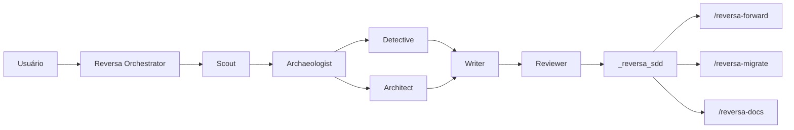
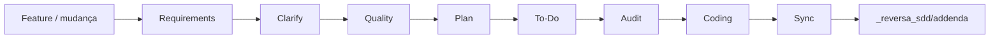
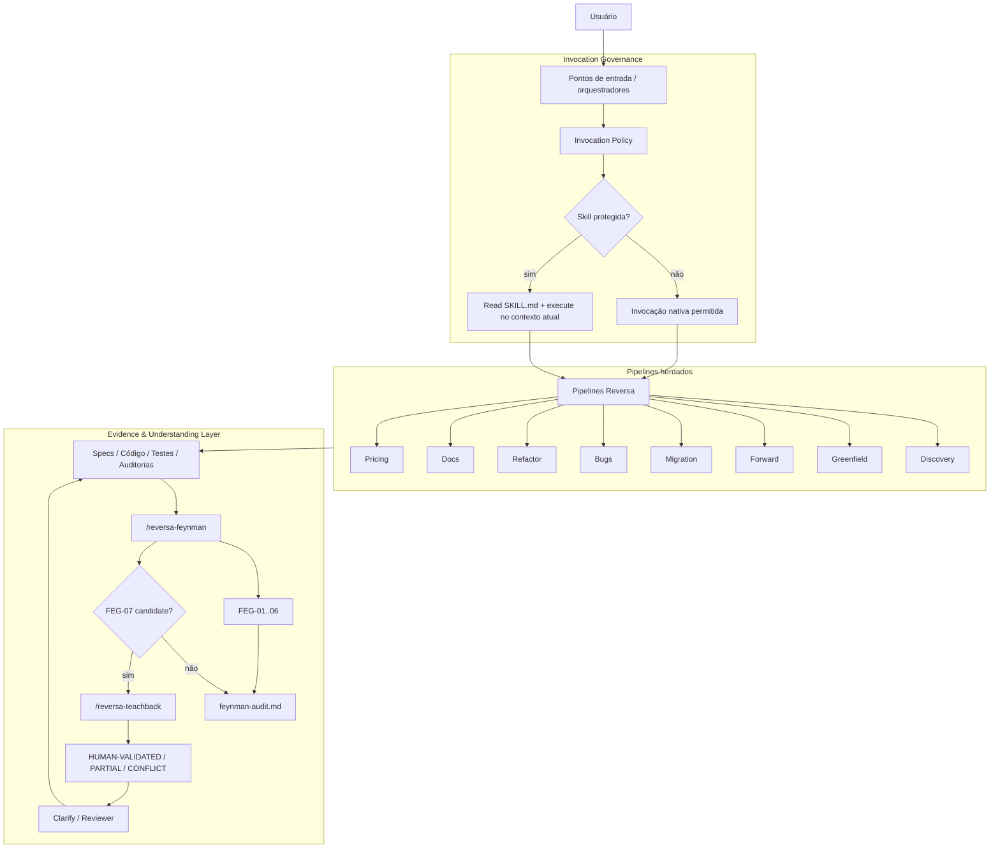
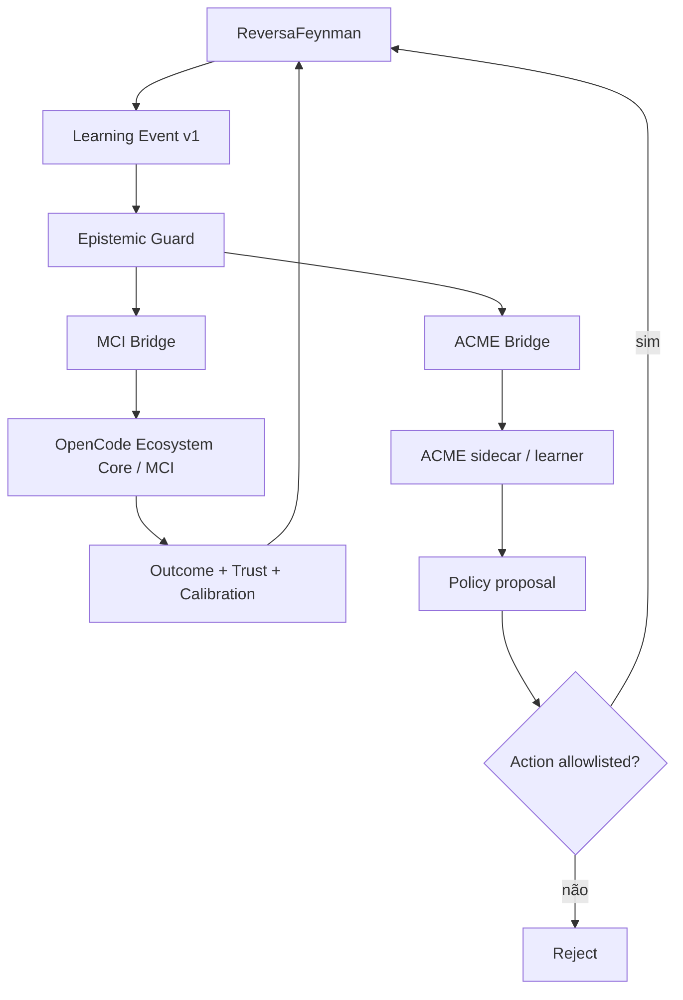
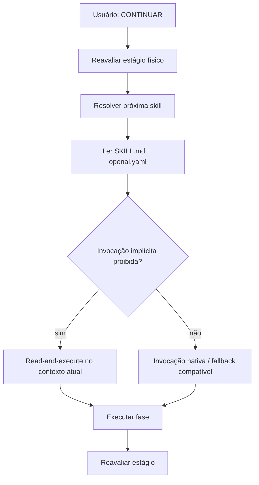

# ReversaFeynman

**Engenharia reversa, especificações executáveis, validação epistemológica e aprendizagem adaptativa orientada por evidências para agentes de IA.**

**Repositório canônico:** `MarceloClaro/reversaFeynman`

ReversaFeynman é uma linha independente mantida por **Marcelo Claro Laranjeira**, derivada historicamente do framework **Reversa** original e licenciada sob MIT. A base de engenharia reversa, SDD, pipelines especializados, rastreabilidade e compatibilidade multi-engine é preservada. Sobre ela, esta edição acrescenta:

- Feynman Evidence & Understanding Layer;
- FEG-01..FEG-07;
- Teach-back;
- governança de invocação e handoff seguro;
- estados epistemológicos explícitos;
- integração opcional com **OpenCode Ecosystem Core / MCI**;
- integração opcional com **ACME** por protocolo de experiência e sidecar;
- reward baseline auditável;
- allowlist de ações adaptativas;
- guard que impede uma política aprendida de fabricar `OBSERVED`.

> A independência desta árvore não apaga a proveniência do projeto original. Referências ao Reversa, ao paper e aos autores originais são mantidas. O que muda é a linha de desenvolvimento, distribuição e as extensões arquiteturais desta edição.

> Política completa de independência: [`INDEPENDENCE.md`](INDEPENDENCE.md)

---

## Paper e origem científica

O framework Reversa original é associado ao trabalho:

> **Reversa: A Reverse Documentation Engineering Framework for Converting Legacy Software into Operational Specifications for AI Agents** — Macedo & da Costa, 2026.

Paper: https://arxiv.org/abs/2605.18684

O ReversaFeynman mantém o objetivo central do framework: transformar conhecimento preso em sistemas legados em contratos operacionais rastreáveis para agentes de IA.

A extensão Feynman adiciona uma segunda pergunta:

> **Como sabemos que aquilo que a especificação afirma está realmente sustentado por evidência ou compreensão demonstrável?**

A camada adaptativa adiciona uma terceira:

> **Dado o histórico de resultados, qual agente, rota ou estratégia devemos selecionar sem confundir probabilidade aprendida com verdade observada?**

---

# Reversa original × ReversaFeynman

## Resumo executivo

| Dimensão | Reversa original / arquitetura-base | ReversaFeynman atual | Impacto principal |
|---|---|---|---|
| Objetivo central | Converter legado em especificações operacionais | Mantido | Compatibilidade conceitual preservada |
| Discovery | Scout → Archaeologist → Detective/Architect → Writer → Reviewer | Mantido | Não quebra o fluxo central |
| Forward | Requirements → Clarify → Quality → Plan → To-Do → Audit → Coding → Sync | Mantido com handoff seguro | Evita invocação incompatível de skills protegidas |
| Evidência | CONFIRMED / INFERRED / GAP | `OBSERVED / INFERRED / UNVERIFIED / BLOCKED` | Separação mais forte entre observação e inferência |
| Auditoria | Reviewer, Quality e Audit | FEG-01..06 + `/reversa-feynman` | Proveniência, falsificabilidade e anti-cargo-cult |
| Conhecimento humano | Perguntas e validação | FEG-07 + `/reversa-teachback` | Fluência humana não vira evidência técnica automaticamente |
| Invocação | model-invoked/user-invoked | Policy lockstep + read-and-execute | Mantém proteção sem interromper orquestração |
| Metacognição | Não era camada do núcleo | MCI envelope opcional | Estado, confiança, trust, abstention e gates exportáveis |
| Aprendizagem adaptativa | Não era camada do núcleo | ACME experience opcional | Permite aprender seleção/rankeamento de rotas por outcome |
| Reward | Não aplicável | `heuristic-v1`, auditável e limitado | Baseline falsificável, não autoridade epistemológica |
| Segurança adaptativa | Não aplicável | allowlist + evidence guard | RL não executa qualquer ação nem cria `OBSERVED` |
| Distribuição | Linha original | `MarceloClaro/reversaFeynman` | Evolução independente |
| Upstream | Projeto de origem | Sem sync automático | Incorporação externa somente por decisão explícita |

## O que não mudou

ReversaFeynman não é uma reescrita incompatível. Ele preserva:

- comandos `/reversa-*`;
- binário `reversa`;
- `.reversa/`;
- `_reversa_sdd/`, `_reversa_forward/`, `_reversa_bugs/`, `_reversa_docs/` e `_reversa_refactor/`;
- Discovery, Greenfield, Forward, Migration, Documentation, Bugs, Refactor, Pricing e Translators;
- compatibilidade multi-engine;
- manifest SHA-256;
- rastreabilidade entre especificação, código, teste e defeito;
- licença MIT e atribuição histórica.

---

# Por que o Reversa existe

Sistemas de produção acumulam anos de regras implícitas, decisões arquiteturais não documentadas, exceções operacionais, integrações, estados e lógica crítica. Esse conhecimento costuma estar distribuído entre código, banco de dados, contratos, telas, testes, logs e memória das pessoas.

Agentes de IA conseguem criar e alterar software rapidamente, mas precisam de especificações precisas para não apagar regras existentes. Em sistemas legados, o comportamento implementado é frequentemente a principal fonte para reconstruir a especificação.

O Reversa transforma essa realidade em um processo estruturado de:

```text
reconhecimento → escavação → interpretação → especificação → revisão
```

O ReversaFeynman acrescenta:

```text
compreensão → evidência → falsificabilidade → calibração → aprendizagem controlada
```

---

# Arquitetura original

A arquitetura-base herdada do Reversa é centrada em **orquestradores especializados + agentes de fase + artefatos persistidos em disco**.

## Discovery original



Sequência conceitual:

```text
Reconnaissance → Excavation → Interpretation → Generation → Review
     Scout        Archaeologist   Detective       Writer     Reviewer
                                     Architect
```

## Evolução original



Essa arquitetura continua sendo o núcleo operacional.

---

# Arquitetura ReversaFeynman

A arquitetura Feynman adiciona duas camadas transversais: **governança de invocação** e **controle epistemológico**.



---

# Nova camada adaptativa: MCI + ACME

A implementação atual adiciona uma camada opcional em `lib/integrations/adaptive/`.

Ela não substitui os pipelines Reversa e não transforma RL em autoridade sobre evidência.



## Responsabilidade de cada camada

| Camada | Pergunta principal | Autoridade |
|---|---|---|
| ReversaFeynman | O que sabemos e qual evidência sustenta? | evidência e especificação |
| MCI / OpenCode | Quem executa, como coordenar e quando abster? | metacognição/orquestração |
| ACME | Qual política de seleção tende a produzir melhores outcomes? | sugestão adaptativa |

Invariante fundamental:

```text
policy confidence 0.99 ≠ OBSERVED
Trust Engine 0.99       ≠ OBSERVED
HUMAN-VALIDATED         ≠ OBSERVED
```

`OBSERVED` continua exigindo evidência direta rastreável.

---

# Implementação da camada adaptativa

## Módulos

```text
lib/integrations/adaptive/
├── constants.js
├── event.js
├── evidence-guard.js
├── reward.js
├── mci-bridge.js
├── acme-bridge.js
└── index.js
```

Especificação:

```text
specs/SPEC-ADAPTIVE-MCI-ACME-BRIDGE.md
```

Teste:

```text
scripts/test-adaptive-bridges.mjs
```

## Contratos versionados

| Contrato | Schema |
|---|---|
| Evento interno | `reversa.learning.event/v1` |
| Envelope MCI | `reversa.mci.envelope/v1` |
| Experience ACME | `reversa.acme.experience/v1` |

## Learning Event

Exemplo:

```js
import { createLearningEvent } from './lib/integrations/adaptive/index.js';

const event = createLearningEvent({
  taskId: 'FWD-042',
  stage: 'audit',
  epistemic: {
    state: 'INFERRED',
    feynmanScore: 8,
    highFindings: 1,
    blockedCount: 0,
  },
  confidence: {
    calibrated: 0.63,
    trust: 0.74,
  },
  action: {
    id: 'route:clarify',
  },
  outcome: {
    specAccepted: true,
    testsPassing: true,
    uncertaintyReduction: 0.31,
  },
});
```

## MCI Bridge

A bridge MCI produz um envelope com:

- estado epistemológico;
- Feynman score;
- confiança;
- trust;
- `should_abstain`;
- gates FEG requeridos;
- ação proposta;
- outcome;
- proveniência do evento.

```js
import { buildMciEnvelope } from './lib/integrations/adaptive/index.js';

const envelope = buildMciEnvelope(event);
```

O pacote não embute o OpenCode Ecosystem Core. Transporte é injetado explicitamente:

```js
import { createMciBridge } from './lib/integrations/adaptive/index.js';

const bridge = createMciBridge({
  transport: async (envelope) => {
    // encaminhe explicitamente ao MCI configurado no seu ambiente
    return { accepted: true, id: envelope.task_id };
  },
});
```

Sem `transport`, a bridge apenas constrói o envelope e retorna `sent: false`.

## ACME Bridge

A bridge ACME traduz o evento Reversa para a estrutura:

```text
observation → action → reward → terminal → extras
```

A observação inicial possui sete dimensões:

1. estado epistemológico;
2. Feynman score normalizado;
3. findings HIGH;
4. findings CRITICAL;
5. bloqueios;
6. confiança calibrada;
7. trust.

```js
import { buildAcmeExperience } from './lib/integrations/adaptive/index.js';

const experience = buildAcmeExperience(event);
```

O pacote `reversa` **não passa a depender de JAX, TensorFlow ou `dm-acme`**. O ACME real deve operar como sidecar/serviço externo opcional.

Essa decisão mantém a instalação principal leve e evita transformar o stack Python/RL em requisito para engenharia reversa.

---

# Reward baseline

A primeira política de reward é `heuristic-v1`.

Ela combina:

- aceitação da especificação;
- testes;
- ganho de evidência observada;
- redução de incerteza;
- calibração;
- regressões;
- findings HIGH/CRITICAL;
- custo;
- latência;
- retries.

O score final é limitado a:

```text
-1 ≤ reward ≤ 1
```

Esse reward é um **baseline falsificável**, não um reward “ótimo”.

Ele não pode alterar um estado epistemológico.

```js
import { computeAdaptiveReward } from './lib/integrations/adaptive/index.js';

const reward = computeAdaptiveReward(event.outcome);
```

---

# Guard epistemológico

O guard implementa uma regra rígida:

> nenhuma política aprendida, trust score, MCI score ou resposta humana isolada pode produzir `OBSERVED`.

Exemplo bloqueado:

```js
import { applyEvidenceProposal } from './lib/integrations/adaptive/index.js';

const result = applyEvidenceProposal(
  { id: 'claim-1', epistemic_state: 'INFERRED' },
  {
    proposed: 'OBSERVED',
    source: {
      kind: 'learned-policy',
      direct: false,
      ref: 'policy:acme',
    },
  },
);

// result.epistemic_state === 'INFERRED'
```

Promoção aceita exige evidência direta:

```js
const observed = applyEvidenceProposal(
  { id: 'claim-2', epistemic_state: 'INFERRED' },
  {
    proposed: 'OBSERVED',
    source: {
      kind: 'test',
      direct: true,
      ref: 'tests/example.test.js:42',
    },
  },
);
```

Tipos de evidência direta reconhecidos pelo baseline:

```text
code
contract
test
execution
log
dataset
artifact
```

---

# Allowlist adaptativa

A política externa não recebe permissão irrestrita para agir.

Allowlist inicial:

```text
route:scout
route:architect
route:reviewer
route:feynman
route:teachback
route:clarify
route:audit
route:coding
strategy:sequential
strategy:parallel
control:request-evidence
control:abstain
```

Uma ação fora da allowlist é rejeitada antes do transporte.

O objetivo inicial recomendado para ACME é **seleção adaptativa de agentes/rotas**, preferencialmente contextual bandit/offline evaluation antes de RL profundo de horizonte longo.

---

# Abstention e confiança

A bridge MCI ativa `should_abstain` quando:

- estado = `BLOCKED`; ou
- confiança calibrada fica abaixo do limiar configurado.

Baseline:

```text
abstainBelow = 0.20
```

Abstention é uma decisão operacional de prudência. Não é um novo estado epistemológico.

---

# Comparação arquitetural detalhada

| Aspecto | Reversa base | ReversaFeynman atual | Consequência |
|---|---|---|---|
| Orquestração | Pipeline especializado | Pipeline + MCI envelope opcional | contexto metacognitivo interoperável |
| Handoff | Próximo agente | metadata-aware | protege skills user-invoked |
| Estado | `.reversa/state.json` + artefatos | Mantido | não cria segundo sistema de estado |
| Evidência | confiança visual | estados epistemológicos | menor falsa certeza |
| Fonte humana | resolve lacuna | FEG-07 | humano continua fonte distinta |
| Routing | determinístico/heurístico | pode receber política adaptativa | aprendizado sem remover gates |
| Trust | não é evidência | transportável ao MCI | trust não promove `OBSERVED` |
| Reward | inexistente | baseline explícito | outcome mensurável e auditável |
| RL | inexistente | sidecar opcional | zero dependência RL no core |
| Ações | definidas pelo pipeline | allowlist adaptativa | reduz espaço de ação perigoso |

---

# Impactos das implementações

## Handoff do `/reversa-forward`

Após `CONTINUAR`, o Forward pode localizar a próxima skill, ler seus metadados e executar o conteúdo no contexto atual quando a invocação implícita estiver bloqueada.

Isso preserva `disable-model-invocation` sem interromper o pipeline.

## Economia de contexto do eixo de invocação

A política de invocação documentada historicamente no framework reduziu skills permanentemente model-invoked de **65 para 9**, com redução aproximada de **4.987 para 668 tokens** de descriptions permanentemente carregadas, cerca de **86% nesse componente específico de contexto**.

Esse número não é apresentado como benchmark global do ReversaFeynman.

## Impactos estruturais da camada adaptativa

A nova camada permite:

- transportar contexto epistemológico para MCI;
- registrar experiências de decisão;
- calcular reward auditável;
- experimentar políticas de seleção de agentes;
- calibrar abstention;
- testar políticas sem conceder autoridade epistemológica;
- manter ACME e OpenCode como integrações opcionais.

## Trade-offs

- mais contratos e eventos aumentam a superfície documental;
- reward mal definido pode otimizar o comportamento errado;
- políticas aprendidas precisam de avaliação offline antes de receber maior autonomia;
- ACME real adiciona stack Python/RL no sidecar;
- integração externa exige transporte configurado pelo operador;
- linha independente não recebe mudanças de upstream automaticamente.

---

# Feynman Evidence & Understanding Layer

## Gates

| Gate | Pergunta operacional | Tipo |
|---|---|---|
| `FEG-01` | O mecanismo pode ser explicado sem depender apenas do nome? | compreensão |
| `FEG-02` | A afirmação forte possui evidência/proveniência? | evidência |
| `FEG-03` | Observação e inferência estão separadas? | epistemologia |
| `FEG-04` | Existe teste/oracle capaz de refutar? | falsificabilidade |
| `FEG-05` | A solução resolve necessidade demonstrada ou é cargo cult? | arquitetura |
| `FEG-06` | Qual menor experimento reduz a incerteza? | investigação |
| `FEG-07` | A fonte humana explica mecanismo e transfere para cenário variante? | conhecimento humano |

## Estados de evidência

- `OBSERVED` — evidência direta adequada ao claim;
- `INFERRED` — dedução plausível;
- `UNVERIFIED` — sustentação insuficiente;
- `BLOCKED` — validação necessária, mas indisponível.

## Estados humanos

- `HUMAN-VALIDATED`;
- `HUMAN-PARTIAL`;
- `HUMAN-CONFLICT`.

```text
TEACHBACK_GREEN ≠ OBSERVED
HUMAN-VALIDATED ≠ OBSERVED
policy reward ≠ OBSERVED
trust score ≠ OBSERVED
```

## `/reversa-feynman`

Auditor somente-leitura de FEG-01..06 e detector de candidatos FEG-07.

Score-base:

```text
FEG-01..06 = 0..12
```

FEG-07 permanece fora do score-base.

## `/reversa-teachback`

Validador de conhecimento humano material:

```text
explicação livre
      ↓
probe de mecanismo
      ↓
probe de transferência
      ↓
TEACHBACK_GREEN / YELLOW / RED
      ↓
HUMAN-VALIDATED / PARTIAL / CONFLICT
```

Persistência de `teachback.md` somente após consentimento explícito.

---

# Instalação

Na raiz do projeto a analisar:

```bash
npm exec --yes --package=github:MarceloClaro/reversaFeynman -- reversa install
```

Requisitos do core:

- Node.js `>=18.20.2`;
- pelo menos um harness/agente compatível.

A integração adaptativa **não adiciona dependências npm obrigatórias**.

ACME/JAX/TensorFlow continuam externos e opcionais.

---

# Como usar

| Objetivo | Comando |
|---|---|
| Analisar legado | `/reversa` |
| Discovery autônomo | `/reversa-autonomous` |
| Brainstorm | `/reversa-brainstorm` |
| Projeto novo | `/reversa-new` |
| Projeto novo expresso | `/reversa-new expresso "<ideia>"` |
| Evoluir feature | `/reversa-forward` |
| Pequena emenda | `/reversa-add` |
| Sincronizar addendum | `/reversa-sync` |
| Migrar/reconstruir | `/reversa-migrate` |
| Documentar | `/reversa-docs` |
| Registrar bug | `/reversa-debugger` |
| Corrigir bug | `/reversa-debugger-fix` |
| Debate de bug | `/reversa-debugger-debate` |
| Refatorar | `/reversa-refactor` |
| Pricing | `/reversa-pricing-profile`, `/reversa-pricing-size`, `/reversa-pricing-estimate` |
| Auditoria Feynman | `/reversa-feynman` |
| Teach-back | `/reversa-teachback` |
| Ajuda | `/reversa-agents-help` |

## `CONTINUAR` e handoff seguro



---

# Equipes e agentes

A taxonomia funcional preserva os grupos herdados e acrescenta a camada transversal Feynman.

| Grupo | Função |
|---|---|
| Discovery Core | extrair conhecimento e produzir specs |
| Migration | reconstrução/migração |
| Translators | adaptar fontes estruturadas |
| Pricing | estimativa e perfil |
| Forward | requirements → implementação |
| Documentation | site, mapas e narrativa |
| Ideation | problema → alternativas → pre-spec |
| New Project | ideia → PRD → SDD |
| Bugs | memória causal, diagnóstico e fix |
| Refactor | melhoria interna preservando comportamento |
| ReversaFeynman | auditoria epistemológica e Teach-back |

## Discovery Core

- Reversa;
- Autonomous;
- Scout;
- Archaeologist;
- Detective;
- Architect;
- Writer;
- Reviewer;
- Visor;
- Data Master;
- Design System;
- Agents Help;
- Reconstructor.

## Ideation

```text
Framer → Explorer → Challenger → Arbiter → Pre-Spec
```

## New Project

```text
Ideator → Researcher → Drafter → Spec SDD
```

## Forward

```text
requirements → clarify → quality → plan → to-do → audit → coding → sync
```

A extensão Feynman usa:

```text
Quality → FEG-01 / FEG-04
Audit   → FEG-02 / FEG-03
Clarify → FEG-07 quando necessário
Feynman → FEG-01..06 + candidatos FEG-07
```

## Migration

```text
Paradigm Advisor → Curator → Strategist → Designer → Screen Translator → Inspector
```

## Bugs

```text
SPEC ↔ CODE ↔ TEST ↔ BUG
```

## Refactor

Especialistas incluem Restructure, Modularize, Decouple, Optimize, Simplify, Standardize e Prune.

---

# O que é gerado

## Discovery

```text
_reversa_sdd/
├── inventory.md
├── dependencies.md
├── code-analysis.md
├── data-dictionary.md
├── domain.md
├── state-machines.md
├── permissions.md
├── architecture.md
├── c4-context.md
├── c4-containers.md
├── c4-components.md
├── erd-complete.md
├── confidence-report.md
├── gaps.md
├── questions.md
├── sdd/
├── openapi/
├── user-stories/
├── adrs/
├── flowcharts/
├── sequences/
├── ui/
├── database/
├── design-system/
├── addenda/
└── traceability/
```

## Forward

```text
_reversa_forward/
└── <NNN>-<short-name>/
    ├── requirements.md
    ├── roadmap.md
    ├── investigation.md
    ├── data-delta.md
    ├── onboarding.md
    ├── interfaces/
    ├── actions.md
    ├── progress.jsonl
    ├── legacy-impact.md
    ├── regression-watch.md
    └── audit/
        ├── requirements-audit.md
        ├── cross-check.md
        ├── feynman-audit.md
        └── teachback.md
```

## Demais áreas

```text
_reversa_docs/
_reversa_bugs/
_reversa_refactor/
```

A camada adaptativa trabalha com objetos/eventos em memória. Persistência externa de experiências deve ser definida pelo transport/sidecar e não é habilitada automaticamente.

---

# Engines suportadas

| Engine | Entry file | Skills path |
|---|---|---|
| Claude Code ⭐ | `CLAUDE.md` | `.claude/skills/` + `.agents/skills/` |
| Codex ⭐ | `AGENTS.md` | `.agents/skills/` |
| Cursor ⭐ | `.cursorrules` | `.agents/skills/` |
| Gemini CLI | `GEMINI.md` | `.agents/skills/` |
| Windsurf | `.windsurfrules` | `.agents/skills/` |
| Antigravity | `AGENTS.md` | `.agents/skills/` |
| Kiro | — | `.kiro/skills/` + `.agents/skills/` |
| Opencode | `AGENTS.md` | `.agents/skills/` |
| Hermes | `AGENTS.md` | `.agents/skills/` |
| Cline | `.clinerules` | `.agents/skills/` |
| Roo Code | `.roorules` | `.agents/skills/` |
| GitHub Copilot | `.github/copilot-instructions.md` | `.agents/skills/` |
| Aider | `CONVENTIONS.md` | `.agents/skills/` |
| Amazon Q Developer | `.amazonq/rules/reversa.md` | `.agents/skills/` |

---

# CLI

```bash
npm exec --yes --package=github:MarceloClaro/reversaFeynman -- reversa install
npm exec --yes --package=github:MarceloClaro/reversaFeynman -- reversa status
npm exec --yes --package=github:MarceloClaro/reversaFeynman -- reversa update
npm exec --yes --package=github:MarceloClaro/reversaFeynman -- reversa add-engine
npm exec --yes --package=github:MarceloClaro/reversaFeynman -- reversa export-diagrams
npm exec --yes --package=github:MarceloClaro/reversaFeynman -- reversa uninstall
```

O `update`:

- usa a distribuição em execução como fonte;
- não consulta `registry.npmjs.org/reversa/latest`;
- não faz sync com `sandeco/reversa`;
- preserva customizações detectadas pelo manifest;
- grava `distribution = MarceloClaro/reversaFeynman`.

---

# Política de invocação

Pontos de entrada model-invoked documentados:

```text
reversa
reversa-new
reversa-forward
reversa-migrate
reversa-autonomous
reversa-refactor
reversa-debugger
reversa-docs
reversa-agents-help
```

Skills de fase protegidas mantêm lockstep:

```text
SKILL.md: disable-model-invocation: true
openai.yaml: policy.allow_implicit_invocation: false
```

---

# Independência de upstream

ReversaFeynman pode estudar e incorporar ideias externas, inclusive do Reversa original, OpenCode Ecosystem Core e ACME. Isso não significa sincronização automática nem dependência de runtime.

O guard estrutural rejeita padrões de sync automático como:

```text
gh repo sync
git remote add upstream
git remote set-url upstream
git fetch upstream
git pull upstream
git merge upstream/...
```

`package.json` permanece `private: true`.

---

# Verificação estrutural

```bash
npm run verify
```

A suíte inclui:

```text
scripts/verify-no-upstream-sync.py
scripts/verify-invocation.py
scripts/verify-feynman-layer.py
scripts/test-installer-transport.mjs
scripts/test-adaptive-bridges.mjs
```

O teste adaptativo verifica, entre outros:

- schemas versionados;
- reward entre `-1` e `1`;
- MCI gates;
- abstention;
- allowlist;
- `learned-policy → OBSERVED` bloqueado;
- evidência direta → `OBSERVED` permitido.

> Falha de provisionamento de runner não deve ser apresentada como falha dos testes nem como aprovação dos testes.

---

# Estrutura interna

```text
.reversa/
├── state.json
├── config.toml
├── config.user.toml
├── plan.md
├── version
├── context/
└── _config/

agents/
lib/
├── commands/
├── installer/
├── integrations/
│   └── adaptive/
└── utils/

scripts/
specs/
docs/
INDEPENDENCE.md
```

---

# Desenvolvimento

```bash
git clone https://github.com/MarceloClaro/reversaFeynman.git
cd reversaFeynman
npm install
npm run verify
```

Ao criar ou alterar uma integração adaptativa:

1. não permita que policy/trust/reward gere `OBSERVED`;
2. mantenha ações externas allowlisted;
3. mantenha transport injetado, não implícito;
4. não adicione JAX/TensorFlow/ACME ao core sem decisão arquitetural explícita;
5. versionar mudanças de schema incompatíveis;
6. tratar reward como hipótese falsificável;
7. preservar FEG-02/03/04 como gates de evidência.

---

# Referências de integração

A nova camada foi desenhada para interoperar com:

- `MarceloClaro/opencode-ecosystem-core` — orquestração multiagente, MCI, MetaBus, Blackboard, Trust/Confidence e bridges;
- `MarceloClaro/acme` — framework de reinforcement learning com conceitos Actor/Learner e execução escalável.

Esses projetos permanecem externos e opcionais. O ReversaFeynman implementa os **contratos de fronteira** para integração, não uma cópia interna desses ecossistemas.

---

# Proveniência e licença

ReversaFeynman deriva historicamente do projeto **Reversa** original.

Extensões desta linha incluem:

- handoff seguro para skills protegidas;
- Feynman Evidence & Understanding Layer;
- FEG-01..FEG-07;
- `/reversa-feynman`;
- `/reversa-teachback`;
- integração Feynman em Reviewer, Clarify, Quality, Audit e Challenger;
- distribuição independente;
- guard contra upstream sync;
- Adaptive MCI + ACME Bridge;
- Learning Event v1;
- MCI Envelope v1;
- ACME Experience v1;
- reward `heuristic-v1`;
- action allowlist;
- epistemic guard para políticas aprendidas.

Licença: **MIT** — consulte [`LICENSE`](LICENSE).

---

# Síntese

```text
Reversa original
    │
    ├── engenharia reversa
    ├── SDD e rastreabilidade
    ├── pipelines especializados
    ├── migração / bugs / docs / refactor
    └── multi-engine installer

            +

ReversaFeynman
    │
    ├── evidence provenance
    ├── observation ≠ inference
    ├── falsifiability
    ├── anti-cargo-cult
    ├── minimal experiments
    ├── Teach-back
    └── handoff metadata-aware

            +

Adaptive Layer
    │
    ├── MCI envelope
    ├── calibrated abstention input
    ├── ACME experience
    ├── reward baseline
    ├── action allowlist
    └── learned policy ≠ evidence authority
```

O ReversaFeynman passa, portanto, de:

```text
extrair → especificar → executar → verificar
```

para uma arquitetura extensível de:

```text
extrair
  → compreender
  → especificar
  → decidir
  → executar
  → verificar
  → calibrar
  → aprender
  → reavaliar
```

sem permitir que o aprendizado probabilístico substitua evidência verificável.
