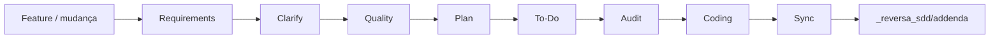
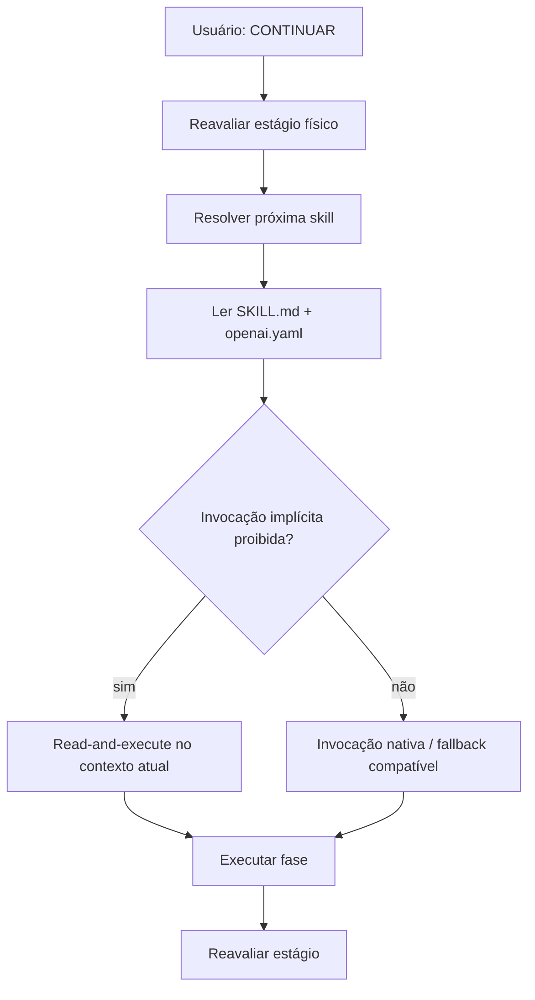

# ReversaFeynman

**Engenharia reversa, especificações executáveis e evolução orientada por evidências para agentes de IA.**

**Repositório canônico:** `MarceloClaro/reversaFeynman`

ReversaFeynman é uma linha independente mantida por **Marcelo Claro Laranjeira**, derivada historicamente do framework **Reversa** original e licenciada sob MIT. A base de engenharia reversa, SDD, pipelines especializados, rastreabilidade e compatibilidade multi-engine é preservada; sobre ela, esta edição acrescenta uma camada explícita de **evidência, compreensão, falsificabilidade, Teach-back e governança de invocação**.

> A independência desta árvore não apaga a proveniência do projeto original. Referências ao Reversa, ao paper e aos autores originais são mantidas. O que muda é a linha de desenvolvimento, distribuição e as extensões arquiteturais desta edição.

> Política completa de independência: [`INDEPENDENCE.md`](INDEPENDENCE.md)

---

## Paper e origem científica

O framework Reversa original é associado ao trabalho:

> **Reversa: A Reverse Documentation Engineering Framework for Converting Legacy Software into Operational Specifications for AI Agents** — Macedo & da Costa, 2026.

Paper: https://arxiv.org/abs/2605.18684

O ReversaFeynman mantém o objetivo central do framework — transformar conhecimento preso em sistemas legados em contratos operacionais rastreáveis para agentes de IA — e adiciona mecanismos para reduzir um segundo tipo de risco: **especificações aparentemente convincentes, mas epistemicamente frágeis**.

---

## Por que o Reversa existe

Sistemas de produção acumulam anos de regras implícitas, decisões arquiteturais não documentadas, exceções operacionais, integrações, estados e lógica crítica. Esse conhecimento existe, mas costuma estar distribuído entre código, banco de dados, contratos, telas, logs e memória das pessoas.

Agentes de IA conseguem criar e alterar software rapidamente, mas dependem de especificações suficientemente precisas para não apagar regras existentes. Em um sistema novo, a especificação pode preceder o código. Em um legado, frequentemente ocorre o inverso: **o comportamento implementado é a principal fonte disponível para reconstruir a especificação**.

O Reversa atua como ponte entre o legado e agentes de IA. Ele extrai estrutura, comportamento, regras, contratos e decisões retroativas e os transforma em especificações rastreáveis.

O ReversaFeynman acrescenta uma pergunta complementar:

> **Como sabemos que aquilo que a especificação afirma está realmente sustentado por evidência ou compreensão demonstrável?**

Por isso, além de extrair conhecimento, esta edição classifica evidência, separa observação de inferência, exige falsificabilidade para afirmações críticas e usa Teach-back quando uma lacuna material depende de conhecimento humano.

---

# Reversa original × ReversaFeynman

## Resumo executivo

| Dimensão | Reversa original / arquitetura-base | ReversaFeynman | Impacto principal |
|---|---|---|---|
| Objetivo central | Converter legado em especificações operacionais para agentes | Mantém o mesmo objetivo | Compatibilidade conceitual preservada |
| Discovery | Scout → Archaeologist → Detective/Architect → Writer → Reviewer | Mantido | Não quebra o fluxo central |
| Evolução de features | Requirements → Clarify → Quality → Plan → To-Do → Audit → Coding → Sync | Mantido e endurecido no handoff | Pipeline deixa de depender de invocação proibida de skills protegidas |
| Evidência | Escala visual CONFIRMED / INFERRED / GAP | `OBSERVED / INFERRED / UNVERIFIED / BLOCKED` + origem humana separada | Evita tratar texto plausível ou resposta humana como observação técnica |
| Auditoria | Reviewer, Quality e Audit | Acrescenta `/reversa-feynman` e FEG-01..06 | Auditoria de entendimento, proveniência, falsificabilidade e cargo cult |
| Conhecimento humano | Perguntas e validação do usuário | FEG-07 + `/reversa-teachback` | Testa mecanismo e transferência antes de usar conhecimento humano como fonte forte |
| Invocação | Skills model-invoked e user-invoked com política de eixo | Mantém a política e corrige o handoff do Forward | `CONTINUAR` pode avançar sem violar `disable-model-invocation` |
| Distribuição | Pacote/linha ligada ao upstream original | Distribuição canônica `MarceloClaro/reversaFeynman` | Controle de evolução próprio |
| Update | Pode consultar distribuição publicada do Reversa | Usa a distribuição ReversaFeynman em execução | Evita atualização indireta para outra linha de código |
| Upstream | Fork historicamente relacionado | Sem sincronização automática | Mudanças externas entram somente por revisão explícita |
| CI estrutural | Verificações do framework | Invocation + Feynman + transporte + no-upstream-sync | Invariantes arquiteturais passam a ser verificáveis |
| Custo cognitivo | Ênfase em completar o pipeline | Ênfase também em provar o que se sabe | Mais rigor; pode exigir mais auditoria/interação em pontos materiais |

### O que não mudou

ReversaFeynman **não é uma reescrita incompatível**. Ele preserva:

- os comandos `/reversa-*`;
- o binário `reversa`;
- a estrutura `.reversa/`;
- `_reversa_sdd/`, `_reversa_forward/`, `_reversa_bugs/`, `_reversa_docs/` e `_reversa_refactor/`;
- Discovery, Greenfield, Forward, Migration, Documentation, Bugs, Refactor, Pricing e Translators;
- compatibilidade com múltiplos harnesses/agentes;
- manifest SHA-256 e atualização que preserva customizações;
- rastreabilidade entre especificação, código, teste e defeito;
- a licença MIT e a atribuição histórica.

---

# Arquitetura original

A arquitetura-base herdada do Reversa é centrada em **orquestradores especializados + agentes de fase + artefatos persistidos em disco**.

## Discovery original

```mermaid
flowchart LR
    U[Usuário] --> R[Reversa Orchestrator]
    R --> S[Scout]
    S --> A[Archaeologist]
    A --> D[Detective]
    A --> AR[Architect]
    D --> W[Writer]
    AR --> W
    W --> RV[Reviewer]
    RV --> SDD[_reversa_sdd]

    SDD --> F[/reversa-forward]
    SDD --> M[/reversa-migrate]
    SDD --> DOC[/reversa-docs]
```

A sequência conceitual é:

```text
Reconnaissance → Excavation → Interpretation → Generation → Review
     Scout        Archaeologist   Detective       Writer     Reviewer
                                     Architect
```

Agentes independentes podem aprofundar áreas específicas, como interface, banco de dados, design system, essência do produto e reconstrução.

## Arquitetura de evolução original



O `/reversa-forward` observa os artefatos físicos da feature e sugere a próxima fase.

## Arquitetura de saídas original

```text
Discovery (/reversa)
        │
        ├── /reversa-forward    → evolução incremental
        ├── /reversa-migrate    → reconstrução/migração
        └── /reversa-docs       → documentação visual

Greenfield
        │
        └── /reversa-new
                └── PRD + SDD
                       └── /reversa-forward
```

Essa arquitetura continua sendo o **núcleo funcional** do ReversaFeynman.

---

# Nova arquitetura ReversaFeynman

A nova arquitetura não substitui os pipelines; ela acrescenta **camadas transversais** de governança e validação.

```mermaid
flowchart TB
    U[Usuário] --> E[Pontos de entrada / orquestradores]

    subgraph INV[Invocation Governance]
        E --> POL[Invocation Policy]
        POL --> META{Skill protegida?}
        META -->|não| NATIVE[Invocação nativa permitida]
        META -->|sim| READ[Read SKILL.md + execute no contexto atual]
    end

    NATIVE --> PIPE[Pipelines Reversa]
    READ --> PIPE

    subgraph CORE[Pipelines herdados]
        PIPE --> DISC[Discovery]
        PIPE --> NEW[Greenfield]
        PIPE --> FWD[Forward]
        PIPE --> MIG[Migration]
        PIPE --> BUG[Bugs]
        PIPE --> REF[Refactor]
        PIPE --> DOC[Docs]
        PIPE --> PRICE[Pricing]
    end

    CORE --> ART[Artefatos / Specs / Código / Auditorias]

    subgraph FE[Evidence & Understanding Layer]
        ART --> FY[/reversa-feynman]
        FY --> G1[FEG-01..06]
        FY --> G7{FEG-07 candidate?}
        G7 -->|não| REPORT[feynman-audit.md]
        G7 -->|sim| TB[/reversa-teachback]
        TB --> HS[HUMAN-VALIDATED / PARTIAL / CONFLICT]
        HS --> CR[Clarify / Reviewer]
        G1 --> REPORT
    end

    CR --> ART
```

## Três planos arquiteturais

### 1. Plano operacional

São os pipelines herdados: Discovery, Forward, Migration, Bugs, Refactor, Documentation, Pricing, Greenfield e Ideation.

### 2. Plano de invocação

Define **como** uma skill pode ser alcançada.

- pontos de entrada podem ser model-invoked;
- skills de fase protegidas usam `disable-model-invocation: true`;
- no harness OpenAI/Codex, a marca equivalente é `policy.allow_implicit_invocation: false`;
- as duas marcas devem permanecer em lockstep;
- orquestradores não devem chamar uma skill protegida pelo nome;
- o handoff seguro lê o `SKILL.md` e executa as instruções no contexto atual.

### 3. Plano epistemológico

Define **com que força uma afirmação pode entrar na especificação**.

- evidência direta do sistema;
- inferência;
- informação não verificada;
- validação bloqueada;
- conhecimento humano validado por Teach-back, ainda separado de observação técnica.

---

# Comparação arquitetural detalhada

| Aspecto | Antes / base Reversa | ReversaFeynman | Consequência de engenharia |
|---|---|---|---|
| Orquestração | Próximo agente decidido pelo pipeline | Mesmo roteamento físico | Preserva previsibilidade |
| Handoff | O orquestrador podia cair em tentativa de invocação incompatível com a flag da skill | Handoff lê metadados; skill protegida é lida e executada no contexto atual | Evita o bloqueio observado após `CONTINUAR` |
| Estado | `.reversa/state.json` + artefatos físicos | Mantido | Não cria segundo sistema de estado |
| Confiança | CONFIRMED / INFERRED / GAP | Escala visual preservada, com estado epistemológico mais granular | Melhor distinção entre certeza visual e origem real da evidência |
| Revisão | Reviewer procura inconsistências e lacunas | Reviewer + FEGs | Revisão inclui mecanismo, proveniência e falsificabilidade |
| Qualidade | Clareza de requirements | Clareza + FEG-01/04 | Termos vagos precisam de comportamento observável/oracle |
| Audit | Cross-check requirements ↔ roadmap ↔ actions | Cross-check + FEG-02/03 | Afirmações fortes precisam de âncora rastreável |
| Challenger | Premortem e riscos | Inclui separação observação/inferência, anti-cargo-cult e experimento mínimo | Riscos não ficam apenas narrativos |
| Fonte humana | Resposta pode resolver uma dúvida | Resposta material pode passar por FEG-07 | Fluência verbal deixa de ser proxy de evidência técnica |
| Score epistemológico | Não havia score Feynman | `0..12` em FEG-01..06 | Diagnóstico comparável sem usar participação humana para inflar score |
| FEG-07 | inexistente | Fora do score-base | Validação humana não mascara falta de evidência do sistema |
| Persistência humana | questions / requirements | `teachback.md` somente com consentimento explícito | Diagnóstico humano é auditável e opt-in |
| Atualização | Linha original/registro | Distribuição GitHub ReversaFeynman | Menor acoplamento operacional ao upstream |
| Proteção contra sync | Não é objetivo do framework-base | `verify-no-upstream-sync.py` | CI rejeita mecanismos automáticos de sincronização |

---

# Impactos das implementações

## Impactos observados ou mensurados

### Handoff do `/reversa-forward`

O problema que motivou uma das mudanças era concreto: após `CONTINUAR`, o Forward podia tentar ativar `reversa-clarify` por um mecanismo proibido pela própria flag `disable-model-invocation`, interrompendo o pipeline.

A correção implementada faz o orquestrador:

1. reavaliar o estágio físico;
2. localizar a próxima skill;
3. ler `SKILL.md` e `agents/openai.yaml`;
4. verificar as políticas de invocação;
5. executar em contexto atual quando a invocação implícita estiver bloqueada.

**Impacto funcional:** o consentimento `CONTINUAR` volta a avançar o pipeline sem remover as proteções de invocação.

### Economia de contexto do eixo de invocação

A política de invocação existente no framework registra uma medição histórica em que a quantidade de skills permanentemente model-invoked caiu de **65 para 9**, reduzindo o conteúdo de `description` carregado permanentemente de aproximadamente **4.987 para 668 tokens**, cerca de **86%** nesse componente de contexto.

ReversaFeynman **preserva e reforça** essa arquitetura; não atribui toda essa economia às extensões Feynman. O ganho documentado pertence à evolução do eixo de invocação e é mantido como invariante.

## Impactos estruturais — sem alegação de benchmark

As mudanças abaixo são impactos de arquitetura e governança. Não são apresentadas como ganho quantitativo de desempenho sem experimento correspondente.

### Evidência mais rastreável

Afirmações fortes passam a exigir uma âncora verificável quando aplicável: arquivo/linha, contrato, teste, log, execução, dataset, resultado bruto ou fonte direta.

### Menor risco de falsa confiança

`OBSERVED` é reservado a evidência direta. Uma conclusão plausível pode continuar `INFERRED`, e uma explicação humana consistente pode ser `HUMAN-VALIDATED` sem se tornar `OBSERVED`.

### Requisitos mais falsificáveis

Termos como “rápido”, “robusto”, “seguro”, “escalável” ou “intuitivo” não bastam quando uma decisão material depende deles. FEG-04 procura um oracle, limite, cenário ou condição observável capaz de provar ou refutar a afirmação.

### Menor cargo cult arquitetural

FEG-05 remove mentalmente o nome do padrão e pergunta qual problema concreto ele resolve, qual evidência mostra que esse problema existe, qual custo adiciona e o que quebraria sem ele.

### Conhecimento humano tratado como fonte distinta

FEG-07 usa explicação livre, probe causal e cenário variante para localizar a fronteira de conhecimento. Isso ajuda a distinguir:

- especialista que compreende o mecanismo;
- resposta parcialmente correta;
- contradição com o sistema;
- ausência de evidência técnica mesmo quando o humano entende a regra.

### Independência operacional

A distribuição não faz sync automático com `sandeco/reversa`. Mudanças externas podem ser estudadas e incorporadas, mas exigem decisão, revisão e commit explícitos.

## Trade-offs introduzidos

Mais rigor também tem custo:

- auditorias adicionais podem aumentar o tempo de revisão;
- FEG-07 pode exigir interação humana quando a regra não está no repositório;
- mais artefatos de auditoria aumentam o volume documental;
- a linha independente não recebe automaticamente correções do upstream;
- evidência insuficiente pode manter uma decisão em `UNVERIFIED` ou `BLOCKED` em vez de permitir uma conclusão rápida.

O objetivo não é maximizar velocidade a qualquer preço, mas **reduzir confiança indevida em especificações usadas por agentes que podem modificar software real**.

---

# Feynman Evidence & Understanding Layer

## Gates

| Gate | Pergunta operacional | Tipo |
|---|---|---|
| `FEG-01` | O mecanismo pode ser explicado sem depender apenas do nome do padrão/termo? | compreensão |
| `FEG-02` | A afirmação forte possui evidência e proveniência rastreável? | evidência |
| `FEG-03` | Observação, inferência, não-verificado e bloqueio estão separados? | epistemologia |
| `FEG-04` | Existe teste/oracle/cenário capaz de refutar a afirmação? | falsificabilidade |
| `FEG-05` | A solução resolve necessidade demonstrada ou é cargo cult? | arquitetura |
| `FEG-06` | Qual é o menor experimento capaz de reduzir a incerteza? | investigação |
| `FEG-07` | A fonte humana consegue explicar mecanismo e transferi-lo para um cenário variante? | conhecimento humano |

## Estados de evidência

- `OBSERVED` — visto diretamente em código, contrato, teste, execução, log ou outro artefato adequado;
- `INFERRED` — dedução plausível, ainda não observada diretamente;
- `UNVERIFIED` — informação sem sustentação suficiente;
- `BLOCKED` — validação necessária, mas o recurso não está disponível.

## Estados de fonte humana

- `HUMAN-VALIDATED` — explicação humana passou pelo Teach-back;
- `HUMAN-PARTIAL` — direção útil, porém existe elo causal, condição ou exceção ausente;
- `HUMAN-CONFLICT` — há contradição material com evidência disponível.

Esses eixos são deliberadamente independentes.

```text
TEACHBACK_GREEN ≠ OBSERVED
HUMAN-VALIDATED ≠ evidência técnica direta
```

## `/reversa-feynman`

Auditor somente-leitura que aplica FEG-01..06 e detecta candidatos FEG-07. Produz `feynman-audit.md` e não altera requirements, roadmap, actions, código ou configuração.

O score-base é `0..12`:

- 2 pontos por gate FEG-01..06 sem finding HIGH/CRITICAL;
- 1 ponto quando restam somente MEDIUM/LOW;
- 0 quando há HIGH/CRITICAL.

FEG-07 aparece separadamente e **não altera o score-base**.

## `/reversa-teachback`

Validador de conhecimento humano usado como fonte para requisito, regra de negócio, decisão ou interpretação do legado.

Fluxo mínimo:

```text
Explicação livre
      ↓
Probe de mecanismo
      ↓
Probe de transferência
      ↓
TEACHBACK_GREEN / YELLOW / RED
      ↓
HUMAN-VALIDATED / PARTIAL / CONFLICT
```

O diagnóstico só é persistido em `teachback.md` após consentimento explícito do usuário.

---

# Instalação

> Enquanto o rename administrativo do GitHub não estiver concluído, o repositório pode ainda aparecer fisicamente sob o slug anterior. A identidade canônica da distribuição é `MarceloClaro/reversaFeynman`.

Na raiz do projeto a analisar:

```bash
npm exec --yes --package=github:MarceloClaro/reversaFeynman -- reversa install
```

Requisitos:

- Node.js `>=18.20.2`;
- pelo menos um harness/agente compatível.

O installer:

1. detecta engines/harnesses disponíveis;
2. coleta nome do projeto, usuário e idiomas;
3. coleta diretório de saída e política de Git;
4. instala todos os agentes presentes em `agents/`;
5. cria os entry files correspondentes ao harness;
6. cria `.reversa/` e os arquivos de configuração necessários;
7. gera manifest SHA-256 para atualização segura.

## Segurança e escopo de escrita

O comportamento depende do workflow:

- **Discovery / documentação / auditoria:** escreve principalmente em `.reversa/` e diretórios de saída gerenciados;
- **Forward Coding, Bug Fix e Refactor:** podem modificar código do projeto, mas somente sob as políticas e gates explícitos de aprovação previstos por esses workflows;
- customizações locais rastreadas pelo manifest são preservadas durante update quando classificadas como modificadas pelo usuário.

Faça backup/versionamento do projeto antes de executar agentes capazes de alterar código.

O framework não precisa armazenar chaves de API próprias: a inteligência é fornecida pelo harness/agente já configurado no ambiente.

---

# Como usar

Após a instalação, abra o projeto no agente de IA e ative o fluxo desejado.

| Objetivo | Comando |
|---|---|
| Analisar legado e produzir specs | `/reversa` |
| Executar Discovery sem paradas intermediárias | `/reversa-autonomous` |
| Estruturar uma ideia antes de especificar | `/reversa-brainstorm` |
| Criar projeto novo a partir de uma ideia | `/reversa-new` |
| Criar projeto novo e seguir até código | `/reversa-new expresso "<ideia>"` |
| Evoluir uma feature a partir de specs | `/reversa-forward` |
| Acrescentar pequena emenda à feature entregue | `/reversa-add` |
| Convergir feature implementada para addendum da extração | `/reversa-sync` |
| Reconstruir/migrar legado | `/reversa-migrate` |
| Gerar documentação visual | `/reversa-docs` |
| Registrar e rastrear defeito | `/reversa-debugger` |
| Investigar/corrigir defeito | `/reversa-debugger-fix` |
| Debater diagnóstico/reparo com múltiplos agentes | `/reversa-debugger-debate` |
| Refatorar preservando comportamento | `/reversa-refactor` |
| Estimar perfil, tamanho e preço | `/reversa-pricing-profile`, `/reversa-pricing-size`, `/reversa-pricing-estimate` |
| Auditar evidência/compreensão | `/reversa-feynman` |
| Validar conhecimento humano material | `/reversa-teachback` |
| Explicar agentes e fluxos | `/reversa-agents-help` |

## `CONTINUAR` e handoff seguro

Nos orquestradores guiados, `CONTINUAR` é consentimento explícito para o próximo passo sugerido. Ele **não** remove as políticas da skill seguinte.

No Forward, o handoff segue esta lógica:



Essa regra corrige a classe de erro em que uma skill com `disable-model-invocation` era chamada pelo mecanismo de Skill tool.

---

# Execuções sem supervisão

Dois caminhos concentram perguntas no início e podem seguir sem checkpoints intermediários:

- `/reversa-autonomous` — Discovery completo;
- `/reversa-new expresso "<ideia>"` — ideia → specs → ciclo Forward → implementação.

O modo autônomo não transforma ações destrutivas, publicação ou mutações externas em operações livres de política. Os limites definidos pelas skills continuam valendo.

---

# Equipes e agentes

O installer atual usa `listAllAgents()` para instalar **todo diretório existente em `agents/`**. A taxonomia funcional mantém dez grupos herdados e adiciona duas skills transversais ReversaFeynman.

## Visão por equipe

| Grupo | Agentes na taxonomia atual | Função principal |
|---|---:|---|
| Discovery Core | 13 | extrair conhecimento e produzir specs |
| Migration | 7 | planejar/reconstruir em novo paradigma/stack |
| Translators | 1 | adaptar fontes estruturadas, como N8N |
| Pricing | 3 | perfil, tamanho e estimativa |
| Forward | 13 | requisitos → implementação → convergência |
| Documentation | 10 | mini-site, mapas, métricas e narrativa |
| Ideation | 6 | framing → opções → riscos → decisão → pre-spec |
| New Project | 5 | ideia → personas → PRD → SDD |
| Bugs | 5 | memória causal, diagnóstico, fix e grafo |
| Refactor | 8 | melhoria interna com preservação de comportamento |
| ReversaFeynman transversal | 2 | auditoria epistemológica e Teach-back |

A soma da taxonomia atual corresponde a **73 skills/agentes**, considerando os dois componentes transversais Feynman além dos dez grupos funcionais.

## Discovery Core

| Agente | Papel |
|---|---|
| Reversa | orquestrador central do Discovery |
| Autonomous | executa Discovery end-to-end após entrevista inicial |
| Scout | superfície, stack, dependências e entry points |
| Archaeologist | análise profunda módulo a módulo |
| Detective | regras implícitas, estados, permissões e ADRs retroativos |
| Architect | C4, ERD, integrações e dívida técnica |
| Writer | especificações operacionais rastreáveis |
| Reviewer | inconsistências, lacunas e confiança |
| Visor | interface a partir de screenshots |
| Data Master | banco, DDL, migrations, ORM, triggers/procedures |
| Design System | tokens, tipografia, spacing, temas e componentes |
| Agents Help | guia do ecossistema |
| Reconstructor | plano bottom-up de reconstrução |

## Ideation

Pipeline:

```text
Framer → Explorer → Challenger → Arbiter → Pre-Spec
```

- **Framer:** separa problema de solução;
- **Explorer:** abre alternativas materialmente distintas;
- **Challenger:** premortem, hipótese fatal, teste barato e custo oculto;
- **Arbiter:** recomenda com trade-off explícito, decisão final humana;
- **Pre-Spec:** mínimo pacote para o pipeline seguinte.

Artefatos: `_reversa_sdd/brainstorms/<sessão>/`.

## New Project

Pipeline:

```text
Ideator → Researcher → Drafter → Spec SDD
```

- `ideation.md`;
- `personas.md`;
- `prd.md`;
- `_reversa_sdd/sdd/*.md`.

## Forward

Pipeline operacional:

```text
requirements → clarify → quality → plan → to-do → audit → coding → sync
```

| Agente | Papel |
|---|---|
| Reversa Forward | detecta estágio físico e faz handoff seguro |
| Requirements | cria `requirements.md` ancorado ao legado quando disponível |
| Clarify | resolve `[DÚVIDA]`; pode usar FEG-07 quando necessário |
| Quality | auditoria de clareza e falsificabilidade |
| Plan | delta técnico sobre o legado |
| To-Do | ações atômicas, dependências e paralelismo |
| Audit | cross-check requirements/roadmap/actions + proveniência |
| Coding | executa `actions.md` e registra progresso/impacto/regressão |
| Code Express | execução expressa quando aplicável |
| Add | pequena emenda pós-entrega |
| Sync | addendum pós-entrega na extração |
| Principles | regras duráveis do projeto |
| Resume | retoma feature pausada |

### Extensão Feynman sobre Forward

```text
requirements
   ├─ Quality → FEG-01 / FEG-04
   ├─ Audit   → FEG-02 / FEG-03
   ├─ Clarify → FEG-07 quando a lacuna é humana e material
   └─ Feynman → FEG-01..06 + detecção de candidatos FEG-07
```

## Migration

Pipeline:

```text
Paradigm Advisor → Curator → Strategist → Designer → Screen Translator → Inspector
```

- decisão consciente de paradigma;
- classificação MIGRATE / DISCARD / HUMAN DECISION;
- avaliação de estratégias como Strangler Fig, Big Bang, Parallel Run e Branch by Abstraction;
- arquitetura e modelo alvo;
- tradução de telas;
- prova de equivalência comportamental.

Artefatos: `_reversa_sdd/migration/`.

## Pricing

Três agentes especializados:

- `/reversa-pricing-profile`;
- `/reversa-pricing-size`;
- `/reversa-pricing-estimate`.

## Translators

O adaptador N8N lê workflow exportado em JSON e produz especificação SDD adequada para reimplementação.

## Documentation Team

Gera mini-site estático em `_reversa_docs/`.

| Agente/skill | Função |
|---|---|
| Reversa Docs | orquestra documentação |
| Mapper | arquitetura, módulos, topologia e visualizações espaciais |
| Analyst | métricas, treemap, sankey, histogramas e timeline |
| Storyteller | glossário, deck e páginas narrativas por feature |
| Publisher | integração final, navegação e validação |
| Arquitetura 3D | visualização 3D |
| Selo Generativo | identidade visual determinística |
| Highcharts Visualizer | gráficos quantitativos |
| Especialista D3 | visualizações relacionais |
| Image Prompt JSON | apoio a prompts estruturados de imagem |

## Bug Agents

Organizam memória causal por contexto em `_reversa_bugs/`.

```text
SPEC ↔ CODE ↔ TEST ↔ BUG
```

- **Bug:** intake/triage/dedupe; não corrige;
- **Bug Fix:** reprodução, causa-raiz, gates de aprovação e fechamento;
- **Bug Debate:** debate multiagente opt-in;
- **Depth Inspection:** varredura especializada;
- **Bug Graph:** índices, matrizes e grafo de relações.

## Code Quality / Refactor

Melhoria perfeita/preventiva sem alterar comportamento observável, com safety net e diff reversível.

Especialistas:

- Restructure;
- Modularize;
- Decouple;
- Optimize;
- Simplify;
- Standardize;
- Prune.

## Camada transversal ReversaFeynman

- **Feynman Auditor:** `/reversa-feynman`;
- **Teach-back Validator:** `/reversa-teachback`.

Eles não substituem os times anteriores. Funcionam como **controle transversal de qualidade epistemológica**.

---

# O que é gerado

## Discovery

```text
_reversa_sdd/
├── inventory.md
├── dependencies.md
├── code-analysis.md
├── data-dictionary.md
├── domain.md
├── state-machines.md
├── permissions.md
├── architecture.md
├── c4-context.md
├── c4-containers.md
├── c4-components.md
├── erd-complete.md
├── confidence-report.md
├── gaps.md
├── questions.md
├── sdd/
│   └── <component>.md
├── openapi/
├── user-stories/
├── adrs/
├── flowcharts/
├── sequences/
├── ui/
├── database/
├── design-system/
├── addenda/
└── traceability/
    ├── spec-impact-matrix.md
    └── code-spec-matrix.md
```

## Greenfield

```text
_reversa_sdd/
├── newproject-brief.md
├── ideation.md
├── personas.md
├── prd.md
└── sdd/
    └── <component>.md
```

## Forward

```text
_reversa_forward/
└── <NNN>-<short-name>/
    ├── requirements.md
    ├── roadmap.md
    ├── investigation.md
    ├── data-delta.md
    ├── onboarding.md
    ├── interfaces/
    ├── actions.md
    ├── progress.jsonl
    ├── legacy-impact.md
    ├── regression-watch.md
    └── audit/
        ├── requirements-audit.md
        ├── cross-check.md
        ├── feynman-audit.md        # quando /reversa-feynman é aplicado
        └── teachback.md            # somente após consentimento explícito
```

`feynman-audit.md` e `teachback.md` também podem existir nos diretórios de revisão global ou de ideação conforme o alvo auditado.

## Documentação

```text
_reversa_docs/
└── site HTML estático e artefatos visuais
```

## Bugs

```text
_reversa_bugs/
├── <context>/
└── generated/
```

## Refactor

```text
_reversa_refactor/
└── <context>/
```

---

# Escalas de confiança

## Escala visual herdada

| Marca | Significado original |
|---|---|
| 🟢 CONFIRMED | extraído diretamente de evidência considerada confirmada |
| 🟡 INFERRED | deduzido a partir de padrões |
| 🔴 GAP | não determinável sem validação adicional |

## Camada epistemológica ReversaFeynman

A escala visual não é descartada; ela ganha um eixo mais explícito:

| Estado | Regra |
|---|---|
| `OBSERVED` | evidência direta adequada ao claim |
| `INFERRED` | dedução plausível |
| `UNVERIFIED` | sem sustentação suficiente |
| `BLOCKED` | faltam recurso/fonte/ferramenta para validar |

Para fonte humana, use adicionalmente:

| Estado | Regra |
|---|---|
| `HUMAN-VALIDATED` | Teach-back demonstrou mecanismo e transferência |
| `HUMAN-PARTIAL` | entendimento útil, porém incompleto |
| `HUMAN-CONFLICT` | conflito material com a evidência observada |

---

# Engines suportadas

| Engine | Entry file | Skills path | Ativação típica |
|---|---|---|---|
| Claude Code ⭐ | `CLAUDE.md` | `.claude/skills/` + `.agents/skills/` | `/reversa` |
| Codex ⭐ | `AGENTS.md` | `.agents/skills/` | `reversa` |
| Cursor ⭐ | `.cursorrules` | `.agents/skills/` | `/reversa` |
| Gemini CLI | `GEMINI.md` | `.agents/skills/` | `/reversa` |
| Windsurf | `.windsurfrules` | `.agents/skills/` | `/reversa` |
| Antigravity | `AGENTS.md` | `.agents/skills/` | `/reversa` |
| Kiro | sem entry file obrigatório | `.kiro/skills/` + `.agents/skills/` | `/reversa` |
| Opencode | `AGENTS.md` | `.agents/skills/` | `reversa` |
| Hermes | `AGENTS.md` | `.agents/skills/` | `reversa` |
| Cline | `.clinerules` | `.agents/skills/` | `/reversa` |
| Roo Code | `.roorules` | `.agents/skills/` | `/reversa` |
| GitHub Copilot | `.github/copilot-instructions.md` | `.agents/skills/` | `/reversa` |
| Aider | `CONVENTIONS.md` | `.agents/skills/` | `reversa` |
| Amazon Q Developer | `.amazonq/rules/reversa.md` | `.agents/skills/` | `/reversa` |

---

# CLI

A edição ReversaFeynman é executada diretamente do repositório canônico.

```bash
npm exec --yes --package=github:MarceloClaro/reversaFeynman -- reversa install
npm exec --yes --package=github:MarceloClaro/reversaFeynman -- reversa status
npm exec --yes --package=github:MarceloClaro/reversaFeynman -- reversa update
npm exec --yes --package=github:MarceloClaro/reversaFeynman -- reversa add-engine
npm exec --yes --package=github:MarceloClaro/reversaFeynman -- reversa uninstall
```

Também existe:

```bash
npm exec --yes --package=github:MarceloClaro/reversaFeynman -- reversa export-diagrams
```

## Update independente

O `update` desta edição:

- usa a versão embutida na própria distribuição em execução;
- não consulta `registry.npmjs.org/reversa/latest` para decidir a versão;
- não busca nem mescla `sandeco/reversa`;
- reinstala/reconcilia agentes da distribuição atual;
- preserva arquivos detectados como customizados;
- grava `distribution = MarceloClaro/reversaFeynman` no estado atualizado.

---

# Política de invocação

Toda skill pertence a um dos dois estados:

- **model-invoked** — pode ser alcançada pelo modelo a partir da intenção;
- **user-invoked** — alcançada pelo humano ou por orquestrador via leitura de `SKILL.md`.

Na política documentada do framework, apenas nove pontos de entrada permanecem model-invoked:

```text
reversa
reversa-new
reversa-forward
reversa-migrate
reversa-autonomous
reversa-refactor
reversa-debugger
reversa-docs
reversa-agents-help
```

As skills de fase permanecem protegidas, reduzindo competição de roteamento e carga permanente de descriptions.

O CI verifica o lockstep entre:

```text
SKILL.md: disable-model-invocation: true
openai.yaml: policy.allow_implicit_invocation: false
```

---

# Independência de upstream

ReversaFeynman pode analisar e incorporar ideias externas, inclusive melhorias futuras do Reversa original. Porém nenhuma delas entra automaticamente.

O guard `scripts/verify-no-upstream-sync.py` rejeita padrões operacionais como:

```text
gh repo sync
git remote add upstream
git remote set-url upstream
git fetch upstream
git pull upstream
git merge upstream/...
```

O `package.json` permanece `private: true` para evitar publicação acidental sob a identidade de pacote da linha original.

---

# Verificação estrutural

```bash
npm run verify
```

A suíte estrutural inclui:

```text
scripts/verify-no-upstream-sync.py
scripts/verify-invocation.py
scripts/verify-feynman-layer.py
scripts/test-installer-transport.mjs
```

Objetivos:

- impedir regressão para sincronização automática;
- manter as duas marcas de invocação em lockstep;
- garantir a presença/invariantes FEG;
- verificar que metadados e skills atravessam o installer.

> Um workflow de CI só deve ser considerado aprovado quando seus steps realmente executarem. Falha de provisionamento de runner não deve ser apresentada como resultado de teste do código.

---

# Estrutura interna

```text
.reversa/
├── state.json
├── config.toml
├── config.user.toml
├── plan.md
├── version
├── context/
│   ├── surface.json
│   └── modules.json
└── _config/
    ├── manifest.yaml
    └── files-manifest.json

.agents/skills/
.claude/skills/
```

No repositório do framework:

```text
agents/                   skills/agentes
bin/                      entrada CLI
lib/                      installer, comandos e utilitários
scripts/                  verificadores e smoke tests
specs/                    especificações formais das evoluções
docs/                     documentação detalhada
INDEPENDENCE.md           política da linha independente
```

---

# Desenvolvimento

```bash
git clone https://github.com/MarceloClaro/reversaFeynman.git
cd reversaFeynman
npm install
npm run verify
```

Ao criar ou alterar uma skill:

1. preserve o eixo user-invoked/model-invoked;
2. não introduza mecanismo automático de sync com upstream;
3. acrescente verificação estrutural quando criar uma nova invariante;
4. não fabrique métricas, benchmarks ou resultados;
5. mantenha comportamento de escrita compatível com o workflow correspondente;
6. rode `npm run verify` antes do commit quando o ambiente permitir.

---

# Proveniência e licença

ReversaFeynman deriva historicamente do projeto **Reversa** original. A arquitetura-base, conceitos, agentes e diversos workflows foram construídos no projeto original e permanecem reconhecidos como tal.

As extensões desta linha incluem, entre outras:

- correção de handoff do Forward para skills protegidas;
- Feynman Evidence & Understanding Layer;
- FEG-01..FEG-07;
- `/reversa-feynman`;
- `/reversa-teachback`;
- integração de FEGs em Reviewer, Clarify, Quality, Audit e Challenger;
- política independente de distribuição;
- guard contra sincronização automática de upstream;
- identidade canônica `MarceloClaro/reversaFeynman`.

Licença: **MIT** — consulte [`LICENSE`](LICENSE).

---

# Síntese: o que o ReversaFeynman acrescenta

```text
Reversa original
    │
    ├── engenharia reversa
    ├── SDD e rastreabilidade
    ├── pipelines especializados
    ├── evolução, migração, bugs, docs e refactor
    └── multi-engine installer

            +

ReversaFeynman
    │
    ├── handoff metadata-aware
    ├── evidence provenance
    ├── observation ≠ inference
    ├── falsifiability
    ├── anti-cargo-cult
    ├── minimal experiments
    ├── human teach-back
    ├── HUMAN-VALIDATED ≠ OBSERVED
    ├── CI invariants
    └── independent distribution
```

O resultado é uma arquitetura que continua transformando legado em especificações executáveis, mas adiciona mecanismos explícitos para responder não apenas **“o que a spec diz?”**, e sim também **“por que devemos acreditar nela, qual evidência a sustenta e o que a refutaria?”**.
