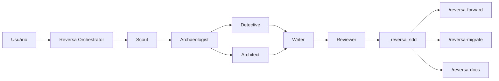
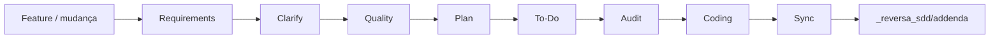
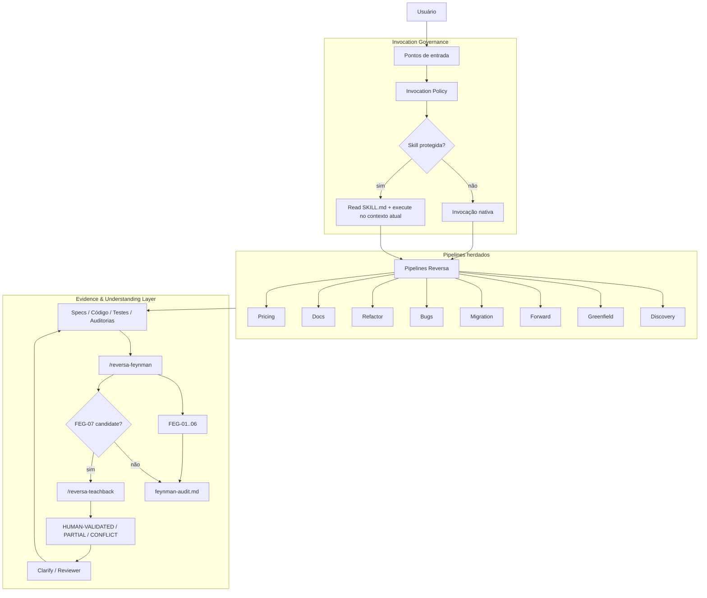
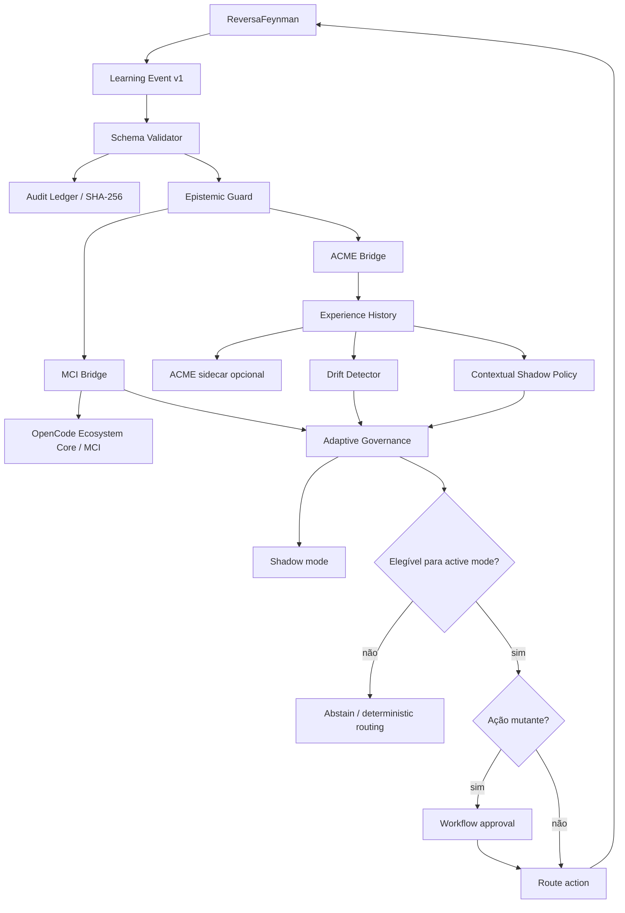
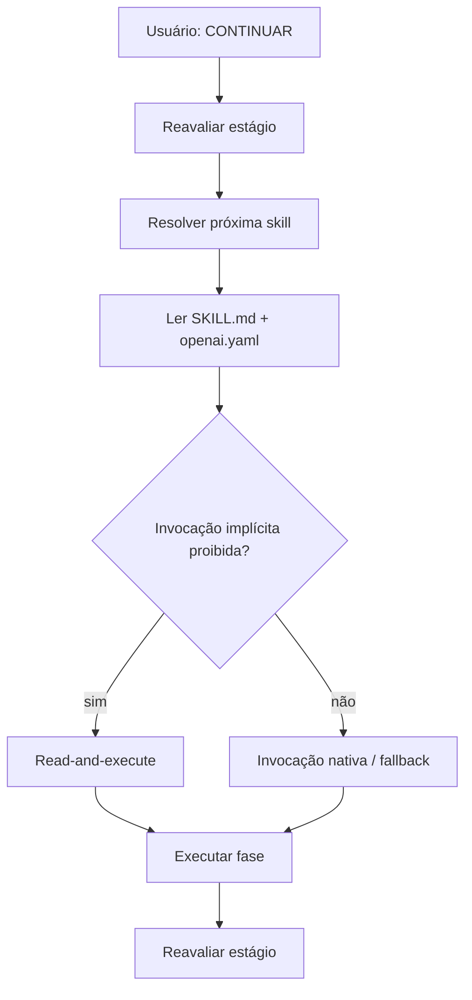

# ReversaFeynman

**Engenharia reversa, especificações executáveis, validação epistemológica e aprendizagem adaptativa governada para agentes de IA.**

**Repositório canônico:** `MarceloClaro/reversaFeynman`

ReversaFeynman é uma linha independente mantida por **Marcelo Claro Laranjeira**, derivada historicamente do framework **Reversa** original e licenciada sob MIT.

A edição preserva a base de engenharia reversa, SDD, rastreabilidade, pipelines especializados e compatibilidade multi-engine, acrescentando três extensões principais:

- **Feynman Evidence & Understanding Layer** — FEG-01..FEG-07, evidência, falsificabilidade e Teach-back;
- **Invocation Governance** — handoff seguro para skills protegidas;
- **Adaptive Governance v2** — MCI/ACME bridges, ledger auditável, shadow policy, drift detection e promoção controlada para modo ativo.

> A linha independente não apaga a proveniência do Reversa original. Licença, referências e atribuição histórica permanecem preservadas.

> Política de independência: [`INDEPENDENCE.md`](INDEPENDENCE.md)

---

## Origem científica

O Reversa original é associado ao trabalho:

> **Reversa: A Reverse Documentation Engineering Framework for Converting Legacy Software into Operational Specifications for AI Agents** — Macedo & da Costa, 2026.

Paper: https://arxiv.org/abs/2605.18684

O objetivo central permanece: transformar conhecimento preso em sistemas legados em especificações operacionais rastreáveis para agentes de IA.

O ReversaFeynman adiciona duas perguntas:

> **Como sabemos que aquilo que a especificação afirma está realmente sustentado por evidência?**

> **Como aprender com outcomes sem transformar probabilidade aprendida em verdade observada?**

---

# Evolução arquitetural

| Dimensão | Reversa base | ReversaFeynman | Adaptive Governance v2 |
|---|---|---|---|
| Engenharia reversa | Discovery + specs | preservada | preservada |
| Forward | requirements → coding → sync | handoff seguro | pode receber ranking adaptativo |
| Evidência | CONFIRMED / INFERRED / GAP | `OBSERVED / INFERRED / UNVERIFIED / BLOCKED` | mesmos estados; policy não altera autoridade |
| Auditoria | Reviewer / Quality / Audit | FEG-01..07 | ledger + drift + governance |
| Fonte humana | perguntas/validação | Teach-back | continua sem equivaler a `OBSERVED` |
| Metacognição | não é camada do núcleo | parcial via FEG | MCI envelope opcional |
| Aprendizagem | não | não | ACME experience opcional |
| Reward | não | não | `heuristic-v1` |
| Policy | determinística/heurística | determinística/heurística | `contextual-shadow-v1` baseline |
| Drift | não | não | reward/confidence/epistemic mix |
| Auditoria de eventos | artefatos | artefatos + Feynman | hash-chain SHA-256 |
| Execução adaptativa | não | não | shadow por padrão; active somente via gates |
| Dependência RL | nenhuma | nenhuma | nenhuma no core; sidecar externo opcional |
| Upstream | projeto original | sem sync automático | sem sync automático |

---

# Arquitetura original

A arquitetura-base herdada do Reversa usa **orquestradores especializados + agentes de fase + artefatos persistidos em disco**.

## Discovery



Fluxo conceitual:

```text
Reconnaissance → Excavation → Interpretation → Generation → Review
     Scout        Archaeologist   Detective       Writer     Reviewer
                                     Architect
```

## Evolução de feature



O núcleo funcional continua preservado.

---

# Arquitetura ReversaFeynman

ReversaFeynman adiciona dois planos transversais: **governança de invocação** e **controle epistemológico**.



Invariante:

```text
TEACHBACK_GREEN ≠ OBSERVED
HUMAN-VALIDATED ≠ OBSERVED
```

---

# Adaptive Governance v2

A camada adaptativa está em:

```text
lib/integrations/adaptive/
```

Ela não substitui os pipelines Reversa e não torna reinforcement learning autoridade sobre evidência.

## Arquitetura v2



## Responsabilidades

| Componente | Pergunta | Autoridade |
|---|---|---|
| ReversaFeynman | O que sabemos? | evidência/especificação |
| FEG | Por que acreditar? O que refutaria? | auditoria epistemológica |
| MCI | Quem deve agir? Quando abster? | metacognição/orquestração |
| ACME | Qual política tende a gerar melhor outcome? | recomendação adaptativa |
| Drift Detector | O comportamento recente mudou? | contenção operacional |
| Governance | A proposal pode sair de shadow? | autorização adaptativa |
| Evidence Guard | Pode virar `OBSERVED`? | autoridade epistemológica final |

Regra central:

```text
policy confidence 0.99 ≠ OBSERVED
Trust Engine 0.99       ≠ OBSERVED
reward = 1.0            ≠ OBSERVED
HUMAN-VALIDATED         ≠ OBSERVED
```

---

# Módulos adaptativos

```text
lib/integrations/adaptive/
├── constants.js
├── schema.js
├── event.js
├── evidence-guard.js
├── reward.js
├── ledger.js
├── drift.js
├── policy.js
├── governance.js
├── mci-bridge.js
├── acme-bridge.js
├── runtime.js
└── index.js
```

Especificações:

```text
specs/SPEC-ADAPTIVE-MCI-ACME-BRIDGE.md
specs/SPEC-ADAPTIVE-GOVERNANCE-V2.md
```

Teste executável:

```text
scripts/test-adaptive-bridges.mjs
```

---

# Contratos versionados

| Contrato | Schema | Função |
|---|---|---|
| Learning Event | `reversa.learning.event/v1` | estado + ação + outcome |
| MCI Envelope | `reversa.mci.envelope/v1` | metacognição + gates + proveniência |
| ACME Experience | `reversa.acme.experience/v1` | observation → action → reward |

A v2 endurece a validação sem quebrar deliberadamente esses schemas.

## Learning Event

```js
import { createLearningEvent } from './lib/integrations/adaptive/index.js';

const event = createLearningEvent({
  taskId: 'FWD-042',
  stage: 'audit',
  epistemic: {
    state: 'INFERRED',
    feynmanScore: 8,
    highFindings: 1,
    blockedCount: 0,
  },
  confidence: {
    calibrated: 0.63,
    trust: 0.74,
  },
  action: { id: 'route:clarify' },
  outcome: {
    specAccepted: true,
    testsPassing: true,
    uncertaintyReduction: 0.31,
  },
});
```

A v2 exige:

- timestamp válido;
- `feynman_score` em `[0,12]` ou nulo;
- confidence/trust em `[0,1]` ou nulos;
- findings/bloqueios não negativos;
- `event_id` único por UUID quando não fornecido explicitamente.

---

# Evidence Guard

Somente evidência direta rastreável pode produzir `OBSERVED`.

Tipos reconhecidos pelo baseline:

```text
code
contract
test
execution
log
dataset
artifact
```

Bloqueado:

```js
applyEvidenceProposal(
  { id: 'claim-1', epistemic_state: 'INFERRED' },
  {
    proposed: 'OBSERVED',
    source: { kind: 'learned-policy', direct: false, ref: 'policy:acme' },
  },
);
```

Aceitável quando sustentado por evidência direta:

```js
applyEvidenceProposal(
  { id: 'claim-2', epistemic_state: 'INFERRED' },
  {
    proposed: 'OBSERVED',
    source: { kind: 'test', direct: true, ref: 'tests/example.test.js:42' },
  },
);
```

---

# MCI Bridge

O envelope MCI transporta:

- estado epistemológico;
- Feynman score;
- confidence;
- trust;
- `should_abstain`;
- FEGs requeridos;
- ação proposta;
- outcome;
- proveniência do evento.

```js
import { buildMciEnvelope } from './lib/integrations/adaptive/index.js';

const envelope = buildMciEnvelope(event);
```

O OpenCode Ecosystem Core continua opcional. Transporte é explicitamente injetado.

---

# ACME Bridge

A experience ACME segue:

```text
observation → action → reward → terminal → extras
```

Observation vector baseline, 7 dimensões:

1. estado epistemológico;
2. Feynman score normalizado;
3. findings HIGH;
4. findings CRITICAL;
5. bloqueios;
6. confidence;
7. trust.

O core não passa a depender de JAX, TensorFlow ou `dm-acme`. ACME real opera como sidecar/learner externo opcional.

---

# Reward baseline

A função `heuristic-v1` combina:

- aceitação da spec;
- testes;
- ganho de evidência observada;
- redução de incerteza;
- calibração;
- regressões;
- findings HIGH/CRITICAL;
- custo;
- latência;
- retries.

```text
-1 ≤ reward ≤ 1
```

O reward é uma hipótese operacional falsificável, não uma medida de verdade.

---

# Audit Ledger

`createAuditLedger()` cria uma cadeia SHA-256:

```text
genesis_hash
    ↓
entry_1 = H(sequence + previous_hash + payload_hash)
    ↓
entry_2 = H(sequence + previous_hash + payload_hash)
    ↓
...
```

Propriedades:

- dedupe por `event_id`;
- payload canonicalizado;
- hash encadeado;
- verificação integral;
- snapshot somente leitura;
- exportação JSONL.

O ledger atual é em memória. Persistência durável pode ser feita pelo transport/sidecar, sem ser habilitada automaticamente.

---

# Contextual Shadow Policy

`contextual-shadow-v1` é um baseline simples e auditável.

Ele:

1. recebe observation atual;
2. filtra candidatos pela allowlist global;
3. busca experiências da mesma ação;
4. calcula similaridade entre observation vectors;
5. estima reward empírico ponderado;
6. acrescenta bônus de incerteza;
7. ranqueia ações.

Toda proposal nasce com:

```text
mode = shadow
evidence_authority = false
```

Uma lista externa de candidatos **não consegue redefinir a allowlist global**.

Exemplo:

```js
const proposal = proposeShadowAction({
  observation: experience.observation,
  experiences: history,
  candidateActions: ['route:reviewer', 'route:clarify'],
});
```

Esse baseline não é apresentado como algoritmo ótimo de contextual bandit. Ele serve como política observável para coleta e avaliação antes de maior autonomia.

---

# Drift Detection

`detectAdaptiveDrift()` compara uma janela histórica de referência com uma janela recente.

Métricas baseline:

```text
reward_delta
confidence_delta
observed_share_delta
```

Status:

```text
insufficient_data
stable
drift
```

Quando drift é detectado, a policy não deve ser promovida automaticamente para modo ativo.

Thresholds são configuráveis e devem ser tratados como hipóteses falsificáveis, não constantes científicas universais.

---

# Adaptive Governance

Uma proposal só pode ser executável quando os gates operacionais forem satisfeitos.

Possíveis bloqueios:

```text
action-not-allowlisted
drift-detected
insufficient-history
low-policy-confidence
approval-required
shadow-mode
```

Ações mutantes permanecem sob gate explícito. Baseline atual:

```text
route:coding → requires_approval=true
```

Estar na allowlist significa “pode ser proposta”, não “pode ser executada livremente”.

---

# Adaptive Runtime

`createAdaptiveRuntime()` coordena a camada v2:

```text
event
  → schema validation
  → ledger
  → MCI envelope
  → ACME experience
  → bounded history
  → drift
  → shadow proposal
  → governance
```

Exemplo:

```js
import {
  createAdaptiveRuntime,
  createLearningEvent,
} from './lib/integrations/adaptive/index.js';

const runtime = createAdaptiveRuntime({
  candidateActions: ['route:reviewer', 'route:clarify', 'route:feynman'],
  maxHistory: 500,
});

const result = await runtime.ingest(event);

console.log(result.proposal.mode);          // shadow
console.log(result.governance.executable); // false por padrão
console.log(result.ledger.valid);           // true
```

Por padrão, o runtime:

- não despacha para MCI/ACME externo;
- não executa action proposal;
- permanece em shadow mode;
- deduplica eventos;
- mantém histórico limitado;
- avalia drift;
- expõe método separado para avaliar ativação.

---

# Estratégia de maturação

A autonomia deve aumentar por etapas:

```text
1. Shadow
   ↓
2. Offline evaluation
   ↓
3. Canary de ações não mutantes
   ↓
4. Guarded active
   ↓
5. Learner externo mais sofisticado
```

## 1. Shadow

Coletar outcomes e comparar o ranking da policy sem alterar o roteamento real.

## 2. Offline evaluation

Avaliar reward, estabilidade, calibração e drift por stage/action antes de habilitar autonomia.

## 3. Canary

Permitir subset pequeno de ações não mutantes.

## 4. Guarded active

Exigir:

- allowlist;
- histórico mínimo;
- confidence mínima;
- drift estável;
- approval quando mutante.

## 5. Learner externo

Somente depois conectar ACME real ou outro learner com dados suficientes.

RL profundo de horizonte longo não é requisito inicial.

---

# Allowlist adaptativa

Baseline:

```text
route:scout
route:architect
route:reviewer
route:feynman
route:teachback
route:clarify
route:audit
route:coding
strategy:sequential
strategy:parallel
control:request-evidence
control:abstain
```

Ações externas fora da allowlist são rejeitadas.

---

# Abstention

O envelope MCI ativa `should_abstain` quando:

- estado epistemológico é `BLOCKED`; ou
- confidence calibrada fica abaixo do limiar configurado.

Baseline:

```text
abstainBelow = 0.20
```

Drift detectado também pode forçar contenção operacional pela governance.

---

# Feynman Evidence & Understanding Layer

| Gate | Pergunta operacional |
|---|---|
| `FEG-01` | O mecanismo pode ser explicado sem depender só do nome? |
| `FEG-02` | A afirmação tem evidência/proveniência? |
| `FEG-03` | Observação e inferência estão separadas? |
| `FEG-04` | Existe teste/oracle que possa refutar? |
| `FEG-05` | A solução resolve necessidade demonstrada ou é cargo cult? |
| `FEG-06` | Qual menor experimento reduz a incerteza? |
| `FEG-07` | A fonte humana explica mecanismo e transfere para cenário variante? |

Estados de evidência:

```text
OBSERVED
INFERRED
UNVERIFIED
BLOCKED
```

Estados humanos:

```text
HUMAN-VALIDATED
HUMAN-PARTIAL
HUMAN-CONFLICT
```

Score-base:

```text
FEG-01..06 = 0..12
```

FEG-07 permanece fora do score-base.

---

# Workflows principais

| Objetivo | Comando |
|---|---|
| Analisar legado | `/reversa` |
| Discovery autônomo | `/reversa-autonomous` |
| Brainstorm | `/reversa-brainstorm` |
| Projeto novo | `/reversa-new` |
| Projeto novo expresso | `/reversa-new expresso "<ideia>"` |
| Evoluir feature | `/reversa-forward` |
| Pequena emenda | `/reversa-add` |
| Convergir addendum | `/reversa-sync` |
| Migrar/reconstruir | `/reversa-migrate` |
| Documentar | `/reversa-docs` |
| Registrar bug | `/reversa-debugger` |
| Corrigir bug | `/reversa-debugger-fix` |
| Debate de bug | `/reversa-debugger-debate` |
| Refatorar | `/reversa-refactor` |
| Pricing | `/reversa-pricing-profile`, `/reversa-pricing-size`, `/reversa-pricing-estimate` |
| Auditoria Feynman | `/reversa-feynman` |
| Teach-back | `/reversa-teachback` |
| Ajuda | `/reversa-agents-help` |

## Handoff seguro



---

# Equipes funcionais

| Grupo | Função |
|---|---|
| Discovery Core | extrair conhecimento e produzir specs |
| Migration | reconstrução/migração |
| Translators | adaptar fontes estruturadas |
| Pricing | perfil, tamanho e estimativa |
| Forward | requirements → implementação → sync |
| Documentation | site, mapas e narrativa |
| Ideation | problema → alternativas → pre-spec |
| New Project | ideia → PRD → SDD |
| Bugs | memória causal, diagnóstico e fix |
| Refactor | melhoria interna preservando comportamento |
| ReversaFeynman | auditoria epistemológica e Teach-back |
| Adaptive Governance | aprendizagem observável, drift e gates |

Discovery Core inclui, entre outros: Reversa, Autonomous, Scout, Archaeologist, Detective, Architect, Writer, Reviewer, Visor, Data Master, Design System, Agents Help e Reconstructor.

Forward preserva:

```text
requirements → clarify → quality → plan → to-do → audit → coding → sync
```

Extensão Feynman no Forward:

```text
Quality → FEG-01 / FEG-04
Audit   → FEG-02 / FEG-03
Clarify → FEG-07 quando necessário
Feynman → FEG-01..06 + candidatos FEG-07
```

---

# Artefatos principais

## Discovery

```text
_reversa_sdd/
├── inventory.md
├── dependencies.md
├── code-analysis.md
├── data-dictionary.md
├── domain.md
├── state-machines.md
├── permissions.md
├── architecture.md
├── c4-context.md
├── c4-containers.md
├── c4-components.md
├── erd-complete.md
├── confidence-report.md
├── gaps.md
├── questions.md
├── sdd/
├── openapi/
├── user-stories/
├── adrs/
├── flowcharts/
├── sequences/
├── ui/
├── database/
├── design-system/
├── addenda/
└── traceability/
```

## Forward

```text
_reversa_forward/
└── <NNN>-<short-name>/
    ├── requirements.md
    ├── roadmap.md
    ├── investigation.md
    ├── data-delta.md
    ├── onboarding.md
    ├── interfaces/
    ├── actions.md
    ├── progress.jsonl
    ├── legacy-impact.md
    ├── regression-watch.md
    └── audit/
        ├── requirements-audit.md
        ├── cross-check.md
        ├── feynman-audit.md
        └── teachback.md
```

Outros diretórios:

```text
_reversa_docs/
_reversa_bugs/
_reversa_refactor/
```

A camada adaptativa mantém ledger/history em memória por padrão. Persistência externa não é ativada implicitamente.

---

# Engines suportadas

| Engine | Entry file | Skills path |
|---|---|---|
| Claude Code ⭐ | `CLAUDE.md` | `.claude/skills/` + `.agents/skills/` |
| Codex ⭐ | `AGENTS.md` | `.agents/skills/` |
| Cursor ⭐ | `.cursorrules` | `.agents/skills/` |
| Gemini CLI | `GEMINI.md` | `.agents/skills/` |
| Windsurf | `.windsurfrules` | `.agents/skills/` |
| Antigravity | `AGENTS.md` | `.agents/skills/` |
| Kiro | — | `.kiro/skills/` + `.agents/skills/` |
| Opencode | `AGENTS.md` | `.agents/skills/` |
| Hermes | `AGENTS.md` | `.agents/skills/` |
| Cline | `.clinerules` | `.agents/skills/` |
| Roo Code | `.roorules` | `.agents/skills/` |
| GitHub Copilot | `.github/copilot-instructions.md` | `.agents/skills/` |
| Aider | `CONVENTIONS.md` | `.agents/skills/` |
| Amazon Q Developer | `.amazonq/rules/reversa.md` | `.agents/skills/` |

---

# Instalação

```bash
npm exec --yes --package=github:MarceloClaro/reversaFeynman -- reversa install
```

Requisitos do core:

- Node.js `>=18.20.2`;
- pelo menos um harness compatível.

A camada adaptativa não adiciona dependências npm obrigatórias.

ACME/JAX/TensorFlow/OpenCode permanecem externos e opcionais.

---

# CLI

```bash
npm exec --yes --package=github:MarceloClaro/reversaFeynman -- reversa install
npm exec --yes --package=github:MarceloClaro/reversaFeynman -- reversa status
npm exec --yes --package=github:MarceloClaro/reversaFeynman -- reversa update
npm exec --yes --package=github:MarceloClaro/reversaFeynman -- reversa add-engine
npm exec --yes --package=github:MarceloClaro/reversaFeynman -- reversa export-diagrams
npm exec --yes --package=github:MarceloClaro/reversaFeynman -- reversa uninstall
```

O updater desta edição:

- usa a distribuição em execução como fonte;
- não consulta `registry.npmjs.org/reversa/latest` para definir autoridade de versão;
- não faz sync automático com `sandeco/reversa`;
- preserva customizações detectadas pelo manifest;
- grava `distribution = MarceloClaro/reversaFeynman`.

---

# Política de invocação

Pontos de entrada model-invoked documentados:

```text
reversa
reversa-new
reversa-forward
reversa-migrate
reversa-autonomous
reversa-refactor
reversa-debugger
reversa-docs
reversa-agents-help
```

Skills protegidas mantêm lockstep:

```text
SKILL.md: disable-model-invocation: true
openai.yaml: policy.allow_implicit_invocation: false
```

---

# Verificação

```bash
npm run verify
```

A suíte inclui:

```text
scripts/verify-no-upstream-sync.py
scripts/verify-invocation.py
scripts/verify-feynman-layer.py
scripts/test-installer-transport.mjs
scripts/test-adaptive-bridges.mjs
```

O teste adaptativo v2 cobre:

- validação dos schemas;
- UUID/timestamp/confidence/trust;
- reward em `[-1,1]`;
- FEGs no MCI envelope;
- abstention;
- allowlist;
- proteção contra bypass de `candidateActions`;
- `route:coding` com approval gate;
- `learned-policy → OBSERVED` bloqueado;
- evidência direta → `OBSERVED` permitido;
- ledger/deduplicação/hash-chain;
- contextual shadow ranking;
- drift detection;
- runtime integrado;
- shadow mode não executável por padrão.

> Workflow só deve ser declarado aprovado quando seus steps realmente executarem. Falha de provisionamento do runner não é resultado do código.

---

# Impactos e limites

## Melhorias estruturais

Adaptive Governance v2 acrescenta:

- contratos mais rígidos;
- IDs de evento mais seguros;
- replay deduplicado;
- trilha auditável por hash-chain;
- shadow policy contextual;
- proteção contra candidate-action allowlist bypass;
- drift detection;
- separação explícita shadow → active;
- gate de aprovação para ações mutantes;
- runtime unificado sem execução automática.

## O que ainda não foi demonstrado

Não são feitas alegações de que:

- `contextual-shadow-v1` seja policy ótima;
- `heuristic-v1` seja reward ótimo;
- thresholds de drift sejam universais;
- ACME melhore empiricamente o Reversa sem benchmark;
- MCI aumente qualidade sem avaliação comparativa.

Essas hipóteses devem ser testadas com dados reais e avaliação reprodutível.

## Trade-offs

- mais governança aumenta complexidade;
- ledger e history aumentam volume de estado;
- reward mal especificado pode induzir comportamento indesejado;
- drift thresholds exigem calibração por domínio;
- maior autonomia exige mais evidência, não menos;
- sidecars externos ampliam superfície operacional e de segurança.

---

# Referências de integração

A camada foi desenhada para interoperar com:

- `MarceloClaro/opencode-ecosystem-core` — MCI, MetaBus, Blackboard, Trust/Confidence, SDD/TDD e coordenação multiagente;
- `MarceloClaro/acme` — Actor/Learner, reinforcement learning e execução escalável.

Eles permanecem projetos externos e opcionais. ReversaFeynman implementa contratos de fronteira, não cópias internas desses ecossistemas.

---

# Independência de upstream

O guard estrutural rejeita sincronização automática com upstream, incluindo padrões como:

```text
gh repo sync
git remote add upstream
git remote set-url upstream
git fetch upstream
git pull upstream
git merge upstream/...
```

Mudanças externas podem ser estudadas e incorporadas apenas por decisão/revisão/commit explícitos.

`package.json` permanece `private: true`.

---

# Desenvolvimento

```bash
git clone https://github.com/MarceloClaro/reversaFeynman.git
cd reversaFeynman
npm install
npm run verify
```

Ao alterar a camada adaptativa:

1. nunca permita que policy/trust/reward crie `OBSERVED`;
2. preserve a allowlist global;
3. não trate candidate list como autorização;
4. mantenha shadow como default;
5. exija approval para ações mutantes;
6. interrompa promoção sob drift;
7. versione mudanças incompatíveis de schema;
8. trate reward/policy/thresholds como hipóteses falsificáveis;
9. mantenha transports explícitos;
10. não adicione JAX/TensorFlow/ACME ao core sem decisão arquitetural explícita.

---

# Proveniência e licença

ReversaFeynman deriva historicamente do projeto **Reversa** original.

Extensões desta linha incluem:

- handoff seguro para skills protegidas;
- Feynman Evidence & Understanding Layer;
- FEG-01..FEG-07;
- `/reversa-feynman`;
- `/reversa-teachback`;
- distribuição independente;
- guard contra upstream sync;
- Adaptive MCI + ACME Bridge;
- Learning Event v1;
- MCI Envelope v1;
- ACME Experience v1;
- reward `heuristic-v1`;
- Evidence Guard;
- Adaptive Governance v2;
- schema validation;
- hash-chain audit ledger;
- `contextual-shadow-v1`;
- drift detection;
- adaptive runtime;
- active-mode governance.

Licença: **MIT** — consulte [`LICENSE`](LICENSE).

---

# Síntese

```text
Reversa original
    │
    ├── engenharia reversa
    ├── SDD e rastreabilidade
    ├── pipelines especializados
    └── multi-engine installer

            +

ReversaFeynman
    │
    ├── evidence provenance
    ├── observation ≠ inference
    ├── falsifiability
    ├── anti-cargo-cult
    ├── minimal experiments
    ├── Teach-back
    └── handoff metadata-aware

            +

Adaptive Governance v2
    │
    ├── schema validation
    ├── audit hash-chain
    ├── MCI envelope
    ├── ACME experience
    ├── reward baseline
    ├── contextual shadow policy
    ├── drift detection
    ├── allowlist + approval gates
    ├── runtime coordenado
    └── learned policy ≠ evidence authority
```

O ciclo evolui de:

```text
extrair → especificar → executar → verificar
```

para:

```text
extrair
  → compreender
  → especificar
  → decidir
  → executar
  → verificar
  → calibrar
  → aprender em shadow
  → detectar drift
  → governar ativação
  → reavaliar
```

sem permitir que aprendizagem probabilística substitua evidência verificável.
