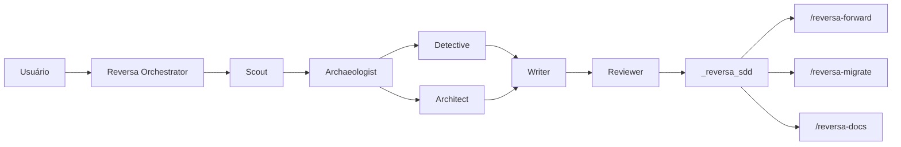
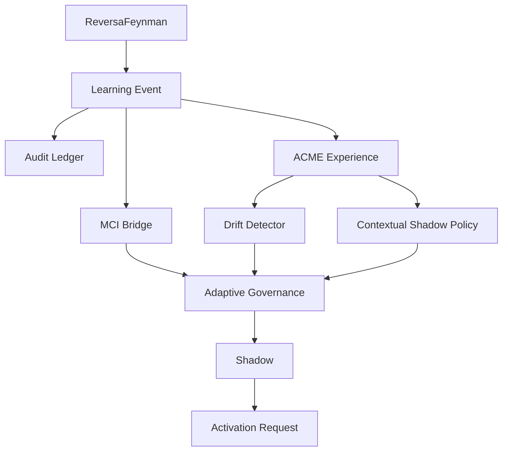
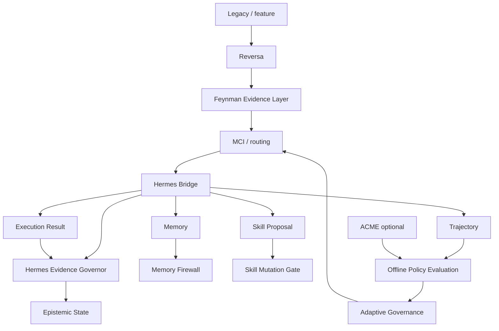

# ReversaFeynman

**Engenharia reversa, especificações executáveis, validação epistemológica e aprendizagem adaptativa governada para agentes de IA.**

**Identidade canônica preparada:** `MarceloClaro/reversaFeynman`

> **Estado do slug no GitHub — 13/09/2026:** o repositório físico ainda está publicado como `MarceloClaro/reversa`. A identidade `MarceloClaro/reversaFeynman` já é usada pelo código e pela documentação, mas o rename administrativo do GitHub ainda não foi concluído.

ReversaFeynman é uma linha independente mantida por **Marcelo Claro Laranjeira**, derivada historicamente do framework **Reversa** original e licenciada sob MIT.

A edição preserva engenharia reversa, SDD, rastreabilidade, pipelines especializados e compatibilidade multi-engine, acrescentando:

- **Feynman Evidence & Understanding Layer** — FEG-01..FEG-07, evidência, falsificabilidade e Teach-back;
- **Invocation Governance** — handoff seguro para skills protegidas;
- **Adaptive Governance v2** — MCI/ACME bridges, ledger auditável, shadow policy, drift detection e ativação controlada;
- **Offline Policy Evaluation v3** — `decide → observe`, holdout temporal, Brier/ECE, reward/regret, IC95% bootstrap e Adaptive Governance Report;
- **Hermes Bridge v1** — memória longitudinal governada, propostas de skill em shadow, trajetórias e resultados de execução;
- **Hermes Evidence Governor v2** — autoridade operacional de governança de evidência, substituindo o antigo Evidence Guard.

> Independência de desenvolvimento não significa independência de proveniência. O ReversaFeynman reconhece explicitamente o Reversa original como sua base histórica, arquitetural e científica, e preserva a autoria externa do Hermes Agent pela Nous Research.

Documentação principal:

- [`INDEPENDENCE.md`](INDEPENDENCE.md)
- [`docs/ACADEMIC-PROVENANCE.md`](docs/ACADEMIC-PROVENANCE.md)
- [`docs/HERMES-BRIDGE.md`](docs/HERMES-BRIDGE.md)
- [`docs/HERMES-EVIDENCE-GOVERNOR.md`](docs/HERMES-EVIDENCE-GOVERNOR.md)
- [`CITATION.cff`](CITATION.cff)

---

# Origem acadêmica e atribuição explícita

## Reversa original — obra de origem

O **ReversaFeynman é uma obra derivada do framework Reversa original**, publicado no repositório:

**SANDECO — Reversa**  
https://github.com/sandeco/reversa

A referência científica primária do framework original é:

**Sanderson Oliveira de Macedo; Ronaldo Martins da Costa.**  
**Reversa: A Reverse Documentation Engineering Framework for Converting Legacy Software into Operational Specifications for AI Agents.**  
arXiv, 2026. `arXiv:2605.18684`. Categoria principal `cs.SE`.  
DOI: `10.48550/arXiv.2605.18684`

## Referência do paper original — ABNT

> MACEDO, Sanderson Oliveira de; COSTA, Ronaldo Martins da. **Reversa: A Reverse Documentation Engineering Framework for Converting Legacy Software into Operational Specifications for AI Agents**. arXiv, 2026. arXiv:2605.18684. DOI: 10.48550/arXiv.2605.18684. Disponível em: https://arxiv.org/abs/2605.18684. Acesso em: 13 set. 2026.

## Referência do software original — ABNT

> SANDECO. **Reversa**: transform legacy systems into executable specifications for AI coding agents. GitHub, 2026. Disponível em: https://github.com/sandeco/reversa. Acesso em: 13 set. 2026.

## BibTeX do paper original

```bibtex
@misc{demacedo2026reversa,
  title         = {Reversa: A Reverse Documentation Engineering Framework for Converting Legacy Software into Operational Specifications for AI Agents},
  author        = {Sanderson Oliveira de Macedo and Ronaldo Martins da Costa},
  year          = {2026},
  eprint        = {2605.18684},
  archivePrefix = {arXiv},
  primaryClass  = {cs.SE},
  doi           = {10.48550/arXiv.2605.18684},
  url           = {https://arxiv.org/abs/2605.18684}
}
```

## Delimitação de autoria

| Camada | Proveniência |
|---|---|
| reverse documentation engineering | **Reversa original — Macedo & Costa / sandeco** |
| Discovery e pipeline multiagente de extração | **Reversa original** |
| especificações operacionais rastreáveis | **Reversa original** |
| estrutura `.reversa/`, famílias `/reversa-*` e compatibilidade multi-engine | **Reversa original / evolução histórica do projeto-base** |
| Forward, Migration, Documentation, Bugs e Refactor herdados | **arquitetura-base Reversa** |
| Feynman Evidence & Understanding Layer | **extensão ReversaFeynman** |
| FEG-01..FEG-07 e Teach-back | **extensão ReversaFeynman** |
| Adaptive Governance / MCI / ACME boundary | **extensão ReversaFeynman** |
| Offline Policy Evaluation v3 | **extensão ReversaFeynman** |
| Hermes Agent: memória, skills, subagentes e trajetórias | **Nous Research** |
| Hermes Bridge / Memory Firewall / Skill Mutation Gate | **extensão ReversaFeynman** |
| Hermes Evidence Governor v2 | **extensão ReversaFeynman** |

---

# Evolução arquitetural

| Dimensão | Reversa base | ReversaFeynman | Adaptive v2/v3 | Hermes v1/v2 |
|---|---|---|---|---|
| Engenharia reversa | Discovery + specs | preservada | preservada | preservada |
| Evidência | CONFIRMED / INFERRED / GAP | estados epistemológicos explícitos | policy não altera autoridade | Hermes governa evidência com regras locais |
| Auditoria | Reviewer / Quality / Audit | FEG-01..07 | ledger + drift + OPE | Memory Firewall + Evidence Governor |
| Aprendizagem | não | não | ACME opcional | memória/skills/trajectories opcionais |
| Execução adaptativa | não | não | shadow + activation request | transport Hermes opcional |
| Auto-ativação | não | não | não | não |
| `OBSERVED` | evidência do pipeline | evidência direta rastreável | métricas não promovem | governor exige evidência direta rastreável |

---

# Arquitetura original herdada do Reversa



Fluxo conceitual:

```text
Reconnaissance → Excavation → Interpretation → Generation → Review
```

Forward:

```text
requirements → clarify → quality → plan → to-do → audit → coding → sync
```

---

# Feynman Evidence & Understanding Layer

| Gate | Pergunta operacional |
|---|---|
| `FEG-01` | O mecanismo pode ser explicado sem depender apenas do nome? |
| `FEG-02` | A afirmação forte possui evidência/proveniência? |
| `FEG-03` | Observação e inferência estão separadas? |
| `FEG-04` | Existe teste/oracle capaz de refutar? |
| `FEG-05` | A solução resolve necessidade demonstrada ou é cargo cult? |
| `FEG-06` | Qual menor experimento reduz a incerteza? |
| `FEG-07` | A fonte humana explica mecanismo e transfere para cenário variante? |

Estados epistemológicos:

```text
OBSERVED
INFERRED
UNVERIFIED
BLOCKED
```

Estados humanos:

```text
HUMAN-VALIDATED
HUMAN-PARTIAL
HUMAN-CONFLICT
```

Invariantes:

```text
TEACHBACK_GREEN   ≠ OBSERVED
HUMAN-VALIDATED   ≠ OBSERVED
policy confidence ≠ OBSERVED
reward            ≠ OBSERVED
Hermes memory     ≠ OBSERVED
Hermes confidence ≠ OBSERVED
```

---

# Hermes Evidence Governor v2

O **Hermes Evidence Governor** substitui o antigo componente ativo chamado **Evidence Guard**.

Implementação ativa:

```text
lib/integrations/hermes/evidence-governor.js
```

Compatibilidade legada:

```text
lib/integrations/adaptive/evidence-guard.js
```

O arquivo legado é apenas um shim de reexportação. As regras de decisão não vivem mais nele.

## Regra central

```text
Hermes governa o processo de evidência.
Evidência direta rastreável estabelece OBSERVED.
```

Portanto, o governor rejeita `OBSERVED` quando a origem independente é:

```text
hermes-memory
hermes-confidence
hermes-user-model
hermes-skill-proposal
learned-policy
mci-trust
human
```

Tipos de evidência direta aceitos pelo baseline:

```text
code
contract
test
execution
log
dataset
artifact
```

Para promover para `OBSERVED`:

```text
source.direct === true
AND kind reconhecido
AND source.ref rastreável
AND origem não proibida
AND regra local aceita
```

## API principal

```js
import {
  applyHermesEvidenceProposal,
  createHermesEvidenceGovernor,
  evaluateHermesEvidence,
} from './lib/integrations/hermes/index.js';
```

Exemplo:

```js
const claim = applyHermesEvidenceProposal(
  { id: 'claim-1', epistemic_state: 'INFERRED' },
  {
    proposed: 'OBSERVED',
    source: {
      kind: 'test',
      direct: true,
      ref: 'tests/payment.test.js:42',
    },
  },
);
```

A decisão registra:

```text
governor = hermes-evidence-governor/v2
evidence_authority = direct-traceable-evidence
```

quando a evidência direta é aceita.

## Transport Hermes opcional

```js
const governor = createHermesEvidenceGovernor({
  transport: async (request) => collectFromHermes(request),
});
```

O runtime remoto retorna apenas um **candidato**. A resposta passa novamente pelas regras locais:

```text
Hermes remoto
    ↓
candidato
    ↓
Hermes Evidence Governor local
    ↓
accepted / rejected
```

Um runtime remoto não pode se autodeclarar autoridade epistemológica.

---

# Hermes Bridge v1

A integração vive em:

```text
lib/integrations/hermes/
```

Contratos:

```text
reversa.hermes.memory/v1
reversa.hermes.skill.proposal/v1
reversa.hermes.trajectory/v1
reversa.hermes.execution.result/v1
```

A bridge expõe o governor nativamente:

```js
const bridge = createHermesBridge();

bridge.evidence.evaluate(...);
bridge.evidence.apply(...);
bridge.evidence.collectEvidence(...);
```

Também é possível separar o transport geral do transport de evidência:

```js
const bridge = createHermesBridge({
  transport: genericTransport,
  evidenceTransport: evidenceCollector,
});
```

## Memory Firewall

Memória Hermes pode contextualizar, mas não produzir `OBSERVED` por si só.

```text
INFERRED
UNVERIFIED
BLOCKED
```

são estados permitidos no contrato de memória.

Memória de personalização permanece fora da autoridade de evidência.

## Skill Mutation Gate

Toda proposta de skill nasce com:

```text
mode = shadow
requires_review = true
requires_tests = true
evidence_authority = false
```

Elegibilidade exige:

```text
reviewApproved
AND testsPassing
AND feynmanApproved
AND no drift
```

Mesmo elegível:

```text
executable = false
file_mutation_performed = false
```

A bridge nunca autoaplica uma alteração de skill.

## Trajetórias

Trajetórias geram sinais operacionais conservadores:

- steps;
- failures;
- tool calls;
- duração conhecida;
- ações repetidas;
- estado terminal.

Trajetória é dado de execução/avaliação, não prova automática de domínio.

---

# Adaptive Governance v2

A camada adaptativa está em:

```text
lib/integrations/adaptive/
```

Ela não torna reinforcement learning autoridade sobre evidência.



Ações adaptativas permanecem limitadas por allowlist. Ações mutantes, como `route:coding`, exigem aprovação explícita.

---

# Offline Policy Evaluation v3

A v3 separa decisão e outcome:

```text
decide(contexto + histórico anterior)
            ↓
workflow baseline executa
            ↓
observe(outcome)
            ↓
histórico é atualizado
```

Isso reduz look-ahead leakage.

A avaliação inclui:

- holdout temporal;
- Brier Score;
- Expected Calibration Error;
- reward baseline × shadow;
- regret estimado;
- IC95% bootstrap determinístico;
- promotion readiness;
- drift e validade do ledger;
- Adaptive Governance Report.

Mesmo quando readiness é positiva:

```text
eligible_for_activation_request = true
auto_activate = false
```

---

# Arquitetura integrada



Responsabilidades:

| Componente | Pergunta principal |
|---|---|
| Reversa original | O que o sistema legado realmente faz? |
| ReversaFeynman | Como sabemos e o que pode refutar? |
| MCI | Quem deve agir e quando abster? |
| Hermes Bridge | Como persistir memória, skills, trajetórias e resultados? |
| Hermes Evidence Governor | A evidência suporta a transição epistemológica? |
| ACME/OPE | Qual política tende a gerar melhores outcomes? |

---

# SDD e TDD

Especificações principais:

```text
specs/SPEC-FEYNMAN-EVIDENCE-UNDERSTANDING-LAYER.md
specs/SPEC-ADAPTIVE-MCI-ACME-BRIDGE.md
specs/SPEC-ADAPTIVE-GOVERNANCE-V2.md
specs/SPEC-ADAPTIVE-OFFLINE-EVALUATION-V3.md
specs/SPEC-HERMES-BRIDGE-V1.md
specs/SPEC-HERMES-EVIDENCE-GOVERNOR-V2.md
```

Fluxo de desenvolvimento adotado:

```text
SPEC
  ↓
RED
  ↓
GREEN
  ↓
REFACTOR / HARDENING
  ↓
CI / PR
```

Testes relevantes:

```text
scripts/test-adaptive-bridges.mjs
scripts/test-offline-policy-evaluation.mjs
scripts/test-hermes-bridge.mjs
scripts/test-hermes-optionality.mjs
scripts/test-hermes-evidence-governor.mjs
```

---

# Governança de invocação

Pontos de entrada model-invoked documentados:

```text
reversa
reversa-new
reversa-forward
reversa-migrate
reversa-autonomous
reversa-refactor
reversa-debugger
reversa-docs
reversa-agents-help
```

Skills protegidas mantêm lockstep:

```text
SKILL.md: disable-model-invocation: true
openai.yaml: policy.allow_implicit_invocation: false
```

Quando uma skill protegida é a próxima etapa, o orquestrador lê o `SKILL.md` e executa suas instruções no contexto atual, em vez de invocá-la implicitamente pelo nome.

---

# Equipes e agentes

A taxonomia funcional preserva os grupos herdados e as extensões transversais.

| Grupo | Função |
|---|---|
| Discovery Core | extrair conhecimento e produzir specs |
| Migration | reconstrução/migração |
| Translators | adaptar fontes estruturadas |
| Pricing | estimativa e perfil |
| Forward | requirements → implementação |
| Documentation | site, mapas e narrativa |
| Ideation | problema → alternativas → pre-spec |
| New Project | ideia → PRD → SDD |
| Bugs | memória causal, diagnóstico e fix |
| Refactor | melhoria interna preservando comportamento |
| ReversaFeynman | auditoria epistemológica e Teach-back |
| Adaptive Layer | MCI/ACME, drift, policy e OPE |
| Hermes Layer | memória, skill proposals, trajetórias e evidence governance |

A taxonomia de skills/agentes herdados permanece compatível com o installer existente; a camada Hermes é uma integração de runtime/contratos, não uma duplicação das 73 skills já documentadas.

---

# Artefatos gerados

## Discovery

```text
_reversa_sdd/
├── inventory.md
├── dependencies.md
├── code-analysis.md
├── data-dictionary.md
├── domain.md
├── state-machines.md
├── permissions.md
├── architecture.md
├── confidence-report.md
├── gaps.md
├── questions.md
├── sdd/
├── openapi/
├── user-stories/
├── adrs/
├── flowcharts/
├── sequences/
├── database/
├── addenda/
└── traceability/
```

## Forward

```text
_reversa_forward/
└── <NNN>-<short-name>/
    ├── requirements.md
    ├── roadmap.md
    ├── investigation.md
    ├── actions.md
    ├── progress.jsonl
    ├── legacy-impact.md
    ├── regression-watch.md
    └── audit/
        ├── requirements-audit.md
        ├── cross-check.md
        ├── feynman-audit.md
        └── teachback.md
```

## Adaptive

```text
_reversa_sdd/
└── adaptive/
    └── governance-report.md
```

---

# Instalação

Enquanto o slug físico permanecer `MarceloClaro/reversa`:

```bash
npm exec --yes --package=github:MarceloClaro/reversa -- reversa install
```

Após o rename administrativo para `MarceloClaro/reversaFeynman`:

```bash
npm exec --yes --package=github:MarceloClaro/reversaFeynman -- reversa install
```

Requisitos do core:

- Node.js `>=18.20.2`;
- pelo menos um harness/agente compatível.

Hermes runtime, OpenCode MCI, ACME, JAX e TensorFlow continuam opcionais.

---

# Como usar

| Objetivo | Comando |
|---|---|
| Analisar legado | `/reversa` |
| Discovery autônomo | `/reversa-autonomous` |
| Brainstorm | `/reversa-brainstorm` |
| Projeto novo | `/reversa-new` |
| Evoluir feature | `/reversa-forward` |
| Pequena emenda | `/reversa-add` |
| Sincronizar addendum | `/reversa-sync` |
| Migrar/reconstruir | `/reversa-migrate` |
| Documentar | `/reversa-docs` |
| Registrar/corrigir bug | `/reversa-debugger`, `/reversa-debugger-fix` |
| Refatorar | `/reversa-refactor` |
| Auditoria Feynman | `/reversa-feynman` |
| Teach-back | `/reversa-teachback` |
| Ajuda | `/reversa-agents-help` |

As camadas Adaptive e Hermes são APIs internas/integrações nesta versão; não adicionam slash commands obrigatórios.

---

# Engines suportadas

| Engine | Entry file | Skills path |
|---|---|---|
| Claude Code ⭐ | `CLAUDE.md` | `.claude/skills/` + `.agents/skills/` |
| Codex ⭐ | `AGENTS.md` | `.agents/skills/` |
| Cursor ⭐ | `.cursorrules` | `.agents/skills/` |
| Gemini CLI | `GEMINI.md` | `.agents/skills/` |
| Windsurf | `.windsurfrules` | `.agents/skills/` |
| Antigravity | `AGENTS.md` | `.agents/skills/` |
| Kiro | — | `.kiro/skills/` + `.agents/skills/` |
| Opencode | `AGENTS.md` | `.agents/skills/` |
| Hermes | `AGENTS.md` | `.agents/skills/` |
| Cline | `.clinerules` | `.agents/skills/` |
| Roo Code | `.roorules` | `.agents/skills/` |
| GitHub Copilot | `.github/copilot-instructions.md` | `.agents/skills/` |
| Aider | `CONVENTIONS.md` | `.agents/skills/` |
| Amazon Q Developer | `.amazonq/rules/reversa.md` | `.agents/skills/` |

**Hermes como engine compatível** e **Hermes Bridge/Evidence Governor** são conceitos diferentes: o primeiro é um harness suportado pelo installer; o segundo é uma camada arquitetural interna de interoperabilidade e governança.

---

# Independência de upstream

ReversaFeynman não sincroniza automaticamente com `sandeco/reversa` nem com outros repositórios externos.

O guard estrutural rejeita padrões de sincronização automática como:

```text
gh repo sync
git remote add upstream
git remote set-url upstream
git fetch upstream
git pull upstream
git merge upstream/...
```

`package.json` permanece `private: true`.

A independência operacional não altera a obrigação de atribuir academicamente o Reversa original, nem a atribuição do Hermes Agent à Nous Research.

---

# Verificação estrutural

```bash
npm run verify
```

A suíte inclui:

```text
scripts/verify-no-upstream-sync.py
scripts/verify-invocation.py
scripts/verify-feynman-layer.py
scripts/test-installer-transport.mjs
scripts/test-adaptive-bridges.mjs
scripts/test-offline-policy-evaluation.mjs
scripts/test-hermes-bridge.mjs
scripts/test-hermes-optionality.mjs
scripts/test-hermes-evidence-governor.mjs
```

Entre os invariantes testados:

- policy/trust/reward não produzem `OBSERVED`;
- memória Hermes não produz `OBSERVED`;
- Hermes user model não produz `OBSERVED`;
- skill proposal permanece shadow e não muta arquivos;
- transport Hermes remoto não contorna as regras locais;
- `adaptive/evidence-guard.js` não contém ruleset independente;
- API legada delega ao Hermes Evidence Governor;
- Hermes/Python/Nous não são dependências obrigatórias do pacote;
- `decide → observe` evita look-ahead;
- drift bloqueia promoção;
- OPE não autoativa policy.

> Falha de provisionamento de runner não deve ser apresentada como falha nem como aprovação da suíte quando nenhum step tiver executado.

---

# Estrutura interna

```text
agents/
lib/
├── commands/
├── installer/
├── integrations/
│   ├── adaptive/
│   │   └── evidence-guard.js   # compatibility shim only
│   └── hermes/
│       ├── bridge.js
│       ├── constants.js
│       ├── contracts.js
│       ├── schema.js
│       ├── memory-firewall.js
│       ├── skill-governance.js
│       ├── trajectory.js
│       ├── evidence-adapter.js
│       ├── evidence-governor.js
│       └── index.js
└── utils/

scripts/
specs/
docs/
CITATION.cff
INDEPENDENCE.md
```

---

# Referências de integração

A arquitetura foi desenhada para interoperar opcionalmente com:

- `MarceloClaro/opencode-ecosystem-core` — MCI, MetaBus, Blackboard, Trust/Confidence e coordenação multiagente;
- `MarceloClaro/acme` — aprendizagem experimental de políticas;
- `NousResearch/hermes-agent` / `MarceloClaro/hermes-agent` — memória, skills, subagentes, tools e trajetórias.

Esses projetos permanecem externos e opcionais. O ReversaFeynman implementa contratos de fronteira e governança própria.

---

# Proveniência e licença

O framework-base é o **Reversa original**, de `sandeco/reversa`, associado ao paper de Macedo e Costa (2026).

O Hermes Agent é atribuído à **Nous Research**. O repositório `MarceloClaro/hermes-agent` é um fork usado para estudo e integração.

Extensões desta linha incluem:

- handoff seguro para skills protegidas;
- Feynman Evidence & Understanding Layer;
- FEG-01..FEG-07;
- Teach-back;
- Adaptive MCI/ACME Bridge;
- Audit Ledger SHA-256;
- Contextual Shadow Policy;
- Drift Detector;
- Offline Policy Evaluation v3;
- Hermes Bridge v1;
- Memory Firewall;
- Skill Mutation Gate;
- Hermes Evidence Governor v2.

Para trabalhos acadêmicos, recomenda-se citar o paper original do Reversa e identificar separadamente a versão/commit/tag do ReversaFeynman utilizado.

Licença do software: **MIT** — consulte [`LICENSE`](LICENSE).

---

# Síntese

```text
Reversa original — sandeco / Macedo & Costa (2026)
        ↓
reverse documentation engineering
        ↓
ReversaFeynman
        ↓
Feynman Evidence & Understanding
        ↓
MCI / Adaptive Governance
        ↓
Hermes Bridge
        ├── memory
        ├── skill proposals
        ├── trajectories
        └── execution results
        ↓
Hermes Evidence Governor
        ↓
direct traceable evidence rules
        ↓
OBSERVED / INFERRED / UNVERIFIED / BLOCKED
        ↓
Offline Policy Evaluation / learning
```

O ciclo evolui para:

```text
extrair
→ compreender
→ especificar
→ decidir em shadow
→ executar
→ registrar trajetória
→ coletar evidência
→ governar evidência com Hermes
→ observar outcome
→ verificar
→ calibrar
→ avaliar offline
→ detectar drift
→ aprender
→ reavaliar
```

sem permitir que memória, confiança, recompensa, aprendizado probabilístico ou um runtime remoto substituam evidência direta verificável.
