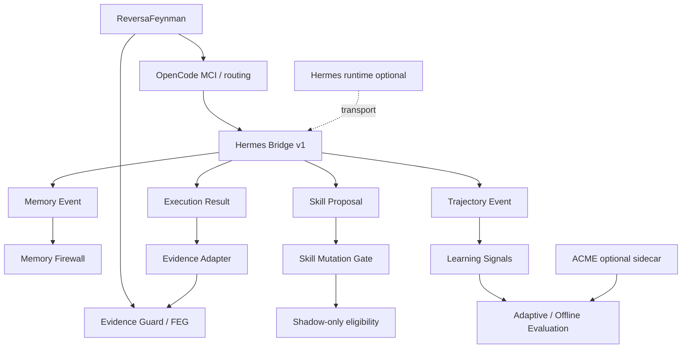

# Hermes Bridge v1 — Memory, Skill Evolution & Trajectory Layer

## Status

Implemented as an optional ReversaFeynman interoperability layer.

Specification: [`../specs/SPEC-HERMES-BRIDGE-V1.md`](../specs/SPEC-HERMES-BRIDGE-V1.md)

Tests:

```text
scripts/test-hermes-bridge.mjs
scripts/test-hermes-optionality.mjs
```

## Provenance

Hermes Agent is an external project built by **Nous Research**. The repository `MarceloClaro/hermes-agent` is a fork of `NousResearch/hermes-agent`.

- upstream/original project: `https://github.com/NousResearch/hermes-agent`
- local fork used for study/integration: `https://github.com/MarceloClaro/hermes-agent`
- license reported by GitHub/upstream: MIT

ReversaFeynman does not claim authorship of Hermes Agent, its memory system, its skill system, its gateways, its tool execution model or its trajectory facilities. This document describes only the ReversaFeynman boundary contracts and governance added to interoperate with those concepts.

## Why integrate Hermes

ReversaFeynman already provides:

- reverse documentation engineering;
- SDD artifacts and traceability;
- FEG-01..07;
- Evidence Guard;
- MCI/ACME boundary contracts;
- Audit Ledger;
- drift detection;
- shadow policy;
- Offline Policy Evaluation.

Hermes adds a complementary axis:

- persistent cross-session memory;
- procedural memory/skills;
- skill improvement from experience;
- isolated subagents;
- tool/RPC execution;
- trajectories suitable for later evaluation or training;
- scheduled/unattended operation.

The bridge intentionally does **not** merge these responsibilities.

## Architecture



Responsibility split:

| Layer | Responsibility |
|---|---|
| Reversa original | reverse documentation engineering and operational specs |
| ReversaFeynman | evidence, falsifiability, epistemic state and traceability |
| OpenCode MCI | metacognitive routing/trust/confidence |
| Hermes | memory, skills, tools, subagents, execution trajectories |
| ACME | experimental policy learning/evaluation |
| Hermes Bridge | safe, versioned contracts between Hermes concepts and ReversaFeynman |

## Contracts

### Memory Event

```text
reversa.hermes.memory/v1
```

Memory can inform context but cannot establish truth by itself.

```text
Hermes memory      ≠ OBSERVED
memory confidence  ≠ OBSERVED
user model         ≠ OBSERVED
session summary    ≠ OBSERVED
```

Allowed memory epistemic states:

```text
INFERRED
UNVERIFIED
BLOCKED
```

`OBSERVED` is rejected at validation time.

### Skill Proposal

```text
reversa.hermes.skill.proposal/v1
```

Every proposal is created with:

```text
mode = shadow
requires_review = true
requires_tests = true
evidence_authority = false
```

A proposal cannot modify files through this bridge.

Eligibility requires:

```text
reviewApproved
AND testsPassing
AND feynmanApproved
AND no drift
```

Even then:

```text
eligible = true
executable = false
file_mutation_performed = false
```

The normal repository workflow remains responsible for applying an accepted change.

### Trajectory Event

```text
reversa.hermes.trajectory/v1
```

Trajectory events capture operational history. The bridge derives only measurable operational signals:

- number of steps;
- failed steps;
- tool calls;
- known duration;
- repeated actions;
- terminal/completion status.

A trajectory is useful for adaptive/offline evaluation, but is not direct evidence for arbitrary claims.

### Execution Result

```text
reversa.hermes.execution.result/v1
```

A successful execution does not automatically create `OBSERVED` claims.

Promotion path:

```text
Hermes execution result
        ↓
explicit direct_evidence[]
        ↓
recognized evidence kind
        ↓
explicit claim_id mapping
        ↓
Evidence Proposal
        ↓
existing ReversaFeynman Evidence Guard
        ↓
OBSERVED only if the guard accepts it
```

Recognized direct evidence kinds remain defined by ReversaFeynman:

```text
code
contract
test
execution
log
dataset
artifact
```

## Memory Firewall

`classifyHermesMemory()` prevents semantic memory from silently becoming evidence.

Personalization memory is explicitly isolated:

```text
scope = personalization
        ↓
context/personalization only
        ↓
evidence_authority = false
```

This protects project/scientific reasoning from user-model leakage.

## Skill evolution flow

Recommended flow:

```text
Hermes experience
      ↓
Skill Proposal
      ↓
shadow
      ↓
Reviewer
      ↓
Tests
      ↓
Feynman audit
      ↓
Drift check
      ↓
eligible proposal
      ↓
normal Reversa repository change workflow
      ↓
new outcomes
      ↓
Offline Policy Evaluation
```

No self-improvement mechanism is allowed to bypass tests or epistemic review.

## SDD

The bridge was specified before implementation in:

```text
specs/SPEC-HERMES-BRIDGE-V1.md
```

The SPEC defines:

- problem and goal;
- non-goals;
- provenance;
- four schemas;
- epistemic invariants;
- Memory Firewall;
- Skill Mutation Gate;
- trajectory signal extraction;
- evidence adaptation;
- transport boundary;
- security requirements;
- executable acceptance criteria.

## TDD

The implementation history intentionally follows:

```text
SPEC
  ↓
RED: test imports API not implemented yet
  ↓
GREEN: implement contracts/gates/adapters
  ↓
REFACTOR: wire optionality + CI + docs
```

Primary acceptance test:

```text
scripts/test-hermes-bridge.mjs
```

It verifies:

- memory validation;
- rejection of `OBSERVED` memory;
- personalization isolation;
- skill shadow mode;
- review/test/Feynman gates;
- drift blocking;
- ordered trajectories;
- trajectory signals;
- no evidence from successful execution alone;
- direct test evidence mapped to an explicit claim;
- final authority delegated to the existing Evidence Guard;
- inert dispatch without transport.

Optionality test:

```text
scripts/test-hermes-optionality.mjs
```

It rejects the addition of Hermes, Nous or Python runtime dependencies to the Node package.

## Runtime optionality

No Hermes dependency is present in `package.json`.

No builder or validator performs network calls.

`createHermesBridge()` accepts an optional transport callback. Without it:

```js
const bridge = createHermesBridge();
await bridge.dispatch(contract);
// { requested: false, reason: 'no-transport-configured' }
```

This allows adapters for Hermes CLI, RPC, MCP or another transport to be added later without coupling the core to one execution backend.

## Security invariants

```text
Hermes memory            ≠ direct evidence
Hermes confidence        ≠ direct evidence
Hermes user model        ≠ direct evidence
Hermes skill proposal    ≠ executable mutation
Hermes trajectory        ≠ claim truth
Hermes execution success ≠ OBSERVED
```

Only a direct, traceable evidence reference mapped to a claim may be forwarded as an `OBSERVED` proposal, and the existing Evidence Guard remains the final authority.
