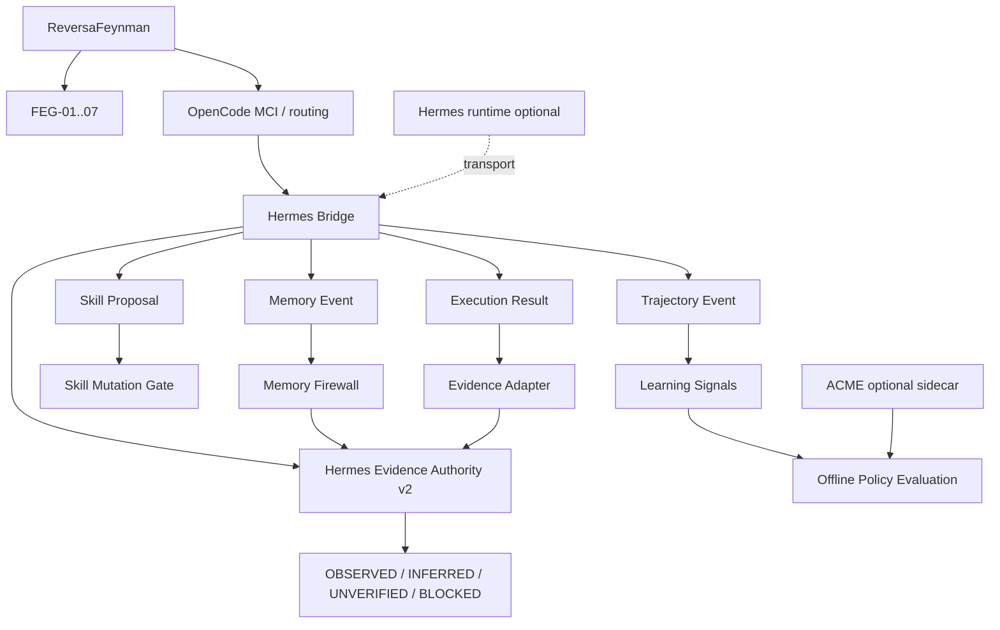

# Hermes Bridge — Memory, Skills, Trajectories & Evidence Authority

## Status

- **Hermes Bridge v1:** implemented
- **Hermes Evidence Authority v2:** implemented in this evolution

Specifications:

```text
specs/SPEC-HERMES-BRIDGE-V1.md
specs/SPEC-HERMES-EVIDENCE-AUTHORITY-V2.md
```

Executable tests:

```text
scripts/test-hermes-bridge.mjs
scripts/test-hermes-evidence-authority.mjs
scripts/test-hermes-optionality.mjs
```

## Provenance

Hermes Agent is an external project built by **Nous Research**.

- original/upstream: `https://github.com/NousResearch/hermes-agent`
- fork used for study/interoperability: `https://github.com/MarceloClaro/hermes-agent`
- license reported by the upstream repository: MIT

ReversaFeynman does not claim authorship of Hermes Agent, its original memory system, skill system, gateways, tool runtime, subagents or trajectory facilities. The contracts, Memory Firewall, Skill Mutation Gate and **Hermes Evidence Authority v2** documented here are ReversaFeynman interoperability/governance extensions.

## Architectural decision v2

The previous standalone ReversaFeynman `Evidence Guard` implementation has been replaced as the canonical evidence-decision engine.

Canonical implementation:

```text
lib/integrations/hermes/evidence-authority.js
```

Historical compatibility path:

```text
lib/integrations/adaptive/evidence-guard.js
```

The historical file remains only as a compatibility facade and delegates its legacy exports directly to Hermes:

```text
assertEpistemicState
    → assertHermesEpistemicState

isDirectEvidence
    → isHermesDirectEvidence

evaluateEvidenceProposal
    → evaluateHermesEvidenceProposal

applyEvidenceProposal
    → applyHermesEvidenceProposal
```

It no longer contains an independent allowlist or promotion algorithm.

## Current architecture



## Responsibility split

| Layer | Responsibility |
|---|---|
| Reversa original | reverse documentation engineering and operational specifications |
| ReversaFeynman / FEG | falsifiability, provenance discipline, understanding audits |
| OpenCode MCI | metacognitive routing, confidence/trust and orchestration |
| Hermes Agent | memory, skills, tools, subagents and execution trajectories |
| Hermes Bridge | safe versioned interoperability contracts |
| Hermes Evidence Authority v2 | canonical epistemic promotion decision engine |
| ACME | experimental policy learning/evaluation |

## Evidence authority contract

Every canonical decision uses:

```text
reversa.hermes.evidence.decision/v1
```

and identifies itself as:

```text
authority = hermes
engine = hermes-evidence-authority-v2
evidence_authority = true
```

`evidence_authority=true` refers to the **decision engine**. It does not turn memories, trajectories, skill proposals or execution envelopes into evidence authorities.

Those contracts continue to use:

```text
evidence_authority = false
```

## Promotion to OBSERVED

Hermes Evidence Authority accepts `OBSERVED` only when all three conditions hold:

```text
source.direct === true
AND source.kind is allowlisted
AND source.ref is traceable/non-empty
```

Baseline accepted direct-evidence kinds remain:

```text
code
contract
test
execution
log
dataset
artifact
```

The following do not produce `OBSERVED` by themselves:

```text
hermes-memory
hermes-skill
hermes-confidence
learned-policy
mci-trust
human
```

Therefore:

```text
Hermes is the evidence decision authority
```

but:

```text
Hermes memory ≠ direct evidence
Hermes confidence ≠ direct evidence
Hermes skill success ≠ direct evidence
```

This distinction is intentional.

## Memory Event

Schema:

```text
reversa.hermes.memory/v1
```

Memory can inform context but cannot establish truth by itself.

Allowed memory epistemic states:

```text
INFERRED
UNVERIFIED
BLOCKED
```

A memory contract declaring `OBSERVED` is rejected during validation.

### Memory context inside the authority

The Hermes Evidence Authority may receive a `memoryContext` array.

Memory context is used diagnostically:

- number of valid memory items;
- number of invalid items;
- number of personalization items;
- memory references.

It does not change an indirect claim into direct evidence.

The same direct-evidence proposal must have the same accept/reject result with or without memory context.

## Personalization isolation

`scope=personalization` remains isolated from epistemic promotion.

```text
personalization memory
        ↓
context/personalization
        ↓
evidence_authority = false
```

User modeling cannot silently enter scientific or engineering claims as truth.

## Skill Proposal

Schema:

```text
reversa.hermes.skill.proposal/v1
```

Every proposal starts with:

```text
mode = shadow
requires_review = true
requires_tests = true
evidence_authority = false
```

Eligibility requires:

```text
reviewApproved
AND testsPassing
AND feynmanApproved
AND no drift
```

Even when eligible:

```text
executable = false
file_mutation_performed = false
```

The bridge never silently rewrites a skill.

## Trajectory Event

Schema:

```text
reversa.hermes.trajectory/v1
```

Trajectory processing extracts operational signals only:

- step count;
- failed steps;
- tool calls;
- known duration;
- repeated actions;
- completion/terminal state.

A trajectory is useful for offline evaluation but is not proof of arbitrary domain claims.

## Execution Result

Schema:

```text
reversa.hermes.execution.result/v1
```

The current promotion path is:

```text
Hermes execution result
        ↓
direct_evidence[]
        ↓
Hermes direct-evidence classifier
        ↓
explicit claim_id mapping
        ↓
Evidence Proposal
        ↓
Hermes Evidence Authority v2
        ↓
OBSERVED only if accepted
```

The evidence adapter now uses `isHermesDirectEvidence()` directly. It no longer imports the adaptive direct-evidence allowlist as its own decision mechanism.

## New-API usage

```js
import { createHermesBridge } from './lib/integrations/hermes/index.js';

const hermes = createHermesBridge();

const decision = hermes.evaluateEvidence({
  current: 'INFERRED',
  proposed: 'OBSERVED',
  source: {
    kind: 'test',
    direct: true,
    ref: 'tests/example.test.js:42',
  },
});
```

The same bridge exposes:

```text
hermes.evidenceAuthority
hermes.evaluateEvidence
hermes.applyEvidence
```

## Legacy API compatibility

Existing consumers may continue to import:

```js
import {
  applyEvidenceProposal,
  evaluateEvidenceProposal,
} from './lib/integrations/adaptive/index.js';
```

These names now delegate to Hermes Evidence Authority v2.

An applied claim contains the canonical field:

```text
hermes_evidence_authority
```

and temporarily also exposes:

```text
epistemic_guard
```

as a compatibility alias pointing to the exact same frozen decision object.

## SDD

The original bridge was specified in:

```text
specs/SPEC-HERMES-BRIDGE-V1.md
```

The replacement of Evidence Guard by Hermes is specified separately in:

```text
specs/SPEC-HERMES-EVIDENCE-AUTHORITY-V2.md
```

The v2 specification defines:

- canonical Hermes evidence API;
- compatibility facade requirements;
- direct evidence rules;
- memory-context semantics;
- apply semantics;
- adapter migration;
- security invariants;
- executable TDD criteria.

## TDD

The v2 development sequence is:

```text
SPEC v2
   ↓
RED: test imports Hermes Evidence Authority API before implementation
   ↓
GREEN: canonical Hermes authority + adaptive facade
   ↓
REFACTOR: Bridge exposure + adapter migration + docs/CI
```

Primary v2 test:

```text
scripts/test-hermes-evidence-authority.mjs
```

It proves that:

- direct `test` evidence is accepted;
- Hermes memory at confidence `1.0` still cannot create `OBSERVED`;
- learned-policy, MCI trust, human state, Hermes skills and Hermes confidence are non-authoritative sources;
- memory context cannot override indirect-evidence rejection;
- direct decisions remain stable with/without memory context;
- applied claims expose `hermes_evidence_authority`;
- the legacy alias points to the same Hermes decision;
- legacy Adaptive API delegates to Hermes;
- the execution adapter uses Hermes classification;
- the old Adaptive file contains no independent allowlist/promotion logic.

## Runtime optionality

Hermes Agent remains an optional external runtime.

No Hermes/Nous/Python dependency is added to `package.json`.

The **Hermes Evidence Authority itself is local JavaScript code in ReversaFeynman**, so evidence decisions do not require network access or a running external Hermes process.

This avoids a critical failure mode where epistemic validation would disappear when an external agent runtime is unavailable.

## Security invariants

```text
Hermes runtime unavailable      → local authority still works
Hermes memory high confidence   → still not direct evidence
Hermes skill successful         → still not direct evidence
Policy reward/calibration       → still not direct evidence
Human fluency/validation        → still not direct evidence
Direct traceable source         → may authorize OBSERVED
```

No evidence decision performs network access, shell execution or file mutation.

## Summary

The architecture is now intentionally asymmetric:

```text
Before
------
Hermes execution/memory
        ↓
Evidence Adapter
        ↓
Adaptive Evidence Guard

After
-----
Hermes memory / execution / skills / trajectory
        ↓
Hermes Bridge
        ↓
Hermes Evidence Authority v2
        ↓
Epistemic state
```

`adaptive/evidence-guard.js` survives only to prevent breaking existing callers; it is no longer the implementation authority.
