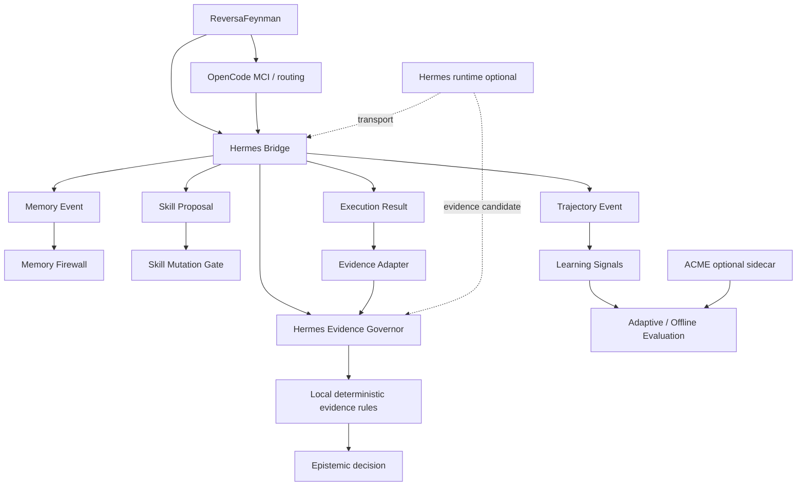

# Hermes Bridge v1 — Memory, Skill Evolution, Trajectory & Evidence Governance

## Status

Implemented as an optional ReversaFeynman interoperability layer.

Specifications:

```text
specs/SPEC-HERMES-BRIDGE-V1.md
specs/SPEC-HERMES-EVIDENCE-GOVERNOR-V2.md
```

Tests:

```text
scripts/test-hermes-bridge.mjs
scripts/test-hermes-optionality.mjs
scripts/test-hermes-evidence-governor.mjs
```

## Provenance

Hermes Agent is an external project built by **Nous Research**. The repository `MarceloClaro/hermes-agent` is a fork of `NousResearch/hermes-agent`.

- upstream/original project: `https://github.com/NousResearch/hermes-agent`
- fork used for study/integration: `https://github.com/MarceloClaro/hermes-agent`
- license reported by GitHub/upstream: MIT

ReversaFeynman does not claim authorship of Hermes Agent, its memory system, skill system, gateways, tool execution model or trajectory facilities. ReversaFeynman implements the contracts and governance boundary described here.

## Architectural decision

The former ReversaFeynman **Evidence Guard** has been replaced by the **Hermes Evidence Governor v2**.

Active implementation:

```text
lib/integrations/hermes/evidence-governor.js
```

Legacy compatibility path:

```text
lib/integrations/adaptive/evidence-guard.js
```

The legacy file is now a thin re-export shim and contains no independent evidence-decision rules.

## Architecture



Responsibility split:

| Layer | Responsibility |
|---|---|
| Reversa original | reverse documentation engineering and operational specs |
| ReversaFeynman | evidence semantics, falsifiability, epistemic state and traceability |
| OpenCode MCI | metacognitive routing/trust/confidence |
| Hermes Agent | memory, skills, tools, subagents and execution trajectories |
| Hermes Bridge | versioned interoperability contracts |
| Hermes Evidence Governor | active evidence-governance component |
| ACME | experimental policy learning/evaluation |

## Contracts

### Memory Event

```text
reversa.hermes.memory/v1
```

Memory can inform context but cannot establish truth by itself.

```text
Hermes memory      ≠ OBSERVED
memory confidence  ≠ OBSERVED
user model         ≠ OBSERVED
session summary    ≠ OBSERVED
```

Allowed memory epistemic states:

```text
INFERRED
UNVERIFIED
BLOCKED
```

`OBSERVED` is rejected at memory-contract validation time.

### Skill Proposal

```text
reversa.hermes.skill.proposal/v1
```

Every proposal is created with:

```text
mode = shadow
requires_review = true
requires_tests = true
evidence_authority = false
```

Eligibility requires review, passing tests, Feynman approval and absence of drift. Eligibility does not mutate files.

### Trajectory Event

```text
reversa.hermes.trajectory/v1
```

Trajectory events capture operational history and derive only measurable execution signals such as steps, failures, tool calls, duration, repeated actions and terminal status.

A trajectory is evaluation/training data, not proof of arbitrary domain claims.

### Execution Result

```text
reversa.hermes.execution.result/v1
```

A successful execution does not automatically create `OBSERVED` claims.

The promotion path is now:

```text
Hermes execution result
        ↓
explicit direct_evidence[]
        ↓
recognized evidence kind
        ↓
explicit claim_id mapping
        ↓
evidence proposal
        ↓
Hermes Evidence Governor
        ↓
local deterministic rules
        ↓
OBSERVED only if accepted
```

Recognized direct evidence kinds:

```text
code
contract
test
execution
log
dataset
artifact
```

## Hermes Evidence Governor

Primary API:

```js
import {
  applyHermesEvidenceProposal,
  createHermesEvidenceGovernor,
  evaluateHermesEvidence,
} from '../lib/integrations/hermes/index.js';
```

Direct evidence accepted by the governor must be traceable and explicit.

Forbidden as independent sources of `OBSERVED`:

```text
hermes-memory
hermes-confidence
hermes-user-model
hermes-skill-proposal
learned-policy
mci-trust
human
```

These sources may contextualize reasoning or support weaker states, but do not independently establish observation.

Detailed documentation:

```text
docs/HERMES-EVIDENCE-GOVERNOR.md
```

## Native bridge integration

`createHermesBridge()` exposes the governor directly:

```js
const bridge = createHermesBridge();

bridge.evidence.evaluate(...);
bridge.evidence.apply(...);
bridge.evidence.collectEvidence(...);
```

A separate evidence transport may be supplied:

```js
const bridge = createHermesBridge({
  transport: genericHermesTransport,
  evidenceTransport: hermesEvidenceCollector,
});
```

The evidence transport can collect candidate evidence, but cannot override local deterministic rules.

## Memory Firewall

`classifyHermesMemory()` prevents semantic memory from silently becoming evidence.

Personalization memory remains isolated:

```text
scope = personalization
        ↓
context/personalization only
        ↓
evidence_authority = false
```

## Skill evolution flow

```text
Hermes experience
      ↓
Skill Proposal
      ↓
shadow
      ↓
Reviewer
      ↓
Tests
      ↓
Feynman audit
      ↓
Drift check
      ↓
eligible proposal
      ↓
normal Reversa repository change workflow
      ↓
new outcomes
      ↓
Offline Policy Evaluation
```

No self-improvement mechanism may bypass tests or epistemic review.

## SDD/TDD history

Hermes Bridge v1 was specified before implementation in:

```text
specs/SPEC-HERMES-BRIDGE-V1.md
```

The evidence-governance replacement is specified in:

```text
specs/SPEC-HERMES-EVIDENCE-GOVERNOR-V2.md
```

The v2 TDD test proves:

- direct `test` evidence can promote `INFERRED -> OBSERVED`;
- Hermes memory/confidence/user-model cannot promote to `OBSERVED`;
- learned policy, MCI trust and human confidence cannot promote to `OBSERVED`;
- governor works without a Hermes runtime;
- a remote Hermes candidate cannot bypass local rules;
- Hermes Bridge exposes the governor natively;
- the old Evidence Guard path contains no duplicate rule engine;
- old APIs remain operational through delegation;
- no Hermes/Nous/Python dependency is added to the Node package.

## Runtime optionality

No Hermes runtime dependency is present in `package.json`.

No builder, validator or local evidence evaluator performs network calls.

Without transport, both the general Hermes Bridge and the evidence governor remain fully local.

## Security invariants

```text
Hermes memory            ≠ direct evidence
Hermes confidence        ≠ direct evidence
Hermes user model        ≠ direct evidence
Hermes skill proposal    ≠ executable mutation
Hermes trajectory        ≠ claim truth
Hermes execution success ≠ OBSERVED
remote Hermes response   ≠ local rule override
```

The active authority is therefore the **Hermes Evidence Governor**, while the authority basis for `OBSERVED` remains **direct, traceable evidence**.
