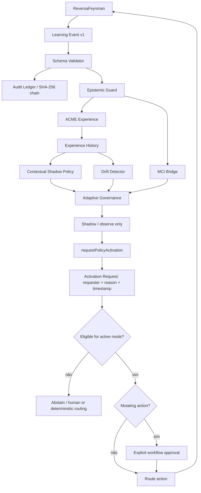

# SPEC — Adaptive Governance v2

## Status

Implementado como evolução compatível da camada `Adaptive MCI + ACME Bridge`.

## Objetivo

Transformar a primeira integração adaptativa em um subsistema governado, auditável e apto a experimentação segura, sem conceder a políticas aprendidas autoridade epistemológica nem execução irrestrita.

A v2 acrescenta cinco capacidades:

1. validação estrutural dos contratos;
2. ledger em hash-chain para replay/auditoria;
3. contextual shadow policy;
4. detecção de drift;
5. runtime coordenador com promoção explícita e rastreável para modo ativo.

## Invariantes

### AGV2-01 — `OBSERVED` continua fora da autoridade adaptativa

Nenhum reward, score, trust, política contextual, drift detector, MCI ou ACME pode promover um claim para `OBSERVED` sem evidência direta aceita pelo `Evidence Guard`.

### AGV2-02 — Candidate actions não redefinem a allowlist

Uma lista de candidatos externa é sempre intersectada com a allowlist global do ReversaFeynman. Uma ação arbitrária nunca se torna permitida apenas por aparecer em `candidateActions`.

### AGV2-03 — Shadow mode por padrão

A policy baseline `contextual-shadow-v1` apenas ranqueia/projeta uma ação. Ela não é executável por padrão.

### AGV2-04 — Ativação é uma decisão explícita, separada e auditável

Uma proposal não se torna ativa por simples alteração do campo `mode`.

A transição deve ocorrer por `requestPolicyActivation()`, que exige:

- proposal originalmente em `shadow`;
- `requestedBy` não vazio;
- `reason` não vazio;
- timestamp válido.

A função produz `activation_request` com solicitante, motivo e timestamp.

Depois disso, `governAdaptiveProposal()` ainda exige simultaneamente:

- ação allowlisted;
- ausência de drift detectado;
- histórico mínimo;
- confiança mínima da policy;
- `activeMode=true`;
- `proposal.mode='active'`;
- `activation_request` presente;
- aprovação explícita quando a ação for mutante.

### AGV2-05 — Drift força contenção

Drift relevante de reward, confiança ou mistura epistemológica impede promoção automática da policy e pode forçar abstention.

### AGV2-06 — Eventos são deduplicados e auditáveis

O ledger rejeita replay duplicado por `event_id` e encadeia cada registro com SHA-256 sobre sequence + previous hash + canonical payload hash.

### AGV2-07 — Schemas são validados antes de consumo

Learning Event, MCI Envelope e ACME Experience passam por validação estrutural e de limites antes de serem aceitos pela camada adaptativa.

### AGV2-08 — Dependências externas continuam opcionais

Não há dependência obrigatória em `opencode-ecosystem-core`, `dm-acme`, JAX ou TensorFlow.

## Arquitetura



## Contratos v1 preservados

A v2 continua usando:

- `reversa.learning.event/v1`;
- `reversa.mci.envelope/v1`;
- `reversa.acme.experience/v1`.

Não houve quebra deliberada de schema; houve validação mais rigorosa.

## Learning Event hardening

`createLearningEvent()` agora:

- usa UUID quando `metadata.eventId` não é fornecido;
- rejeita timestamp inválido;
- rejeita confidence/trust fora de `[0,1]`;
- valida o evento completo antes de devolvê-lo.

## Schema validation

`schema.js` verifica, entre outros:

- `feynman_score ∈ [0,12]`;
- contadores não negativos;
- confiança/trust em `[0,1]`;
- IDs FEG válidos;
- vetor ACME com 7 dimensões finitas;
- reward em `[-1,1]`;
- `evidence_authority=false`.

## Audit Ledger

`createAuditLedger()` mantém uma cadeia:

```text
genesis_hash
    ↓
entry_1 = H(sequence_1 + previous + payload_hash_1)
    ↓
entry_2 = H(sequence_2 + entry_1 + payload_hash_2)
    ↓
...
```

Propriedades:

- dedupe por `event_id`;
- SHA-256;
- snapshot somente leitura;
- verificação integral da cadeia;
- exportação JSONL.

O ledger em memória não substitui armazenamento persistente externo. Ele fornece integridade e replay dentro do runtime atual.

## Contextual Shadow Policy

`contextual-shadow-v1` é um baseline deliberadamente simples e auditável.

Para cada ação candidata segura:

1. seleciona experiências históricas da mesma ação;
2. calcula similaridade entre observation vectors;
3. estima reward empírico ponderado pela similaridade;
4. adiciona bônus de incerteza/exploração;
5. ranqueia as ações.

A proposta sempre nasce em:

```text
mode = shadow
evidence_authority = false
```

Esse baseline não é apresentado como contextual bandit estatisticamente ótimo. Ele serve para coleta segura de evidência operacional e comparação posterior com um learner externo.

## Drift detector

O detector compara uma janela de referência com uma janela recente.

Métricas baseline:

- `reward_delta`;
- `confidence_delta`;
- `observed_share_delta`.

Status possíveis:

- `insufficient_data`;
- `stable`;
- `drift`.

Thresholds são configuráveis e devem ser tratados como hipóteses falsificáveis.

## Adaptive Governance

A policy só pode ser marcada como executável quando todos os gates operacionais forem satisfeitos.

Bloqueios possíveis:

```text
action-not-allowlisted
drift-detected
insufficient-history
low-policy-confidence
approval-required
shadow-mode
```

`shadow-mode` inclui ausência de `activation_request` válido, ausência de `activeMode=true` ou proposal ainda em modo shadow.

Ações mutantes permanecem sujeitas ao workflow humano/determinístico. `route:coding` continua como baseline mutante.

## Adaptive Runtime

`createAdaptiveRuntime()` coordena:

```text
event
  → schema validation
  → ledger
  → MCI envelope
  → ACME experience
  → bounded history
  → drift
  → shadow proposal
  → governance
```

Por padrão:

- valida `candidateActions` antes do primeiro ingest;
- não despacha para transports externos;
- não executa action proposal;
- mantém a policy em shadow mode;
- expõe `requestActivation()` para produzir um activation request explícito;
- expõe `evaluateActivation()` para aplicar os gates finais.

## Critérios de aceitação

- CA1: learning event inválido é rejeitado.
- CA2: confidence/trust fora de `[0,1]` é rejeitado.
- CA3: ledger detecta evento duplicado.
- CA4: ledger verifica a própria hash-chain.
- CA5: candidate action fora da allowlist não entra no ranking nem no runtime.
- CA6: shadow proposal nunca é executável por padrão.
- CA7: simples alteração manual de `mode` sem `activation_request` não basta para execução.
- CA8: `requestPolicyActivation()` exige solicitante, motivo e timestamp válido.
- CA9: modo ativo exige histórico e confiança mínimos.
- CA10: drift bloqueia promoção da policy.
- CA11: ação mutante exige aprovação explícita.
- CA12: policy/reward/trust continuam sem autoridade para criar `OBSERVED`.
- CA13: runtime integra ledger, MCI, ACME, drift e governance sem ação automática.
- CA14: `scripts/test-adaptive-bridges.mjs` cobre os invariantes acima.

## Estratégia recomendada de maturação

1. **Shadow:** coletar dados e comparar decisões sem alterar roteamento real.
2. **Offline evaluation:** medir estabilidade, reward e calibração por action/stage.
3. **Canary:** habilitar apenas ações não mutantes e baixo risco.
4. **Guarded active:** permitir subset de rotas sob drift/activation/approval gates.
5. **External learner:** somente depois, conectar ACME real ou outro learner com dados suficientes.

RL profundo de horizonte longo não é requisito nem recomendação inicial.
