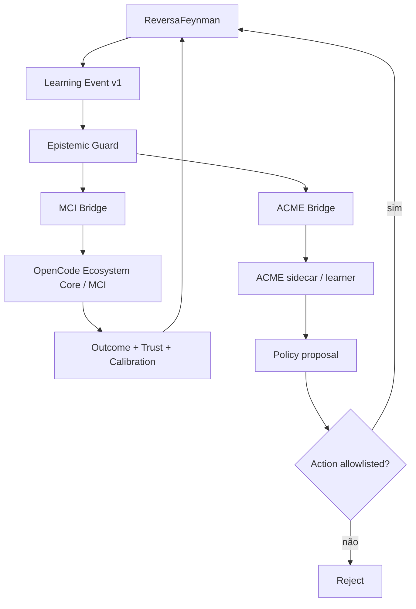

# SPEC — Adaptive MCI + ACME Bridge

## Status

Implementado como camada opcional e desacoplada.

## Objetivo

Permitir que o ReversaFeynman exponha eventos versionados de execução, evidência, confiança e outcome para dois consumidores externos:

1. **OpenCode Ecosystem Core / MCI** — metacognição, roteamento, confiança, memória e coordenação multiagente;
2. **ACME** — aprendizagem de política a partir de experiências, inicialmente adequada a seleção/rankeamento de ações e contextual bandits.

A integração não altera a autoridade epistemológica do ReversaFeynman.

## Invariantes

### ADP-01 — Aprendizagem não cria evidência

Uma política aprendida, Trust Engine, score MCI ou resposta humana não pode promover um claim a `OBSERVED`.

`OBSERVED` exige evidência direta com proveniência rastreável, por exemplo código, contrato, teste, execução, log, dataset ou artefato.

### ADP-02 — Bridge não executa mutação por si

As bridges geram envelopes e experiências. Transporte/execução é injetado explicitamente pelo consumidor.

### ADP-03 — Ações adaptativas são allowlisted

Uma política externa pode propor somente ações da allowlist configurada. Ações fora dela são rejeitadas antes do envio/execução.

### ADP-04 — Recompensa não é verdade

Reward mede utilidade operacional de um outcome. Reward alto não altera `OBSERVED / INFERRED / UNVERIFIED / BLOCKED`.

### ADP-05 — Abstention

`BLOCKED` ou confiança calibrada abaixo do limiar gera `should_abstain` no envelope MCI.

### ADP-06 — ACME é opcional

O pacote `reversa` não depende de JAX, TensorFlow ou `dm-acme`. A bridge produz um contrato serializável compatível com um sidecar/serviço ACME externo.

### ADP-07 — MCI é opcional

O pacote `reversa` não depende do `opencode-ecosystem-core`. O consumo ocorre via `transport` injetado e envelope versionado.

## Contratos

### Evento Reversa

Schema: `reversa.learning.event/v1`

```json
{
  "task_id": "FWD-042",
  "stage": "audit",
  "state": {
    "epistemic_state": "INFERRED",
    "feynman_score": 8,
    "high_findings": 1,
    "blocked_count": 0,
    "confidence": 0.63,
    "trust": 0.74
  },
  "action": {
    "id": "route:clarify"
  },
  "outcome": {
    "specAccepted": true,
    "testsPassing": true,
    "uncertaintyReduction": 0.31
  }
}
```

### Envelope MCI

Schema: `reversa.mci.envelope/v1`

Inclui estado epistemológico, confiança, trust, sugestão de abstention, FEGs requeridos, ação proposta e proveniência do evento.

### Experience ACME

Schema: `reversa.acme.experience/v1`

Estrutura:

```text
observation → action → reward → terminal → extras
```

A observação inicial codifica:

1. estado epistemológico;
2. Feynman score normalizado;
3. findings HIGH;
4. findings CRITICAL;
5. bloqueios;
6. confiança calibrada;
7. trust.

## Reward heuristic-v1

O reward inicial é deliberadamente heurístico e auditável. Combina:

- aceitação da spec;
- testes;
- ganho de evidência observada;
- redução de incerteza;
- calibração;
- regressões;
- findings HIGH/CRITICAL;
- custo;
- latência;
- retries.

O score final é limitado a `[-1, 1]`.

Nenhuma alegação é feita de que `heuristic-v1` seja reward ótimo. Ele deve ser tratado como baseline falsificável e ajustável a partir de experimentos.

## Arquitetura



## Primeiro uso recomendado

Usar a camada ACME inicialmente para **seleção adaptativa de agentes/rotas**, preferencialmente como contextual bandit/offline policy evaluation antes de qualquer RL profundo de horizonte longo.

Exemplos de ações seguras:

- `route:reviewer`;
- `route:feynman`;
- `route:teachback`;
- `route:clarify`;
- `route:audit`;
- `control:request-evidence`;
- `control:abstain`.

## Critérios de aceitação

- CA1: política aprendida não consegue promover claim a `OBSERVED`.
- CA2: evidência direta rastreável consegue promover claim a `OBSERVED`.
- CA3: ação fora da allowlist é rejeitada.
- CA4: experience ACME é serializável e contém `evidence_authority=false`.
- CA5: envelope MCI inclui gates FEG obrigatórios.
- CA6: `BLOCKED` ou confiança abaixo do limiar ativa abstention.
- CA7: reward permanece entre `-1` e `1`.
- CA8: `npm run verify` executa o teste estrutural da camada adaptativa.
