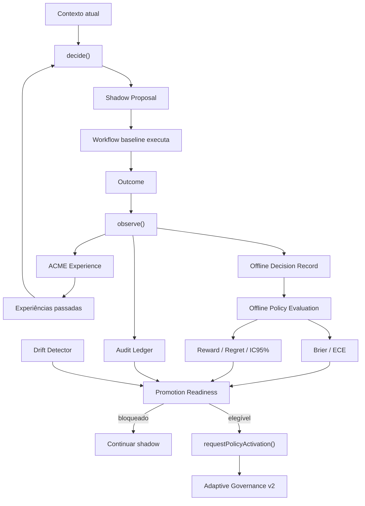

# SPEC — Adaptive Offline Policy Evaluation v3

## Status

Implementado como evolução compatível da Adaptive Governance v2.

## Objetivo

Adicionar uma etapa formal de avaliação offline entre `shadow` e qualquer solicitação de ativação. A v3 mede desempenho, calibração e regret em dados históricos/holdout sem conceder execução automática nem autoridade epistemológica à policy.

A v3 também corrige um risco arquitetural da v2: a proposal não deve ser calculada depois de incorporar o outcome do próprio evento. O runtime passa a separar decisão e observação.

## Princípio central

```text
decide(contexto, histórico passado)
        ↓
executa rota baseline / workflow normal
        ↓
observe(outcome)
        ↓
aprende / avalia
```

Nunca:

```text
observe(outcome atual) → decide para o mesmo evento
```

## Invariantes

### OPE3-01 — No look-ahead leakage

`decide()` calcula a shadow proposal somente com experiências anteriores. O outcome do evento atual só entra em `observe()`.

### OPE3-02 — Holdout temporal

`evaluateOfflinePolicy()` divide registros ordenados temporalmente em treino e holdout. Estatísticas de ação usadas para estimar reward/regret no holdout são obtidas apenas no bloco de treino.

### OPE3-03 — Outcome shadow direto somente em matched actions

O outcome da shadow policy é diretamente observável somente quando:

```text
shadow_action == executed_action
```

Quando há desacordo, a v3 não inventa counterfactual.

### OPE3-04 — Estimativa observacional != efeito causal

Reward e regret estimados para ações não executadas usam médias históricas de ação/estágio do treino. O relatório deve rotular isso explicitamente como estimativa observacional/model-based, não causal.

### OPE3-05 — Calibração em matched shadow

Brier Score e ECE são calculados somente para registros onde a shadow action foi realmente executada e `actual_success` está disponível.

### OPE3-06 — Readiness não ativa policy

`evaluatePromotionReadiness()` pode retornar:

```text
eligible_for_activation_request = true
```

mas sempre:

```text
auto_activate = false
```

A etapa seguinte continua sendo `requestPolicyActivation()` e todos os gates v2 permanecem obrigatórios.

### OPE3-07 — Evidência permanece separada

Nenhuma métrica offline, IC95%, Brier, ECE, reward, regret ou readiness pode promover um claim para `OBSERVED`.

### OPE3-08 — Relatório persistente é opt-in

A geração do relatório é pura. A escrita em `_reversa_sdd/adaptive/governance-report.md` só ocorre quando `writeAdaptiveGovernanceReport()` é chamado explicitamente.

### OPE3-09 — Persistência não pode escapar do projeto

O writer resolve o caminho sob `rootDir` e rejeita path traversal para fora da raiz configurada.

## Novos contratos

```text
reversa.offline.decision/v1
reversa.offline.evaluation/v1
reversa.adaptive.report/v1
```

Os contratos v1 anteriores permanecem:

```text
reversa.learning.event/v1
reversa.mci.envelope/v1
reversa.acme.experience/v1
```

## Runtime v3

### `decide(event)`

Entrada: Learning Event contendo contexto epistemológico, confiança e rota baseline atual. O método ignora o outcome para fins de policy e usa somente `history()` anterior.

Saída:

- observation;
- drift pré-decisão;
- shadow proposal;
- governance shadow;
- `history_count_before_decision`;
- baseline action;
- `evidence_authority=false`.

### `observe(event, { decision })`

Após o workflow baseline produzir outcome:

1. registra evento no Audit Ledger;
2. constrói MCI Envelope;
3. constrói ACME Experience;
4. cria Offline Decision Record;
5. adiciona experiência ao histórico;
6. recalcula drift pós-observação;
7. opcionalmente despacha para transports externos.

### `ingest(event)`

Permanece retrocompatível. Internamente executa:

```text
decide(event) → observe(event)
```

A ordem impede look-ahead leakage mesmo quando o evento fornecido já contém outcome.

## Offline Decision Record

Schema: `reversa.offline.decision/v1`.

Campos principais:

- event/task/stage;
- baseline action;
- shadow action;
- executed action;
- baseline/shadow match flags;
- policy confidence;
- policy history count;
- reward observado;
- actual success;
- estado epistemológico;
- `evidence_authority=false`.

## Avaliação offline

### Split temporal

Baseline:

```text
trainFraction = 0.70
```

O valor é configurável.

### Matriz por estágio/ação

Para cada `(stage, executed_action)`:

- N;
- reward médio;
- success rate;
- quantidade de shadow matches;
- confiança média da shadow nos matches.

### Brier Score

Para matched shadow records:

```text
Brier = mean((confidence - outcome)^2)
```

Quanto menor, melhor calibração quadrática. A v3 não fixa interpretação científica universal para os limiares; eles são baseline operacional configurável.

### ECE

Expected Calibration Error por bins configuráveis:

```text
ECE = sum(weight_bin * |avg_confidence_bin - accuracy_bin|)
```

Somente matched shadow records entram no cálculo.

### Reward/regret observacional

O bloco de treino estima reward médio por estágio/ação. No holdout, a v3 estima:

- reward baseline;
- reward shadow;
- delta estimado;
- regret baseline;
- regret shadow.

Regret usa como referência a melhor média de ação observada no treino para o mesmo estágio.

Essas estimativas não são apresentadas como counterfactual causal.

### IC95% bootstrap

O delta estimado usa bootstrap percentile 95%, com PRNG determinístico/seed configurável para reprodutibilidade.

O default é um baseline de engenharia, não prova estatística de efeito causal.

## Promotion Readiness

Defaults de governança:

```text
minRecords = 30
minMatchedShadow = 12
minShadowCoverage = 0.20
maxBrier = 0.25
maxEce = 0.20
maxEstimatedShadowRegret = 0.10
minEstimatedRewardDelta = 0.00
```

Esses valores são **hipóteses operacionais configuráveis**, não thresholds cientificamente universais.

Readiness exige, além das métricas:

- drift não detectado;
- ledger válido;
- limite inferior do IC95% do delta estimado >= `minEstimatedRewardDelta`.

Possíveis bloqueios:

```text
offline-evaluation-unavailable
insufficient-records
insufficient-shadow-matches
low-shadow-coverage
brier-above-threshold
ece-above-threshold
estimated-shadow-regret-high
reward-delta-ci-not-positive-enough
drift-detected
ledger-invalid
```

Mesmo sem bloqueios:

```text
eligible_for_activation_request = true
auto_activate = false
```

## Adaptive Governance Report

Schema: `reversa.adaptive.report/v1`.

Conteúdo mínimo:

- quantidade de registros treino/holdout;
- shadow coverage;
- agreement baseline × shadow;
- Brier;
- ECE;
- reward baseline/shadow estimado;
- delta e IC95%;
- regret baseline/shadow;
- drift;
- validade do ledger;
- readiness;
- blockers;
- matrizes de desempenho;
- caveats metodológicos.

Caminho sugerido:

```text
_reversa_sdd/adaptive/governance-report.md
```

A gravação é explicitamente opt-in.

## Arquitetura



## Critérios de aceitação

- CA1: `decide()` não adiciona o evento atual ao histórico.
- CA2: `observe()` adiciona experiência somente após a decisão.
- CA3: `ingest()` preserva compatibilidade e respeita decide→observe.
- CA4: avaliação usa split temporal treino/holdout.
- CA5: calibration usa somente shadow-matched outcomes.
- CA6: matriz por stage/action é produzida.
- CA7: reward/regret estimados são marcados como observacionais.
- CA8: IC95% bootstrap é reprodutível por seed.
- CA9: readiness nunca autoativa.
- CA10: drift ou ledger inválido bloqueia readiness.
- CA11: relatório Markdown é gerado com caveats.
- CA12: writer persiste somente por chamada explícita e bloqueia path traversal.
- CA13: `OBSERVED` continua fora da autoridade da avaliação adaptativa.
- CA14: `npm run verify` executa teste dedicado da v3.

## Próximas etapas possíveis

Somente após acumular dados reais suficientes:

1. comparar o baseline observacional com métodos de off-policy evaluation adequados ao logging policy;
2. registrar propensities quando o roteador baseline for estocástico;
3. considerar IPS/SNIPS/DR apenas quando os pressupostos e logging permitirem;
4. introduzir canary controlado para ações não mutantes;
5. recalibrar thresholds por projeto/estágio/agente;
6. manter RL profundo fora do core enquanto não houver evidência de necessidade.
